\n

## 桥接模式（Bridge Pattern）

\n\n\n\n

**Bridge**  is a structural design pattern that lets you split a large class or a set of closely related classes into two separate hierarchies—abstraction and implementation—which can be developed independently of each other.

\n\n\n\n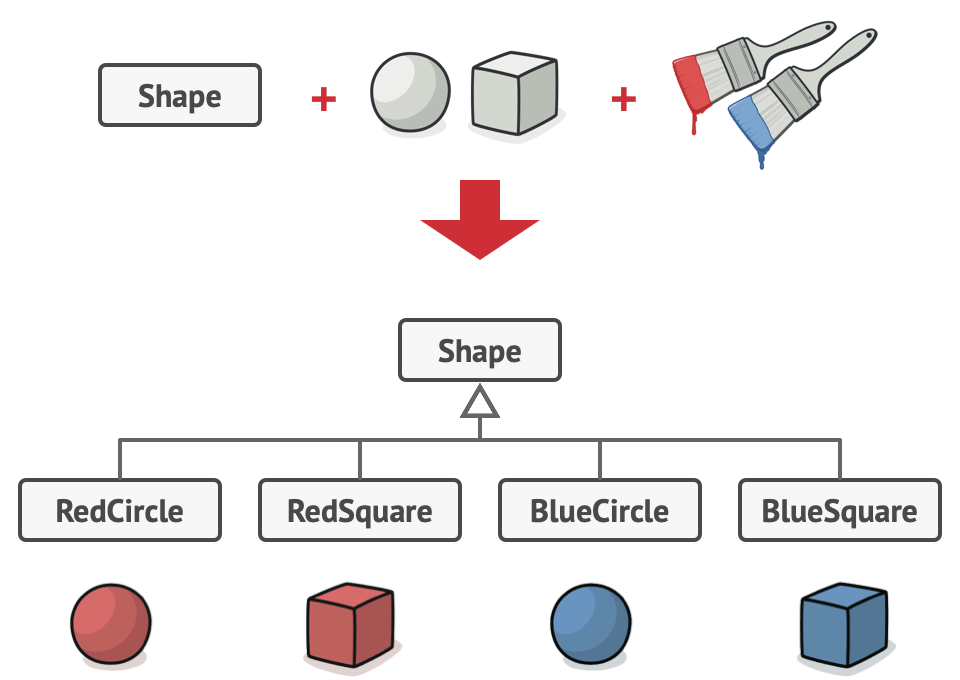\n\n\n\n

理解桥接模式，需要理解如何分离抽象化和实现化，使得二者脱耦，可以独立变化

\n\n\n\n

Adding new shape types and colors to the hierarchy will grow it exponentially. For example, to add a triangle shape you’d need to introduce two subclasses, one for each color. And after that, adding a new color would require creating three subclasses, one for each shape type. The further we go, the worse it becomes.

\n\n\n\n

The Bridge pattern attempts to solve this problem by**switching from inheritance to the object composition.** What this means is that you extract one of the dimensions into a separate class hierarchy, so that the original classes will reference an object of the new hierarchy, instead of having all of its state and behaviors within one class

\n\n\n\n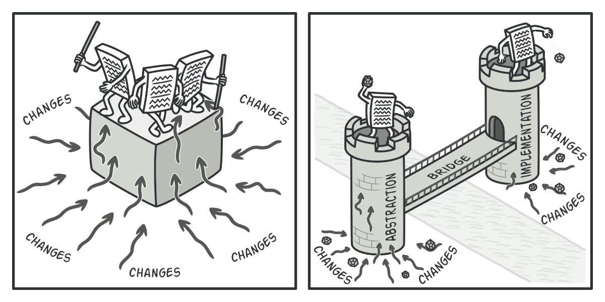\n\n\n\n

In a worst-case scenario, this app might look like a giant spaghetti bowl, where hundreds of conditionals connect different types of GUI with various APIs all over the code.

\n\n\n\n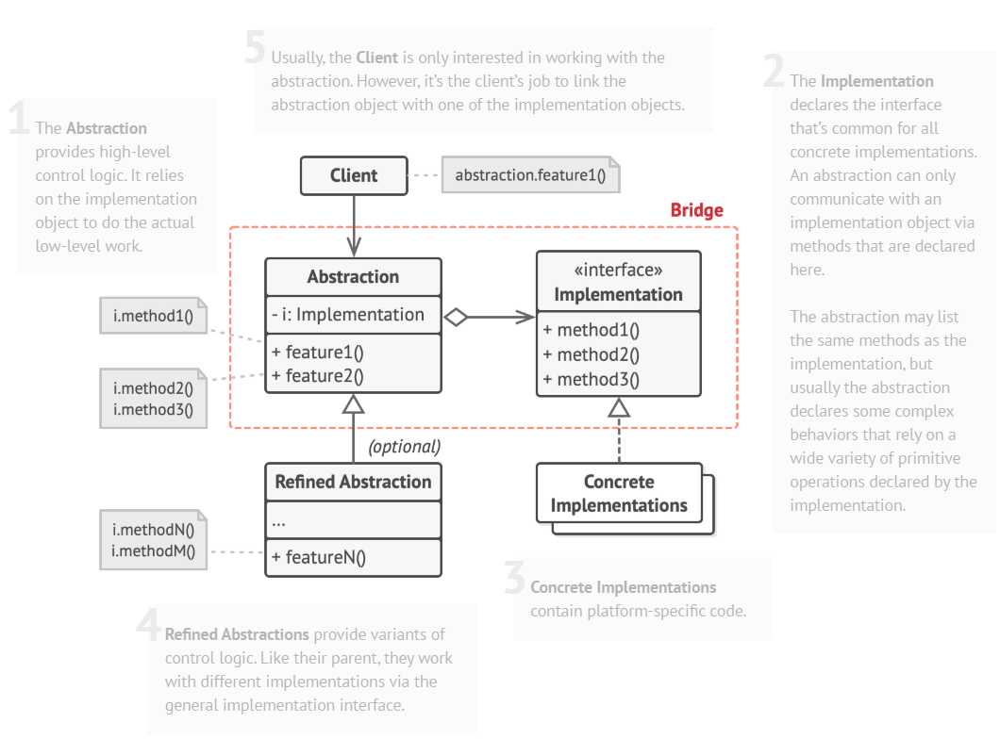\n\n\n\n

## 装饰模式（decorator）

\n\n\n\n

Imagine that you’re working on a notification library which lets other programs notify their users about important events.

\n\n\n\n

The initial version of the library was based on the `Notifier` class that had only a few fields, a constructor and a single `send` method. The method could accept a message argument from a client and send the message to a list of emails that were passed to the notifier via its constructor. A third-party app which acted as a client was supposed to create and configure the notifier object once, and then use it each time something important happened.

\n\n\n\n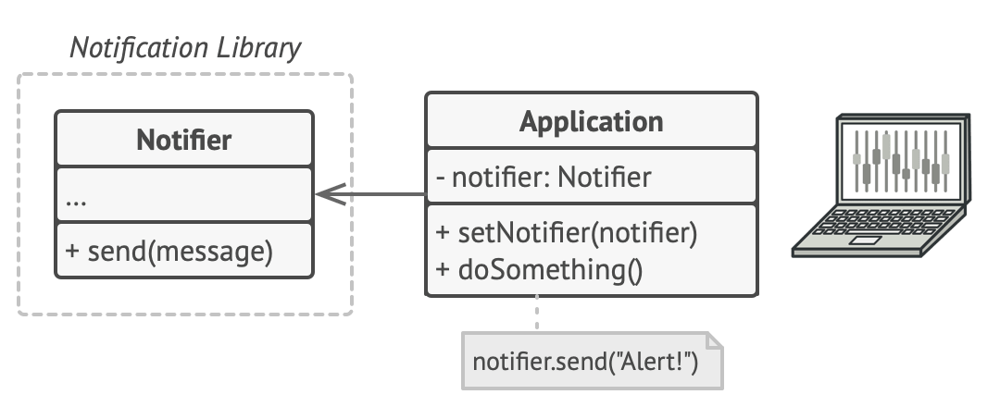\n\n\n\n

At some point, you realize that users of the library expect more than just email notifications. Many of them would like to receive an SMS about critical issues. Others would like to be notified on Facebook and, of course, the corporate users would love to get Slack notifications.

\n\n\n\n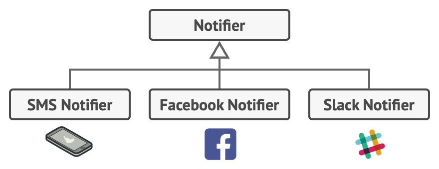\n\n\n\n

How hard can that be? You extended the `Notifier` class and put the additional notification methods into new subclasses. Now the client was supposed to**instantiate the desired notification class** and use it for all further notifications.

\n\n\n\n

But then someone reasonably asked you, “Why can’t you**use several notification types at once**? If your house is on fire, you’d probably want to be informed through every channel.”

\n\n\n\n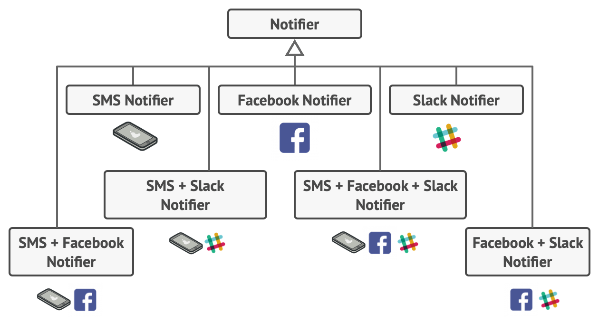\n\n\n\n

One of the ways to overcome these caveats is by using _Aggregation_  or _Composition_    
 instead of _Inheritance_. Both of the alternatives work almost the same way: one object _has a_  reference to another and delegates it some work, whereas with inheritance, the object itself _is_  able to do that work, inheriting the behavior from its superclass.

\n\n\n\n

With this new approach you can easily substitute the linked “helper” object with another, changing the behavior of the container at runtime. An object can use the behavior of various classes, having references to multiple objects and delegating them all kinds of work. Aggregation/composition is the key principle behind many design patterns, including Decorator. On that note, let’s return to the pattern discussion.

\n\n\n\n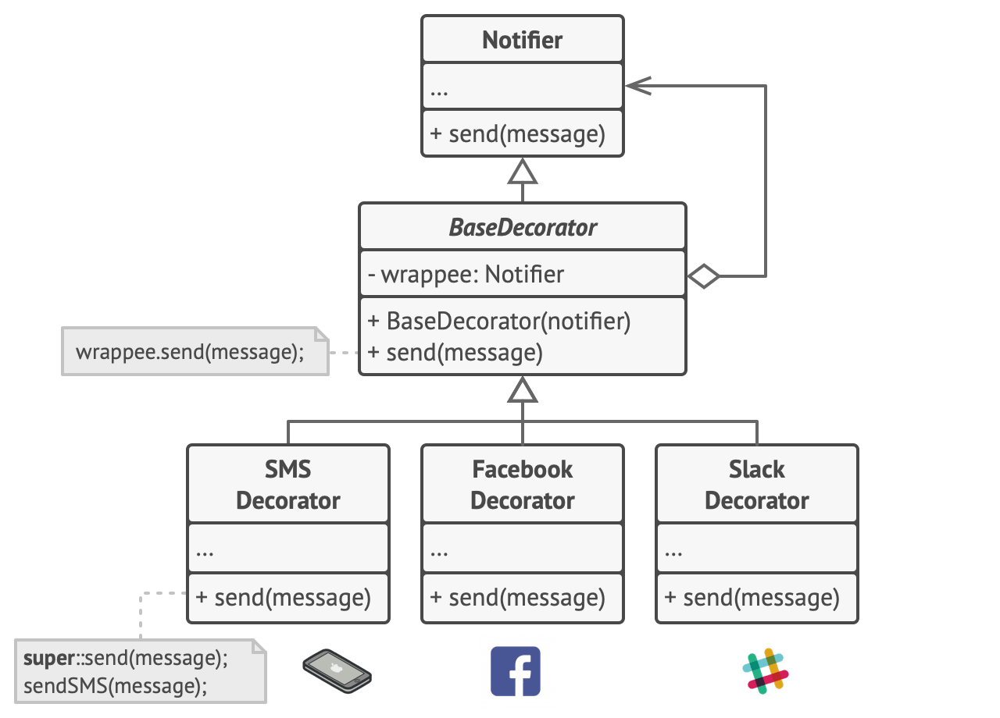\n\n\n\n

## 观察者模式(Observer)

\n\n\n\n

Imagine that you have two types of objects: a `Customer` and a `Store`. The customer is very interested in a particular brand of product (say, it’s a new model of the iPhone) which should become available in the store very soon.

\n\n\n\n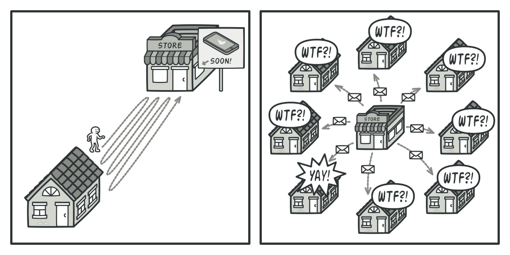\n\n\n\n

The customer could visit the store every day and check product availability. But while the product is still en route, most of these trips would be pointless.

\n\n\n\n\n\n\n\n

That’s why it’s crucial that all subscribers implement the same interface and that the publisher communicates with them only via that interface. This interface should declare the notification method along with a set of parameters that the publisher can use to pass some contextual data along with the notification.

\n\n\n\n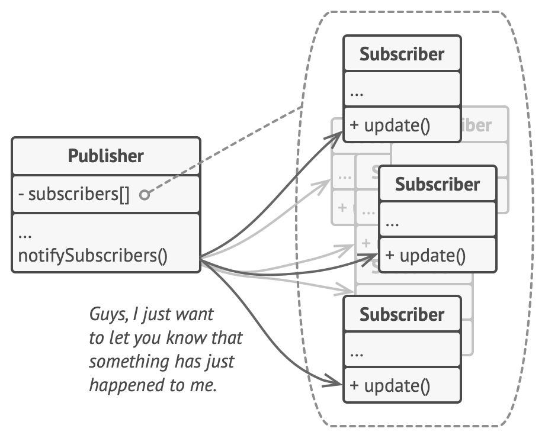\n\n\n\n

观察者模式(Observer Pattern)：定义对象间的一种一对多依赖关系，使得每当一个对象状态发生改变时，其相关依赖对象皆得到通知并被自动更新。观察者模式又叫做发布-订阅（Publish/Subscribe）模式、模型-视图（Model/View）模式、源-监听器（Source/Listener）模式或从属者（Dependents）模式。观察者模式是一种对象行为型模式。

\n\n\n\n

这一模式中的关键对象是观察目标和观察者，一个目标可以有任意数目的与之相依赖的观察者，一旦目标的状态发生改变，所有的观察者都将得到通知。

\n\n\n\n

观察者模式可以实现表示层和数据逻辑层的分离，并定义了稳定的消息更新传递机制，抽象了更新接口，使得可以有各种各样不同的表示层作为具体观察者角色。  
并且在观察目标和观察者之间建立了一个抽象的耦合，符合开闭原则的要求

\n\n\n\n

缺点（fallbacks）：如果一个观察目标对象有很多直接和间接的观察者的话，将所  
有的观察者都通知到会花费很多时间。  
观察者模式没有相应的机制让观察者知道所观察的目标对象是怎么发生变化的，而仅仅只是知道观察目标发生了变化。

\n\n\n\n\n\n\n\n

Pseudocode（伪代码）

\n\n\n\n\n\n\n\n
    
    
    // The base publisher class includes subscription management\n// code and notification methods.\nclass EventManager is\n    private field listeners: hash map of event types and listeners\n\n    method subscribe(eventType, listener) is\n        listeners.add(eventType, listener)\n\n    method unsubscribe(eventType, listener) is\n        listeners.remove(eventType, listener)\n\n    method notify(eventType, data) is\n        foreach (listener in listeners.of(eventType)) do\n            listener.update(data)\n\n// The concrete publisher contains real business logic that's\n// interesting for some subscribers. We could derive this class\n// from the base publisher, but that isn't always possible in\n// real life because the concrete publisher might already be a\n// subclass. In this case, you can patch the subscription logic\n// in with composition, as we did here.\nclass Editor is\n    public field events: EventManager\n    private field file: File\n\n    constructor Editor() is\n        events = new EventManager()\n\n    // Methods of business logic can notify subscribers about\n    // changes.\n    method openFile(path) is\n        this.file = new File(path)\n        events.notify("open", file.name)\n\n    method saveFile() is\n        file.write()\n        events.notify("save", file.name)\n\n    // ...\n\n\n// Here's the subscriber interface. If your programming language\n// supports functional types, you can replace the whole\n// subscriber hierarchy with a set of functions.\ninterface EventListener is\n    method update(filename)\n\n// Concrete subscribers react to updates issued by the publisher\n// they are attached to.\nclass LoggingListener implements EventListener is\n    private field log: File\n    private field message: string\n\n    constructor LoggingListener(log_filename, message) is\n        this.log = new File(log_filename)\n        this.message = message\n\n    method update(filename) is\n        log.write(replace('%s',filename,message))\n\nclass EmailAlertsListener implements EventListener is\n    private field email: string\n    private field message: string\n\n    constructor EmailAlertsListener(email, message) is\n        this.email = email\n        this.message = message\n\n    method update(filename) is\n        system.email(email, replace('%s',filename,message))\n\n\n// An application can configure publishers and subscribers at\n// runtime.\nclass Application is\n    method config() is\n        editor = new Editor()\n\n        logger = new LoggingListener(\n            "/path/to/log.txt",\n            "Someone has opened the file: %s")\n        editor.events.subscribe("open", logger)\n\n        emailAlerts = new EmailAlertsListener(\n            "admin@example.com",\n            "Someone has changed the file: %s")\n        editor.events.subscribe("save", emailAlerts)

\n\n\n\n

### change manager

\n\n\n\n

当目标和观察者间的依赖关系特别复杂时, 可能需要一个维护这些关系的对象。我们称这样的对象为更改管理器（Change Manager）

\n\n\n\n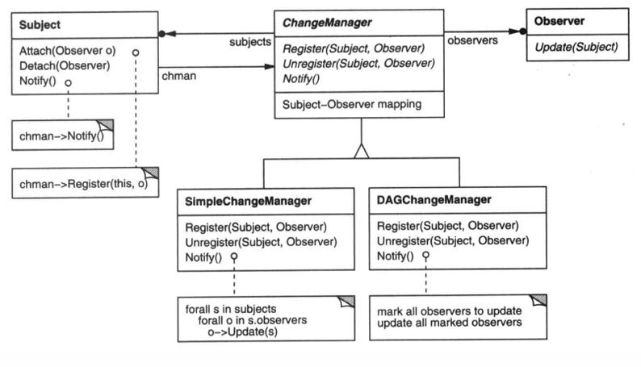\n\n\n\n

### 观察者模式扩展

\n\n\n\n

MVC模式

\n\n\n\n

\n
  * MVC模式是一种架构模式，它包含三个角色：模型(Model)，视图(View)和控制器(Controller)。观察者模式可以用来实现MVC模式，观察者模式中的观察目标就  
是MVC模式中的模型(Model)，而观察者就是MVC中的视图(View)，控制器(Controller)充当两者之间的中介者(Mediator)。当模型层的数据发生改变时，视图层将自动改变其显示内容。
\n
\n\n\n\n

## 中介者模式（Mediator）

\n\n\n\n

**Mediator**  is a behavioral design pattern that lets you reduce chaotic dependencies between objects. The pattern restricts direct communications between the objects and forces them to collaborate only via a mediator object.

\n\n\n\n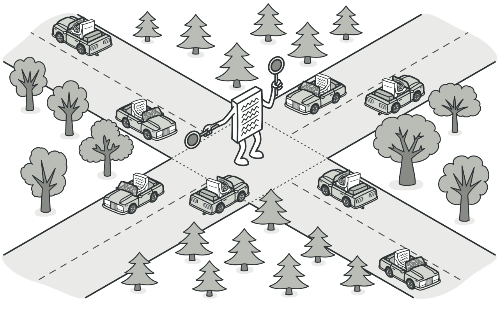\n\n\n\n

### example: A Profile Dialog

\n\n\n\n

Say you have a dialog for creating and editing customer profiles. It consists of various form controls such as text fields, checkboxes, buttons, etc.

\n\n\n\n\n\n\n\n

Some of the form elements may **interact with others**. For instance, selecting the “I have a dog” checkbox may reveal a hidden text field for entering the dog’s name. Another example is the submit button that has to validate values of all fields before saving the data.

\n\n\n\n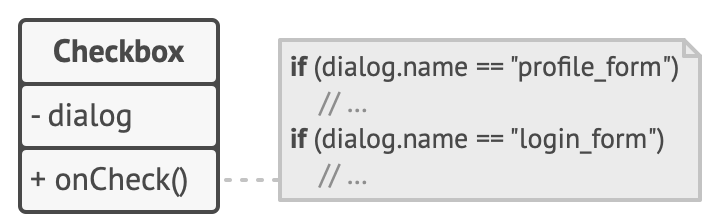\n\n\n\n

**模式动机**

\n\n\n\n

\n
  * 在面向对象的软件设计与开发过程中，根据“单一职责原则”，我们应该尽量将对象细化，使其只负责或呈现单一的职责。
\n\n\n\n
  * 对于一个模块，可能由很多对象构成，而且这些对象之间可能存在相互的引用，为了减少对象两两之间复杂的引用关系，使之成为一个松耦合的系统，我们需要使用中介者模式，这就是中介者模式的模式动机。
\n
\n\n\n\n

The Mediator pattern suggests that you should cease all direct communication between the components which you want to make independent of each other. Instead, these components must collaborate indirectly, by calling a special mediator object that redirects the calls to appropriate components. As a result, the components depend only on a single mediator class instead of being coupled to dozens of their colleagues.

\n\n\n\n

In our example with the profile editing form, the dialog class itself may act as the mediator. Most likely, the dialog class is already aware of all of its sub-elements, so you **won’t even need to introduce new dependencies** into this class.

\n\n\n\n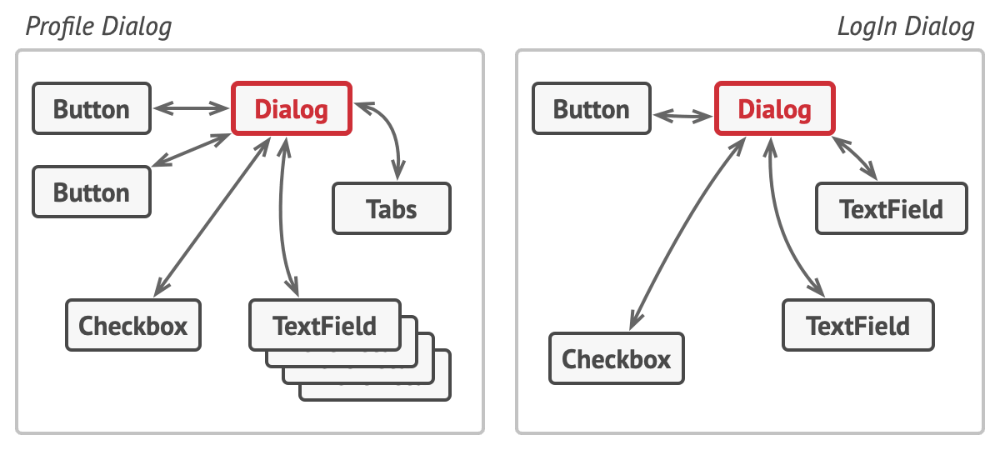\n\n\n\n

最显著的更改发生在实际的表单元素上。让我们考虑一下提交按钮。以前，每次用户单击该按钮时，它都必须验证所有单个表单元素的值。现在，它的唯一工作是通知对话框有关单击的信息。收到此通知后，对话框本身会执行验证或将任务传递给各个元素。因此，按钮不依赖于十几个表单元素，而只依赖于 dialog 类。

\n\n\n\n

You can go further and make the dependency even looser b**y extracting the common interface for all types of dialogs.** The interface would declare the notification method which all form elements can use to notify the dialog about events happening to those elements. Thus, our submit button should now be able to work with any dialog that implements that interface.

\n\n\n\n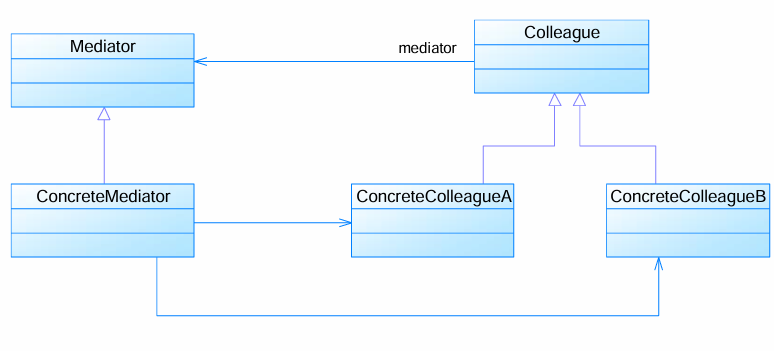\n\n\n\n

\n\n\n\n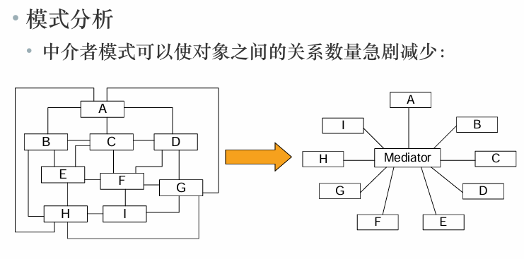\n\n\n\n

Real-World Analogy    
真实世界的类比

\n\n\n\n _Aircraft pilots don’t talk to each other directly when deciding who gets to land their plane next. All communication goes through the control  tower._\n\n\n\n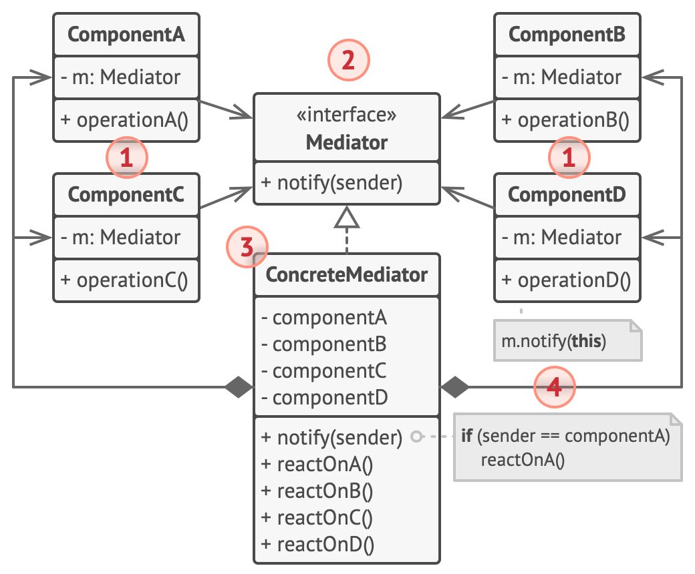\n\n\n\n

**组件** 是包含一些业务逻辑的各种类。每个组件都有一个对中介器的引用，该中介器使用中介器接口的类型声明。该组件不知道 mediator 的实际类，因此您可以通过将组件链接到不同的 mediator 来在其他程序中重用该组件。

\n\n\n\n

### Pseudocode    
伪代码

\n\n\n\n
    
    
    // The mediator interface declares a method used by components\n// to notify the mediator about various events. The mediator may\n// react to these events and pass the execution to other\n// components.\ninterface Mediator is\n    method notify(sender: Component, event: string)\n\n\n// The concrete mediator class. The intertwined web of\n// connections between individual components has been untangled\n// and moved into the mediator.\nclass AuthenticationDialog implements Mediator is\n    private field title: string\n    private field loginOrRegisterChkBx: Checkbox\n    private field loginUsername, loginPassword: Textbox\n    private field registrationUsername, registrationPassword,\n                  registrationEmail: Textbox\n    private field okBtn, cancelBtn: Button\n\n    constructor AuthenticationDialog() is\n        // Create all component objects by passing the current\n        // mediator into their constructors to establish links.\n\n    // When something happens with a component, it notifies the\n    // mediator. Upon receiving a notification, the mediator may\n    // do something on its own or pass the request to another\n    // component.\n    method notify(sender, event) is\n        if (sender == loginOrRegisterChkBx and event == "check")\n            if (loginOrRegisterChkBx.checked)\n                title = "Log in"\n                // 1. Show login form components.\n                // 2. Hide registration form components.\n            else\n                title = "Register"\n                // 1. Show registration form components.\n                // 2. Hide login form components\n\n        if (sender == okBtn && event == "click")\n            if (loginOrRegister.checked)\n                // Try to find a user using login credentials.\n                if (!found)\n                    // Show an error message above the login\n                    // field.\n            else\n                // 1. Create a user account using data from the\n                // registration fields.\n                // 2. Log that user in.\n                // ...\n\n\n// Components communicate with a mediator using the mediator\n// interface. Thanks to that, you can use the same components in\n// other contexts by linking them with different mediator\n// objects.\nclass Component is\n    field dialog: Mediator\n\n    constructor Component(dialog) is\n        this.dialog = dialog\n\n    method click() is\n        dialog.notify(this, "click")\n\n    method keypress() is\n        dialog.notify(this, "keypress")\n\n// Concrete components don't talk to each other. They have only\n// one communication channel, which is sending notifications to\n// the mediator.\nclass Button extends Component is\n    // ...\n\nclass Textbox extends Component is\n    // ...\n\nclass Checkbox extends Component is\n    method check() is\n        dialog.notify(this, "check")\n    // ...

\n\n\n\n

中介者承担两方面的职责：

\n\n\n\n

\n
  * 中转作用（结构性）：通过中介者提供的中转作用，各个同事对象就不再需要显式引用其他同事，当需要和其他同事进行通信时，通过中介者即可。该中转作用属于中介者在结构上的支持。
\n\n\n\n
  * 协调作用（行为性）：中介者可以更进一步的对同事之间的关系进行封装，同事可以一致地和中介者进行交互，而不需要指明中介者需要具体怎么做，中介者根据封装在自身内部的协调逻辑，对同事的请求进行进一步处理，将同事成员之间的关系行为进行分离和封装。该协调作用属于中介者在行为上的支持。
\n
\n\n\n\n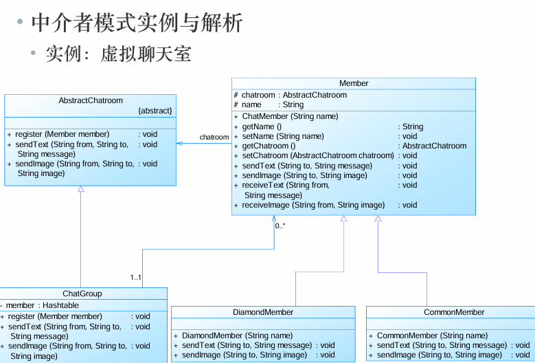\n\n\n\n

中介者模式的优点

\n\n\n\n

\n
  * 简化了对象之间的交互。
\n\n\n\n
  * 将各同事解耦。
\n\n\n\n
  * 减少子类生成。
\n\n\n\n
  * 可以简化各同事类的设计和实现。
\n
\n\n\n\n

中介者模式的缺点

\n\n\n\n

\n
  * 在具体中介者类中包含了同事之间的交互细节，可能会  
导致具体中介者类非常复杂，使得系统难以维护。
\n
\n\n\n\n

在中介者模式中，通过创造出一个中介者对象，将系统中有关的对象所引用的其他对象数目减少到最少，使得一个对象与其同事之间的相互作用被这个对象与中介者对象之间的相互作用所取代。因此，中介者模式就是迪米特法则的一个典型应用

\n\n\n\n

## 模板方法模式（Template Method）

\n\n\n\n

**Template Method**  is a behavioral design pattern that defines the skeleton of an algorithm in the superclass but **lets subclasses override specific steps of the algorithm without changing its  structure.**

\n\n\n\n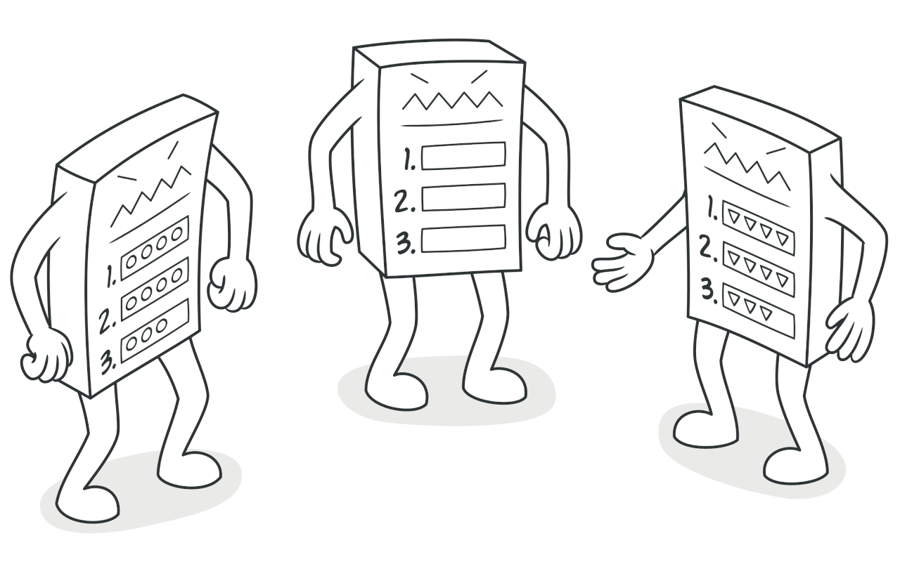\n\n\n\n

### example

\n\n\n\n

Imagine that you’re creating a data mining application that analyzes corporate documents. Users feed the app documents in various formats (PDF, DOC, CSV), and it tries to extract meaningful data from these docs in a uniform format.

\n\n\n\n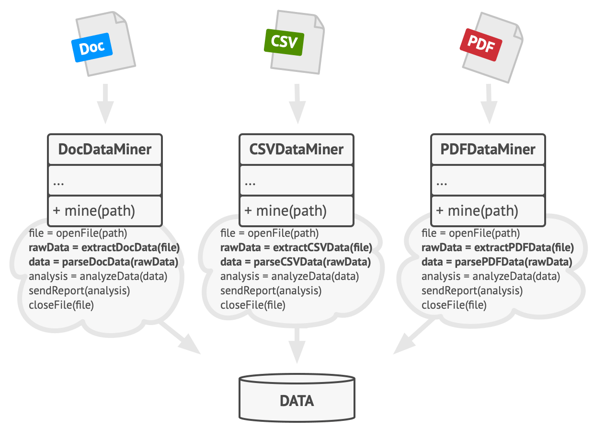\n\n\n\n

At some point, you noticed that all three classes have a lot of similar code. While the code for dealing with various data formats was entirely different in all classes, the code for data processing and analysis is almost identical. Wouldn’t it be great to get rid of the code duplication, leaving the algorithm structure intact?

\n\n\n\n

The Template Method pattern suggests that you**break down an algorithm into a series of steps,** turn these steps into methods, and put a series of calls to these methods inside a single _template method._  The steps may either be `abstract`, or have some default implementation. To use the algorithm, the client is supposed to provide its own subclass, implement all abstract steps, and override some of the optional ones if needed (but not the template method itself).

\n\n\n\n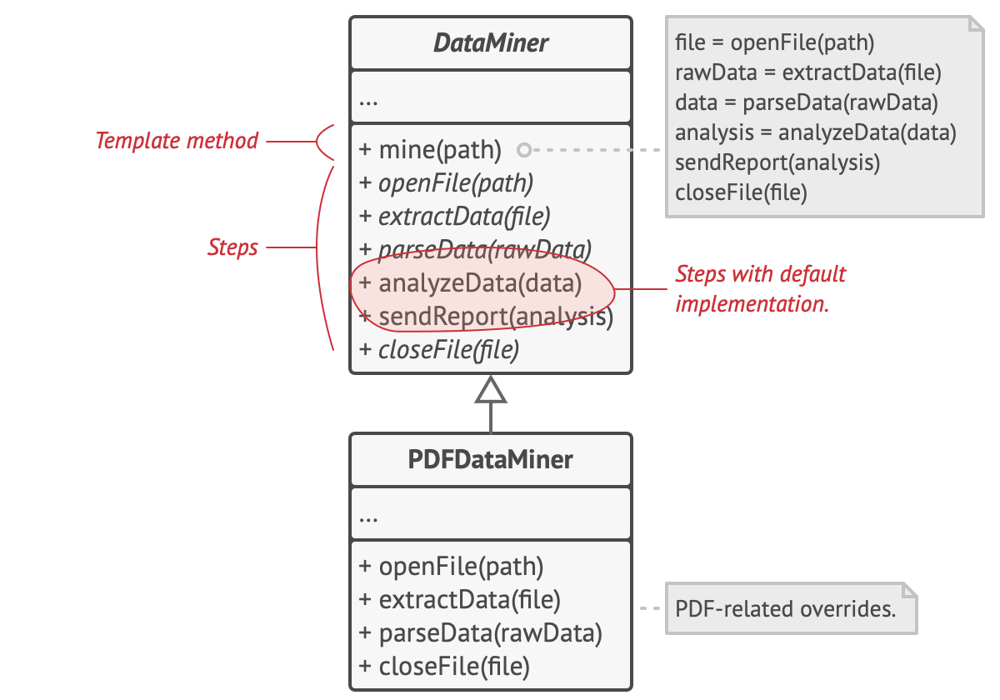\n\n\n\n

正如你所看到的那样， 我们有两种类型的步骤：

\n\n\n\n

\n
  *  _抽象步骤_ 必须由各个子类来实现
\n\n\n\n
  *  _可选步骤_ 已有一些默认实现， 但仍可在需要时进行重写
\n
\n\n\n\n

还有另一种名为 _钩子_ 的步骤。 _钩子_ 是内容为空的可选步骤。 即使不重写钩子， 模板方法也能工作。 钩子通常放置在算法重要步骤的前后， 为子类提供额外的算法扩展点。

\n\n\n\n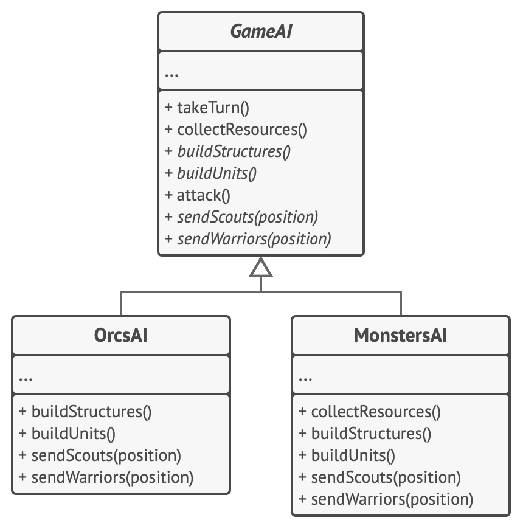\n\n\n\n

游戏中所有的种族都有几乎同类的单位和建筑。 因此你可以在不同的种族上复用相同的 AI 结构， 同时还需要具备重写一些细节的能力。 通过这种方式， 你可以重写半兽人的 AI 使其更富攻击性， 也可以让人类侧重防守， 还可以禁止怪物建造建筑。 在游戏中新增种族需要创建新的 AI 子类， 还需要重写 AI 基类中所声明的默认方法。

\n\n\n\n
    
    
    class GameAI is\n    // 模板方法定义了某个算法的框架。\n    method turn() is\n        collectResources()\n        buildStructures()\n        buildUnits()\n        attack()\n\n    // 某些步骤可在基类中直接实现。\n    method collectResources() is\n        foreach (s in this.builtStructures) do\n            s.collect()\n\n    // 某些可定义为抽象类型。\n    abstract method buildStructures()\n    abstract method buildUnits()\n\n    // 一个类可包含多个模板方法。\n    method attack() is\n        enemy = closestEnemy()\n        if (enemy == null)\n            sendScouts(map.center)\n        else\n            sendWarriors(enemy.position)\n\n    abstract method sendScouts(position)\n    abstract method sendWarriors(position)\n\n// 具体类必须实现基类中的所有抽象操作，但是它们不能重写模板方法自身。\nclass OrcsAI extends GameAI is\n    method buildStructures() is\n        if (there are some resources) then\n            // 建造农场，接着是谷仓，然后是要塞。\n\n    method buildUnits() is\n        if (there are plenty of resources) then\n            if (there are no scouts)\n                // 建造苦工，将其加入侦查编组。\n            else\n                // 建造兽族步兵，将其加入战士编组。\n\n    // ……\n\n    method sendScouts(position) is\n        if (scouts.length > 0) then\n            // 将侦查编组送到指定位置。\n\n    method sendWarriors(position) is\n        if (warriors.length > 5) then\n            // 将战斗编组送到指定位置。\n\n// 子类可以重写部分默认的操作。\nclass MonstersAI extends GameAI is\n    method collectResources() is\n        // 怪物不会采集资源。\n\n    method buildStructures() is\n        // 怪物不会建造建筑。\n\n    method buildUnits() is\n        // 怪物不会建造单位。

\n\n\n\n

## 工厂模式

\n\n\n\n

### 简单工厂模式

\n\n\n\n

简单工厂模式(Simple Factory Pattern)：又称为静态工厂方法(Static Factory Method)模式，它属于类创建型模式。在简单工厂模式中，可以根据参数的不同返回不同类的实例。简单工厂模式专门定义一个类来负责创建其他类的实例，被创建的实例通常都具有共同的父类。

\n\n\n\n

**模式结构**

\n\n\n\n

\n
  * 简单工厂模式包含如下角色：
\n\n\n\n
  * Factory：工厂角色
\n\n\n\n
  * Product：抽象产品角色
\n\n\n\n
  * ConcreteProduct：具体产品角色
\n
\n\n\n\n

模式实例与解析

\n\n\n\n

\n
  * 实例：权限管理
\n\n\n\n
  * 在某OA系统中，系统根据对比用户在登录时输入的账  
号和密码以及在数据库中存储的账号和密码是否一致来  
进行身份验证，如果验证通过，则取出存储在数据库中  
的用户权限等级（以整数形式存储），根据不同的权限  
等级创建不同等级的用户对象，不同等级的用户对象拥  
有不同的操作权限。现使用简单工厂模式来设计该权限  
管理模块。
\n
\n\n\n\n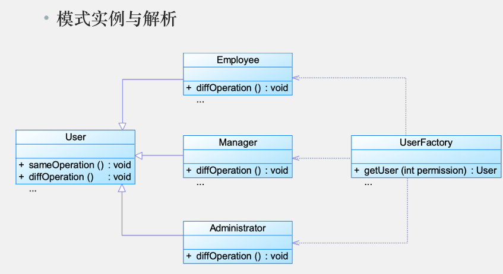\n\n\n\n

## 外观模式（Facade Pattern）

\n\n\n\n

引入外观角色之后，用户只需要直接与外观角色交互，用户与子系统之间的复杂关系由外观角色来实现，从而降低了系统的耦合度。

\n\n\n\n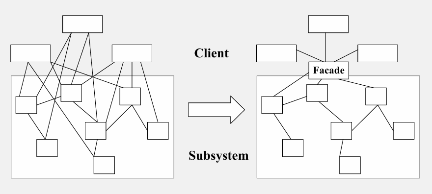\n\n\n\n

**模式分析**

\n\n\n\n

根据“单一职责原则”，在软件中将一个系统划分为若干个子系统有利于降低整个系统的复杂性，一个常见的设计目标是使子系统间的通信和相互依赖关系达到最小，而达到该目标的途径之一就是引入一个外观对象，它为子系统的访问提供了一个简单而单一的入口。

\n\n\n\n

**模式优缺点**

\n\n\n\n

优点：

\n\n\n\n

\n
  * 对客户屏蔽子系统组件，减少了客户处理的对象数目并使得子系统使用起来更加容易。通过引入外观模式，客户代码将变得很简单，与之关联的对象也很少。
\n\n\n\n
  * 实现了子系统与客户之间的松耦合关系，这使得子系统的组件变化不会影响到调用它的客户类，只需要调整外观类即可。
\n\n\n\n
  * 降低了大型软件系统中的编译依赖性，并简化了系统在不同平台之间的移植过程，因为编译一个子系统一般不需要编译所有其他的子系统。一个子系统的修改对其他子系统没有任何影响，而且子系统内部变化也不会影响到外观对象。
\n\n\n\n
  * 只是提供了一个访问子系统的统一入口，并不影响用户直接使用子系统类。
\n
\n\n\n\n

缺点：

\n\n\n\n

\n
  * 不能很好地限制客户使用子系统类，如果对客户访问子  
系统类做太多的限制则减少了可变性和灵活性。
\n\n\n\n
  * 在不引入抽象外观类的情况下，增加新的子系统可能需  
要修改外观类或客户端的源代码，违背了“开闭原则”。
\n
\n\n\n\n

在外观模式中，通常**只需要一个外观类** ，并且此外观类只有一个实例，换言之它是一个**单例** 类。在很多情况下为了节约系统资源，一般将外观类设计为单例类。当然这并不意味着在整个系统里只能有一个外观类，在一个系统中可以设计多个外观类，每个外观类都负责和一些特定的子系统交互，向用户提供相应的业务功能。

\n\n\n\n

**不要通过继承一个外观类在子系统中加入新的行为，这种做法是错误的。**

\n\n\n\n

### 外观模式适用情况包括：

\n\n\n\n

要为一个复杂子系统提供一个简单接口；

\n\n\n\n

客户程序与多个子系统之间存在很大的依赖性；

\n\n\n\n

在层次化结构中，需要定义系统中每一层的入口，使得层与层之间不直接产生联系。

\n\n\n\n

## 享元模式（Flyweight Pattern）

\n\n\n\n

面向对象技术可以很好地解决一些灵活性或可扩展性问题，但在很多情况下需要在系统中增加类和对象的  
个数。当对象数量太多时，将导致运行代价过高，带来性能下降等问题。

\n\n\n\n

假如你希望在长时间工作后放松一下， 所以开发了一款简单的游戏： 玩家们在地图上移动并相互射击。 你决定实现一个真实的粒子系统， 并将其作为游戏的特色。 大量的子弹、 导弹和爆炸弹片会在整个地图上穿行， 为玩家提供紧张刺激的游戏体验。

\n\n\n\n

开发完成后， 你推送提交了最新版本的程序， 并在编译游戏后将其发送给了一个朋友进行测试。 尽管该游戏在你的电脑上完美运行， 但是你的朋友却无法长时间进行游戏： 游戏总是会在他的电脑上运行几分钟后崩溃。 在研究了几个小时的调试消息记录后， 你发现导致游戏崩溃的原因是内存容量不足。 朋友的设备性能远比不上你的电脑， 因此游戏运行在他的电脑上时很快就会出现问题。

\n\n\n\n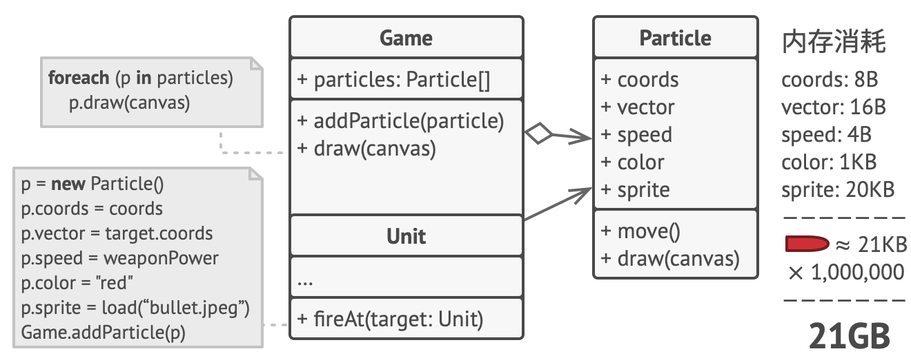\n\n\n\n

仔细观察 `粒子`Particle类， 你可能会注意到颜色 （color） 和精灵图 （sprite）这两个成员变量所消耗的内存要比其他变量多得多。 更糟糕的是， 对于所有的粒子来说， 这两个成员变量所存储的数据几乎完全一样 （比如所有子弹的颜色和精灵图都一样）。

\n\n\n\n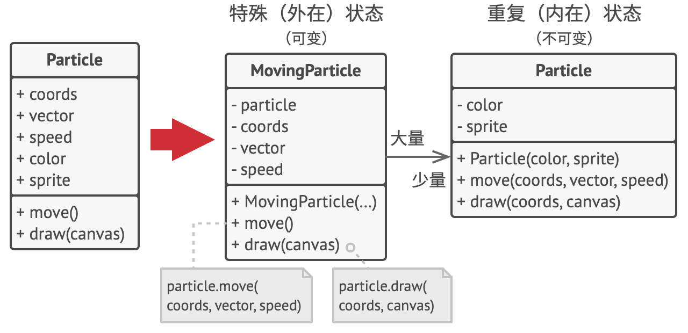\n\n\n\n

享元模式建议不在对象中存储外在状态， 而是将其传递给依赖于它的一个特殊方法。 程序只在对象中保存内在状态， 以方便在不同情景下重用。 这些对象的区别仅在于其内在状态 （与外在状态相比， 内在状态的变体要少很多）， 因此你所需的对象数量会大大削减。

\n\n\n\n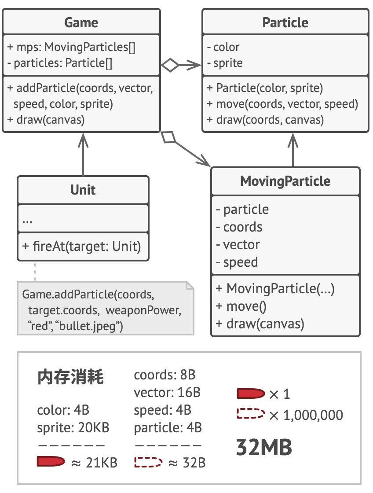\n\n\n\n

那么外在状态会被移动到什么地方呢？ 总得有类来存储它们， 对不对？ 在大部分情况中， 它们会被移动到容器对象中， 也就是我们应用享元模式前的聚合对象中。

\n\n\n\n

在我们的例子中， 容器对象就是主要的 `游戏`Game对象， 其会将所有粒子存储在名为 `粒子`particles的成员变量中。 为了能将外在状态移动到这个类中， 你需要创建多个数组成员变量来存储每个粒子的坐标、 方向矢量和速度。 除此之外， 你还需要另一个数组来存储指向代表粒子的特定享元的引用。 这些数组必须保持同步， 这样你才能够使用同一索引来获取关于某个粒子的所有数据。

\n\n\n\n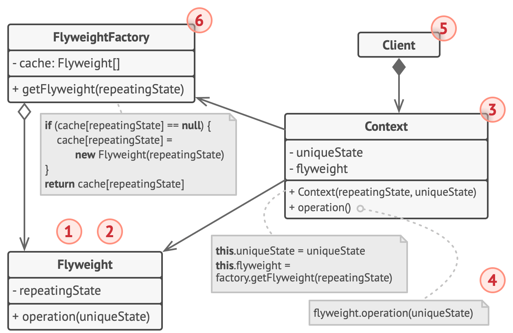\n\n\n\n

### 享元与不可变性

\n\n\n\n

由于享元对象可在不同的情景中使用， 你必须确保其状态不能被修改。 享元类的状态只能由构造函数的参数进行一次性初始化， 它不能对其他对象公开其设置器或公有成员变量。

\n\n\n\n

def:享元模式(Flyweight Pattern)：运用共享技术有效地支持大量细粒度对象的复用。系统只使用少量的对象，而这些对象都很相似，状态变化很小，可以实现对象的多次复用。由于享元模式要求能够共享的对象必须是细粒度对象，因此它又称为轻量级模式，它是一种对象结构型模式。

\n\n\n\n

享元模式的核心在于享元工厂类，享元工厂类的作用在于提供一个用于存储享元对象的享元池，用户需要  
对象时，首先从享元池中获取，如果享元池中不存在，则创建一个新的享元对象返回给用户，并在享元池中保存该新增对象。

\n\n\n\n

在本例中， **享元** 模式能有效减少在画布上渲染数百万个树状对象时所需的内存。

\n\n\n\n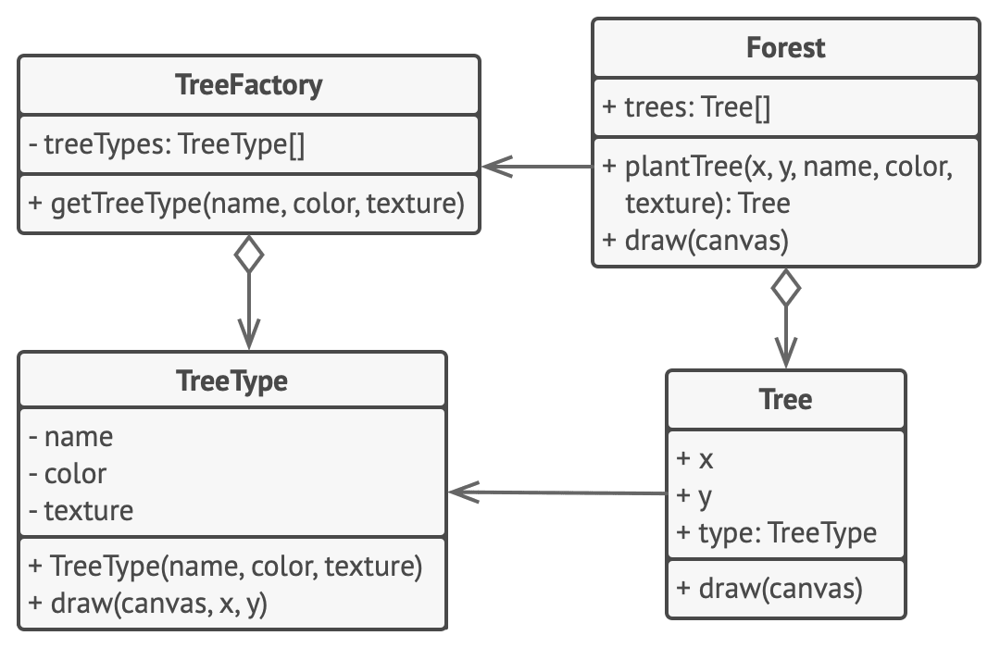\n\n\n\n

## 代理模式（Proxy Pattern）

\n\n\n\n

**代理模式** 是一种结构型设计模式， 让你能够提供对象的替代品或其占位符。 代理控制着对于原对象的访问， 并允许在将请求提交给对象前后进行一些处理。

\n\n\n\n

为什么要控制对于某个对象的访问呢？ 举个例子： 有这样一个消耗大量系统资源的巨型对象， 你只是偶尔需要使用它， 并非总是需要。

\n\n\n\n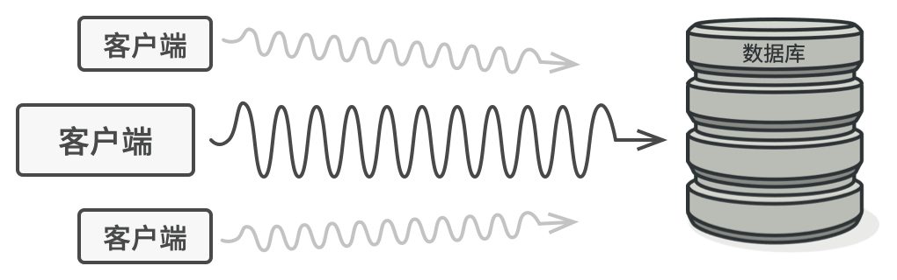\n\n\n\n

你可以实现延迟初始化： 在实际有需要时再创建该对象。 对象的所有客户端都要执行延迟初始代码。 不幸的是， 这很可能会带来很多重复代码。

\n\n\n\n

代理模式建议新建一个与原服务对象接口相同的代理类， 然后更新应用以将代理对象传递给所有原始对象客户端。 代理类接收到客户端请求后会创建实际的服务对象， 并将所有工作委派给它。

\n\n\n\n

**代理模式结构**

\n\n\n\n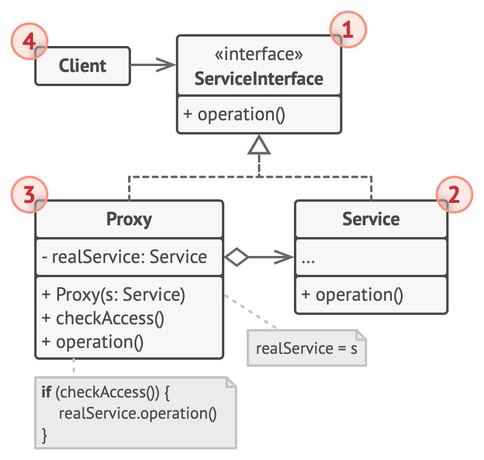\n\n\n\n

\n
  1. **服务接口** （Service Interface） 声明了服务接口。 代理必须遵循该接口才能伪装成服务对象。
\n\n\n\n
  2. **服务** （Service） 类提供了一些实用的业务逻辑。
\n\n\n\n
  3. **代理** （Proxy） 类包含一个指向服务对象的引用成员变量。 代理完成其任务 （例如延迟初始化、 记录日志、 访问控制和缓存等） 后会将请求传递给服务对象。通常情况下， 代理会对其服务对象的整个生命周期进行管理。
\n\n\n\n
  4. **客户端** （Client） 能通过同一接口与服务或代理进行交互， 所以你可在一切需要服务对象的代码中使用代理。
\n
\n\n\n\n

\n