\n

## 日志的功用

\n\n\n\n

针对最常见的InnoDB引擎，有如下几类的日志：

\n\n\n\n

● 错误日志（error log） ：对 MySQL 的**启动、运行、关闭** 过程进行了记录。  
● 二进制日志（binary log，binlog） ：主要记录的是更改数据库数据的 SQL 语句。  
● 一般查询日志（general query log） ：已建立连接的客户端发送给 MySQL 服务器的所有 SQL 记录，因为 SQL 的量比较大，默认是不开启的，也不建议开启。  
● 慢查询日志（slow query log） ：执行时间超过 long_query_time秒钟的查询，解决 SQL**慢查询问题** 的时候会用到。  
● 事务日志(redo log 和 undo log) ：redo log 是重做日志，undo log 是回滚日志。  
● 中继日志(relay log) ：relay log 是复制过程中产生的日志，很多方面都跟 binary log 差不多。不过，relay log 针对的是主从复制中的从库。  
● DDL 日志(metadata log) ：DDL 语句执行的元数据操作

\n\n\n\n

二进制日志（binlog）和事务日志(redo log 和 undo log)比较重要

\n\n\n\n

[MySQL三大日志(binlog、redo log和undo log)详解 | JavaGuide](<https://javaguide.cn/database/mysql/mysql-logs.html>)

\n\n\n\n

MySQL 中数据是以页为单位，你查询一条记录，会从硬盘把一页的数据加载出来，加载出来的数据叫数据页，会放入到 `Buffer Pool` 中。

\n\n\n\n

### redo log

\n\n\n\n

#### **Redo Log 的作用**

\n\n\n\n

\n
  * **持久性保障** ： 当一个事务提交时，MySQL 并不需要立即将数据页的所有修改写入磁盘，而是先将这些修改记录到 Redo Log 中。即使系统发生崩溃，也可以通过 Redo Log 恢复未写入磁盘的数据，从而保证事务的持久性。
\n\n\n\n
  * **提高性能** ： 直接将数据页写入磁盘是一个随机 I/O 操作，效率较低。而 Redo Log 是顺序写入的，性能更高。因此，InnoDB 使用 Redo Log 来延迟对数据页的磁盘写入操作，从而提升性能。
\n
\n\n\n\n

[刷盘时机](<https://javaguide.cn/database/mysql/mysql-logs.html#%E5%88%B7%E7%9B%98%E6%97%B6%E6%9C%BA>)

\n\n\n\n

nnoDB 刷新重做日志的时机有几种情况：

\n\n\n\n

InnoDB 将 redo log 刷到磁盘上有几种情况：

\n\n\n\n

\n
  1. 事务提交：当事务提交时，log buffer 里的 redo log 会被刷新到磁盘（可以通过`innodb_flush_log_at_trx_commit`参数控制，后文会提到）。
\n\n\n\n
  2. log buffer 空间不足时：log buffer 中缓存的 redo log 已经占满了 log buffer 总容量的大约一半左右，就需要把这些日志刷新到磁盘上。
\n\n\n\n
  3. 事务日志缓冲区满：InnoDB 使用一个事务日志缓冲区（transaction log buffer）来暂时存储事务的重做日志条目。当缓冲区满时，会触发日志的刷新，将日志写入磁盘。
\n\n\n\n
  4. Checkpoint（检查点）：InnoDB 定期会执行检查点操作，将内存中的脏数据（已修改但尚未写入磁盘的数据）刷新到磁盘，并且会将相应的重做日志一同刷新，以确保数据的一致性。
\n\n\n\n
  5. 后台刷新线程：InnoDB 启动了一个后台线程，负责周期性（每隔 1 秒）地将脏页（已修改但尚未写入磁盘的数据页）刷新到磁盘，并将相关的重做日志一同刷新。
\n\n\n\n
  6. 正常关闭服务器：MySQL 关闭的时候，redo log 都会刷入到磁盘里去。
\n
\n\n\n\n

总之，InnoDB 在多种情况下会刷新重做日志，以保证数据的持久性和一致性。

\n\n\n\n

我们要注意设置正确的刷盘策略`innodb_flush_log_at_trx_commit` 。根据 MySQL 配置的刷盘策略的不同，MySQL 宕机之后可能会存在轻微的数据丢失问题。

\n\n\n\n

`innodb_flush_log_at_trx_commit` 的值有 3 种，也就是共有 3 种刷盘策略：

\n\n\n\n

\n
  * **0** ：设置为 0 的时候，表示每次事务提交时不进行刷盘操作。这种方式性能最高，但是也最不安全，因为如果 MySQL 挂了或宕机了，可能会丢失最近 1 秒内的事务。
\n\n\n\n
  * **1** ：设置为 1 的时候，表示每次事务提交时都将进行刷盘操作。这种方式性能最低，但是也最安全，因为只要事务提交成功，redo log 记录就一定在磁盘里，不会有任何数据丢失。
\n\n\n\n
  * **2** ：设置为 2 的时候，表示每次事务提交时都只把 log buffer 里的 redo log 内容写入 page cache（文件系统缓存）。page cache 是专门用来缓存文件的，这里被缓存的文件就是 redo log 文件。这种方式的性能和安全性都介于前两者中间。
\n
\n\n\n\n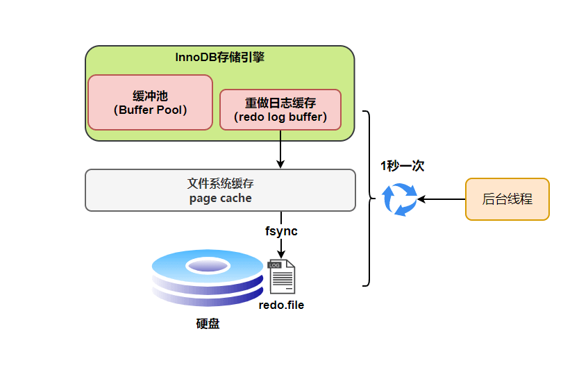\n\n\n\n

## 数据库三大范式是什么？

\n\n\n\n

**第一范式（1NF）：要求数据库表的每一列都是不可分割的原子数据项。**

\n\n\n\n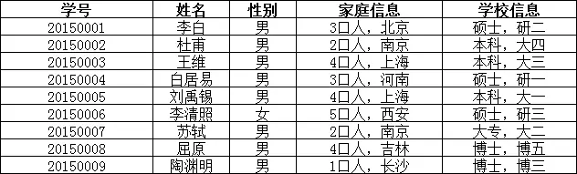\n\n\n\n

在上面的表中，“家庭信息”和“学校信息”列均不满足原子性的要求，故不满足第一范式，调整如下：

\n\n\n\n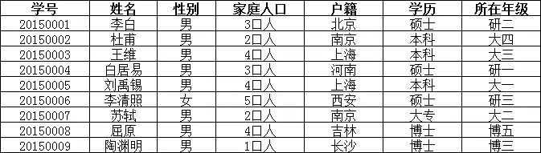\n\n\n\n

**第二范式（2NF）：在1NF的基础上，非码属性必须完全依赖于候选码（在1NF基础上消除非主属性对主码的部分函数依赖）**

\n\n\n\n

**第二范式需要确保数据库表中的每一列都和主键相关，而不能只与主键的某一部分相关（主要针对联合主键而言）。**

\n\n\n\n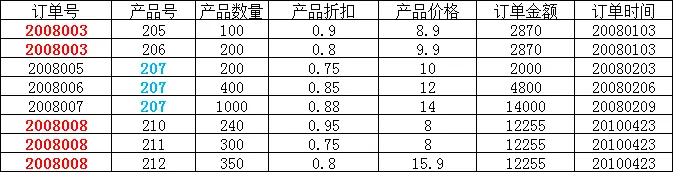\n\n\n\n

在上图所示的情况中，同一个订单中可能包含不同的产品，因此主键必须是“订单号”和“产品号”联合组成，

\n\n\n\n

但可以发现，产品数量、产品折扣、产品价格与“订单号”和“产品号”都相关，但是订单金额和订单时间仅与“订单号”相关，与“产品号”无关，

\n\n\n\n

这样就不满足第二范式的要求，调整如下，需分成两个表：

\n\n\n\n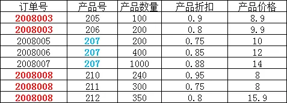\n\n\n\n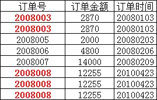\n\n\n\n

**第三范式（3NF）：在2NF基础上，任何非主[属性 (opens new window)](<https://baike.baidu.com/item/%E5%B1%9E%E6%80%A7>)不依赖于其它非主属性（在2NF基础上消除传递依赖）**

\n\n\n\n

**第三范式需要确保数据表中的每一列数据都和主键直接相关，而不能间接相关。**

\n\n\n\n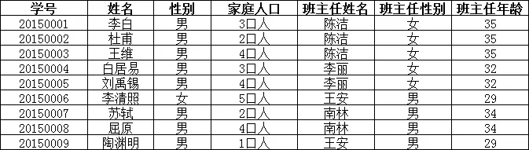\n\n\n\n

上表中，所有属性都完全依赖于学号，所以满足第二范式，但是“班主任性别”和“班主任年龄”直接依赖的是“班主任姓名”，

\n\n\n\n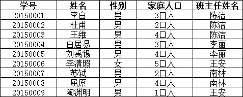\n\n\n\n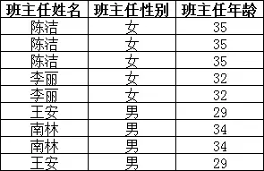\n\n\n\n

## MySQL常见数据类型

\n\n\n\n

### [CHAR 和 VARCHAR 的区别是什么？](<https://javaguide.cn/database/mysql/mysql-questions-01.html#char-%E5%92%8C-varchar-%E7%9A%84%E5%8C%BA%E5%88%AB%E6%98%AF%E4%BB%80%E4%B9%88>)

\n\n\n\n

CHAR 和 VARCHAR 是最常用到的字符串类型，两者的主要区别在于：**CHAR 是定长字符串，VARCHAR 是变长字符串。**

\n\n\n\n

CHAR 在存储时会在右边填充空格以达到指定的长度，检索时会去掉空格；VARCHAR 在存储时需要使用 1 或 2 个额外字节记录字符串的长度，检索时不需要处理。

\n\n\n\n

CHAR 更适合存储长度较短或者长度都差不多的字符串，例如 Bcrypt 算法、MD5 算法加密后的密码、身份证号码。VARCHAR 类型适合存储长度不确定或者差异较大的字符串，例如用户昵称、文章标题等。

\n\n\n\n

CHAR(M) 和 VARCHAR(M) 的 M 都代表能够保存的字符数的最大值，无论是字母、数字还是中文，每个都只占用一个字符。

\n\n\n\n

### int(1) int(10) 在mysql有什么不同？

\n\n\n\n

`INT(1)` 和 `INT(10)` 的区别主要在于 **显示宽度** ，而不是存储范围或数据类型本身的大小。以下是核心区别的总结：

\n\n\n\n

\n
  * 本质是显示宽度，不改变存储方式：`INT` 的存储固定为 4 字节，所有 `INT`（无论写成 `INT(1)` 还是 `INT(10)`）占用的存储空间 均为 4 字节。括号内的数值（如 `1` 或 `10`）是显示宽度，用于在 特定场景下 控制数值的展示格式。
\n\n\n\n
  * 唯一作用场景：`ZEROFILL` 补零显示，当字段设置 `ZEROFILL` 时：数字显示时会用前导零填充至指定宽度。比如，字段类型为 `INT(4) ZEROFILL`，实际存入 `5` → 显示为 `0005`，实际存入 `12345` → 显示仍为 `12345`（宽度超限时不截断）。
\n
\n\n\n\n

### [#](<https://xiaolincoding.com/interview/mysql.html#ip%E5%9C%B0%E5%9D%80%E5%A6%82%E4%BD%95%E5%9C%A8%E6%95%B0%E6%8D%AE%E5%BA%93%E9%87%8C%E5%AD%98%E5%82%A8>)IP地址如何在数据库里存储？

\n\n\n\n

IPv4 地址是一个 32 位的二进制数，通常以点分十进制表示法呈现，例如 `192.168.1.1`。

\n\n\n\n

**字符串类型的存储方式** ：直接将 IP 地址作为字符串存储在数据库中，比如可以用 `VARCHAR(15)`来存储。

\n\n\n\n
    
    
    -- 创建一个表，使用VARCHAR类型存储IPv4地址\nCREATE TABLE ip_records (\n    id INT AUTO_INCREMENT PRIMARY KEY,\n    ip_address VARCHAR(15)\n);\n\n-- 插入数据\nINSERT INTO ip_records (ip_address) VALUES ('192.168.1.1');\n

\n\n\n\n

\n
  * **优点** ：直观易懂，方便直接进行数据的插入、查询和显示，不需要进行额外的转换操作。
\n\n\n\n
  * **缺点** ：占用存储空间较大，字符串比较操作的性能相对较低，不利于进行范围查询。
\n
\n\n\n\n

整数类型的存储方式：将 IPv4 地址转换为 32 位无符号整数进行存储，常用的数据类型有 `INT UNSIGNED`。

\n\n\n\n
    
    
    -- 创建一个表，使用INT UNSIGNED类型存储IPv4地址\nCREATE TABLE ip_records (\n    id INT AUTO_INCREMENT PRIMARY KEY,\n    ip_address INT UNSIGNED\n);\n\n-- 插入数据，需要先将IP地址转换为整数\nINSERT INTO ip_records (ip_address) VALUES (INET_ATON('192.168.1.1'));\n\n-- 查询时将整数转换回IP地址\nSELECT INET_NTOA(ip_address) FROM ip_records;\n

\n\n\n\n

\n
  * **优点** ：占用存储空间小，整数比较操作的性能较高，便于进行范围查询。
\n\n\n\n
  * **缺点** ：需要进行额外的转换操作，不够直观，增加了开发的复杂度。
\n
\n\n\n\n

### 外键约束

\n\n\n\n
    
    
    CREATE TABLE students (\n  id INT PRIMARY KEY,\n  name VARCHAR(50),\n  course_id INT,\n  FOREIGN KEY (course_id) REFERENCES courses(id)\n);

\n\n\n\n

### MySQL的关键字in和exist

\n\n\n\n

在MySQL中，`IN` 和 `EXISTS` 都是用来处理子查询的关键词，但它们在功能、性能和使用场景上有各自的特点和区别。

\n\n\n\n

> \n
> 
> IN关键字
> 
> \n

\n\n\n\n

`IN` 用于检查左边的表达式是否存在于右边的列表或子查询的结果集中。如果存在，则`IN` 返回`TRUE`，否则返回`FALSE`。

\n\n\n\n

语法结构：

\n\n\n\n
    
    
    SELECT column_name(s)\nFROM table_name\nWHERE column_name IN (value1, value2, ...);\n

\n\n\n\n

或

\n\n\n\n
    
    
    SELECT column_name(s)\nFROM table_name\nWHERE column_name IN (SELECT column_name FROM another_table WHERE condition);\n

\n\n\n\n

例子：

\n\n\n\n
    
    
    SELECT * FROM Customers\nWHERE Country IN ('Germany', 'France');\n

\n\n\n\n

> \n
> 
> EXISTS关键字
> 
> \n

\n\n\n\n

`EXISTS` 用于判断子查询是否至少能返回一行数据。它不关心子查询返回什么数据，只关心是否有结果。如果子查询有结果，则`EXISTS` 返回`TRUE`，否则返回`FALSE`。

\n\n\n\n

语法结构：

\n\n\n\n
    
    
    SELECT column_name(s)\nFROM table_name\nWHERE EXISTS (SELECT column_name FROM another_table WHERE condition);\n

\n\n\n\n

例子：

\n\n\n\n
    
    
    SELECT * FROM Customers\nWHERE EXISTS (SELECT 1 FROM Orders WHERE Orders.CustomerID = Customers.CustomerID);\n

\n\n\n\n

区别与选择：

\n\n\n\n

\n
  * **性能差异** ：在很多情况下，`EXISTS` 的性能优于 `IN`，特别是当子查询的表很大时。这是因为`EXISTS` 一旦找到匹配项就会立即停止查询，而`IN`可能会扫描整个子查询结果集。
\n\n\n\n
  * **使用场景** ：如果子查询结果集较小且不频繁变动，`IN` 可能更直观易懂。而当子查询涉及外部查询的每一行判断，并且子查询的效率较高时，`EXISTS` 更为合适。
\n\n\n\n
  * **NULL值处理** ：`IN` 能够正确处理子查询中包含NULL值的情况，而`EXISTS` 不受子查询结果中NULL值的影响，因为它关注的是行的存在性，而不是具体值。
\n
\n\n\n\n

### **SQL查询语句的执行顺序是怎么样的？**

\n\n\n\n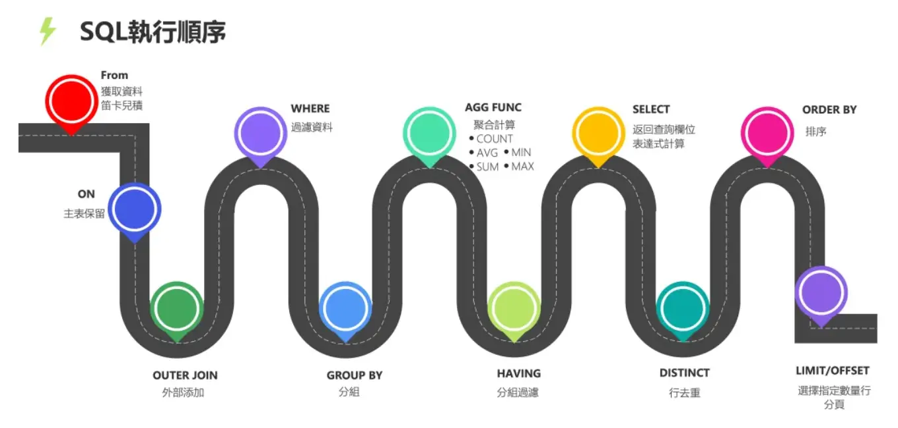\n\n\n\n

### 函数依赖中的重要概念

\n\n\n\n

\n
  * **函数依赖（functional dependency）** ：若在一张表中，在属性（或属性组）X 的值确定的情况下，必定能确定属性 Y 的值，那么就可以说 Y 函数依赖于 X，写作 X → Y。
\n\n\n\n
  * **部分函数依赖（partial functional dependency）** ：如果 X→Y，并且存在 X 的一个真子集 X0，使得 X0→Y，则称 Y 对 X 部分函数依赖。比如学生基本信息表 R 中（学号，身份证号，姓名）当然学号属性取值是唯一的，在 R 关系中，（学号，身份证号）->（姓名），（学号）->（姓名），（身份证号）->（姓名）；所以姓名部分函数依赖于（学号，身份证号）；
\n\n\n\n
  * **完全函数依赖(Full functional dependency)** ：在一个关系中，若某个非主属性数据项依赖于全部关键字称之为完全函数依赖。比如学生基本信息表 R（学号，班级，姓名）假设不同的班级学号有相同的，班级内学号不能相同，在 R 关系中，（学号，班级）->（姓名），但是（学号）->(姓名)不成立，（班级）->(姓名)不成立，所以姓名完全函数依赖与（学号，班级）；
\n\n\n\n
  * **传递函数依赖** ：在关系模式 R(U)中，设 X，Y，Z 是 U 的不同的属性子集，如果 X 确定 Y、Y 确定 Z，且有 X 不包含 Y，Y 不确定 X，（X∪Y）∩Z=空集合，则称 Z 传递函数依赖(transitive functional dependency) 于 X。传递函数依赖会导致数据冗余和异常。传递函数依赖的 Y 和 Z 子集往往同属于某一个事物，因此可将其合并放到一个表中。比如在关系 R(学号 , 姓名, 系名，系主任)中，学号 → 系名，系名 → 系主任，所以存在非主属性系主任对于学号的传递函数依赖。
\n
\n\n\n\n

### [为什么不推荐使用外键与级联？](<https://javaguide.cn/database/basis.html#%E4%B8%BA%E4%BB%80%E4%B9%88%E4%B8%8D%E6%8E%A8%E8%8D%90%E4%BD%BF%E7%94%A8%E5%A4%96%E9%94%AE%E4%B8%8E%E7%BA%A7%E8%81%94>)

\n\n\n\n

对于外键和级联，阿里巴巴开发手册这样说到：

\n\n\n\n

> \n
> 
> 【强制】不得使用外键与级联，一切外键概念**必须在应用层** 解决。
> 
> \n\n\n\n
> 
> 说明: 以学生和成绩的关系为例，学生表中的 student_id 是主键，那么成绩表中的 student_id 则为外键。如果更新学生表中的 student_id，同时触发成绩表中的 student_id 更新，即为级联更新。外键与级联更新适用于单机低并发，不适合分布式、高并发集群；级联更新是强阻塞，存在数据库更新风暴的风险；外键影响数据库的插入速度
> 
> \n

\n\n\n\n

为什么不要用外键呢？大部分人可能会这样回答：

\n\n\n\n

\n
  1. **增加了复杂性：**  a. 每次做 DELETE 或者 UPDATE 都必须考虑外键约束，会导致开发的时候很痛苦, 测试数据极为不方便; b. 外键的主从关系是定的，假如哪天需求有变化，数据库中的这个字段根本不需要和其他表有关联的话就会增加很多麻烦。
\n\n\n\n
  2. **增加了额外工作** ：数据库需要增加维护外键的工作，比如当我们做一些涉及外键字段的增，删，更新操作之后，需要触发相关操作去检查，保证数据的的一致性和正确性，这样会不得不消耗数据库资源。如果在应用层面去维护的话，可以减小数据库压力；
\n\n\n\n
  3. **对分库分表不友好** ：因为分库分表下外键是无法生效的。
\n
\n\n\n\n

### [drop、delete 与 truncate 区别？](<https://javaguide.cn/database/basis.html#drop%E3%80%81delete-%E4%B8%8E-truncate-%E5%8C%BA%E5%88%AB>)

\n\n\n\n

\n
  * `drop`(丢弃数据): `drop table 表名` ，直接将表都删除掉，在删除表的时候使用。
\n\n\n\n
  * `truncate` (清空数据) : `truncate table 表名` ，只删除表中的数据，再插入数据的时候自增长 id 又从 1 开始，在清空表中数据的时候使用。
\n\n\n\n
  * `delete`（删除数据） : `delete from 表名 where 列名=值`，删除某一行的数据，如果不加 `where` 子句和`truncate table 表名`作用类似。
\n
\n\n\n\n

`truncate` 和不带 `where`子句的 `delete`、以及 `drop` 都会删除表内的数据，但是 **`truncate` 和 `delete` 只删除数据不删除表的结构(定义)，执行 `drop` 语句，此表的结构也会删除，也就是执行`drop` 之后对应的表不复存在。**

\n\n\n\n

`truncate` 和 `drop` 属于 DDL(数据定义语言)语句，操作立即生效，原数据不放到 rollback segment 中，不能回滚，操作不触发 trigger。而 `delete` 语句是 DML (数据库操作语言)语句，这个操作会放到 rollback segment 中，事务提交之后才生效。

\n\n\n\n

### [数据库设计通常分为哪几步?](<https://javaguide.cn/database/basis.html#%E6%95%B0%E6%8D%AE%E5%BA%93%E8%AE%BE%E8%AE%A1%E9%80%9A%E5%B8%B8%E5%88%86%E4%B8%BA%E5%93%AA%E5%87%A0%E6%AD%A5>)

\n\n\n\n

\n
  1. **需求分析**  : 分析用户的需求，包括数据、功能和性能需求。
\n\n\n\n
  2. **概念结构设计**  : 主要采用 E-R 模型进行设计，包括画 E-R 图。
\n\n\n\n
  3. **逻辑结构设计**  : 通过将 E-R 图转换成表，实现从 E-R 模型到关系模型的转换。
\n\n\n\n
  4. **物理结构设计**  : 主要是为所设计的数据库选择合适的存储结构和存取路径。
\n\n\n\n
  5. **数据库实施**  : 包括编程、测试和试运行
\n\n\n\n
  6. **数据库的运行和维护**  : 系统的运行与数据库的日常维护。
\n
\n\n\n\n

### MySQL的优点

\n\n\n\n

\n
  1. 成熟稳定，功能完善。
\n\n\n\n
  2. 开源免费。
\n\n\n\n
  3. 文档丰富，既有详细的官方文档，又有非常多优质文章可供参考学习。
\n\n\n\n
  4. 开箱即用，操作简单，维护成本低。
\n\n\n\n
  5. 兼容性好，支持常见的操作系统，支持多种开发语言。
\n\n\n\n
  6. 社区活跃，生态完善。
\n\n\n\n
  7. 事务支持优秀， InnoDB 存储引擎默认使用 REPEATABLE-READ 并不会有任何性能损失，并且，InnoDB 实现的 REPEATABLE-READ 隔离级别其实是可以解决幻读问题发生的。
\n\n\n\n
  8. 支持分库分表、读写分离、高可用。
\n
\n\n\n\n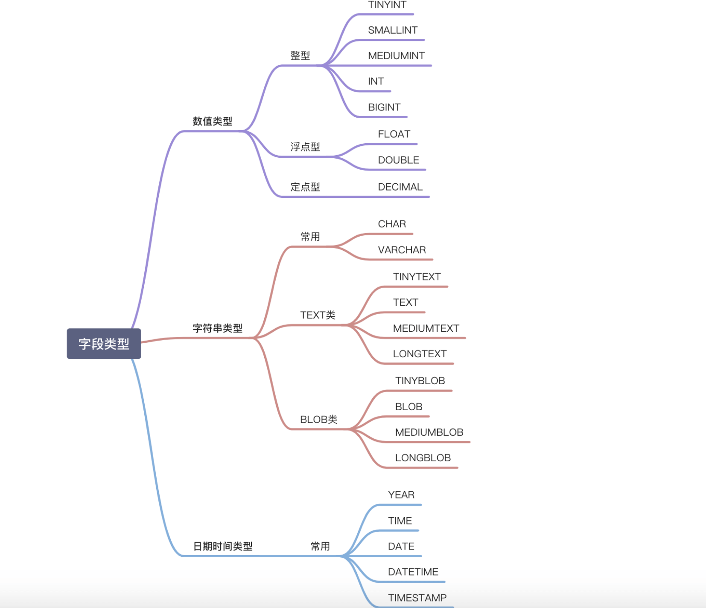\n\n\n\n

### [NULL 和 '' 的区别是什么？](<https://javaguide.cn/database/mysql/mysql-questions-01.html#null-%E5%92%8C-%E7%9A%84%E5%8C%BA%E5%88%AB%E6%98%AF%E4%BB%80%E4%B9%88>)

\n\n\n\n

`NULL` 和 `''` (空字符串) 是两个完全不同的值，它们分别表示不同的含义，并在数据库中有着不同的行为。`NULL` 代表缺失或未知的数据，而 `''` 表示一个已知存在的空字符串。它们的主要区别如下：

\n\n\n\n

\n
  1. **含义** :\n\n
     * `NULL` 代表一个不确定的值，它不等于任何值，包括它自身。因此，`SELECT NULL = NULL` 的结果是 `NULL`，而不是 `true` 或 `false`。 `NULL` 意味着缺失或未知的信息。虽然 `NULL` 不等于任何值，但在某些操作中，数据库系统会将 `NULL` 值视为相同的类别进行处理，例如：`DISTINCT`,`GROUP BY`,`ORDER BY`。需要注意的是，这些操作将 `NULL` 值视为相同的类别进行处理，并不意味着 `NULL` 值之间是相等的。 它们只是在特定操作中被特殊处理，以保证结果的正确性和一致性。 这种处理方式是为了方便数据操作，而不是改变了 `NULL` 的语义。
\n\n\n\n
     * `''` 表示一个空字符串，它是一个已知的值。
\n\n
\n\n\n\n
  2. **存储空间** :\n\n
     * `NULL` 的存储空间占用取决于数据库的实现，通常需要一些空间来标记该值为空。
\n\n\n\n
     * `''` 的存储空间占用通常较小，因为它只存储一个空字符串的标志，不需要存储实际的字符。
\n\n
\n\n\n\n
  3. **比较运算** :\n\n
     * 任何值与 `NULL` 进行比较（例如 `=`, `!=`, `>`, `<` 等）的结果都是 `NULL`，表示结果不确定。要判断一个值是否为 `NULL`，必须使用 `IS NULL` 或 `IS NOT NULL`。
\n\n\n\n
     * `''` 可以像其他字符串一样进行比较运算。例如，`'' = ''` 的结果是 `true`。
\n\n
\n\n\n\n
  4. **聚合函数** :\n\n
     * 大多数聚合函数（例如 `SUM`, `AVG`, `MIN`, `MAX`）会忽略 `NULL` 值。
\n\n\n\n
     * `COUNT(*)` 会统计所有行数，包括包含 `NULL` 值的行。`COUNT(列名)` 会统计指定列中非 `NULL` 值的行数。
\n\n\n\n
     * 空字符串 `''` 会被聚合函数计算在内。例如，`SUM` 会将其视为 0，`MIN` 和 `MAX` 会将其视为一个空字符串。
\n\n
\n
\n\n\n\n

### [MySQL 基础架构](<https://javaguide.cn/database/mysql/mysql-questions-01.html#mysql-%E5%9F%BA%E7%A1%80%E6%9E%B6%E6%9E%84>)

\n\n\n\n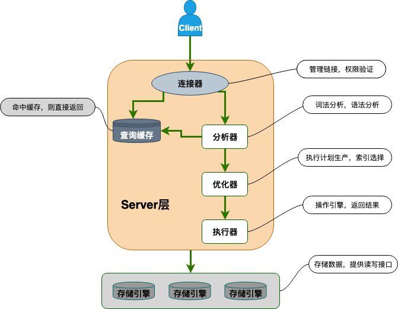\n\n\n\n

从上图可以看出， MySQL 主要由下面几部分构成：

\n\n\n\n

\n
  * **连接器：**  身份认证和权限相关(登录 MySQL 的时候)。
\n\n\n\n
  * **查询缓存：**  执行查询语句的时候，会先查询缓存（MySQL 8.0 版本后移除，因为这个功能不太实用）。
\n\n\n\n
  * **分析器：**  没有命中缓存的话，SQL 语句就会经过分析器，分析器说白了就是要先看你的 SQL 语句要干嘛，再检查你的 SQL 语句语法是否正确。
\n\n\n\n
  * **优化器：**  按照 MySQL 认为最优的方案去执行。
\n\n\n\n
  * **执行器：**  执行语句，然后从存储引擎返回数据。 执行语句之前会先判断是否有权限，如果没有权限的话，就会报错。
\n\n\n\n
  * **插件式存储引擎** ：主要负责数据的存储和读取，采用的是插件式架构，支持 InnoDB、MyISAM、Memory 等多种存储引擎。InnoDB 是 MySQL 的默认存储引擎，绝大部分场景使用 InnoDB 就是最好的选择。
\n
\n\n\n\n\n
  * InnoDB 支持行级别的锁粒度，MyISAM 不支持，只支持表级别的锁粒度。
\n\n\n\n
  * MyISAM 不提供事务支持。InnoDB 提供事务支持，实现了 SQL 标准定义了四个隔离级别。
\n\n\n\n
  * MyISAM 不支持外键，而 InnoDB 支持。
\n\n\n\n
  * MyISAM 不支持 MVCC，而 InnoDB 支持。
\n\n\n\n
  * 虽然 MyISAM 引擎和 InnoDB 引擎都是使用 B+Tree 作为索引结构，但是两者的实现方式不太一样。
\n\n\n\n
  * MyISAM 不支持数据库异常崩溃后的安全恢复，而 InnoDB 支持。
\n\n\n\n
  * InnoDB 的性能比 MyISAM 更强大。
\n
\n\n\n\n

## 索引为什么用B+树

\n\n\n\n

[MySQL 索引：索引为什么使用 B+树？](<https://www.yuque.com/snailclimb/mf2z3k/wghadf>)

\n\n\n\n

B+树与 B 树相比，有以下优势：

\n\n\n\n

●更少的 IO 次数：B+树的非叶节点只包含键，而不包含真实数据，因此每个节点存储的记录个数比 B 数多很多（即阶 m 更大），因此 B+树的高度更低，访问时所需要的 IO 次数更少。此外，由于每个节点存储的记录数更多，所以对访问局部性原理的利用更好，缓存命中率更高。  
●更适于范围查询：在 B 树中进行范围查询时，首先找到要查找的下限，然后对 B 树进行中序遍历，直到找到查找的上限；而 B+树的范围查询，只需要对链表进行遍历即可。  
●更稳定的查询效率：B 树的查询时间复杂度在 1 到树高之间(分别对应记录在根节点和叶节点)，而 B+树的查询复杂度则稳定为树高，因为所有数据都在叶节点。

\n\n\n\n

## MySQL的事务

\n\n\n\n

**何为事务？**  一言蔽之，**事务是逻辑上的一组操作，要么都执行，要么都不执行。**

\n\n\n\n

**那数据库事务有什么作用呢？**

\n\n\n\n

简单来说，数据库事务可以保证多个对数据库的操作（也就是 SQL 语句）构成一个逻辑上的整体。构成这个逻辑上的整体的这些数据库操作遵循：**要么全部执行成功,要么全部不执行**  。

\n\n\n\n
    
    
    # 开启一个事务\nSTART TRANSACTION;\n# 多条 SQL 语句\nSQL1,SQL2...\n## 提交事务\nCOMMIT;

\n\n\n\n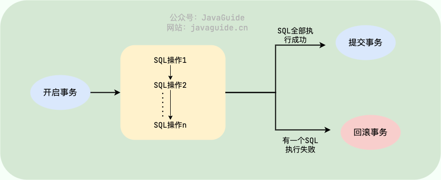\n\n\n\n

\n
  1. **原子性** （`Atomicity`）：事务是最小的执行单位，不允许分割。事务的原子性确保动作要么全部完成，要么完全不起作用；
\n\n\n\n
  2. **一致性** （`Consistency`）：执行事务前后，数据保持一致，例如转账业务中，无论事务是否成功，转账者和收款人的总额应该是不变的；
\n\n\n\n
  3. **隔离性** （`Isolation`）：并发访问数据库时，一个用户的事务不被其他事务所干扰，各并发事务之间数据库是独立的；
\n\n\n\n
  4. **持久性** （`Durability`）：一个事务被提交之后。它对数据库中数据的改变是持久的，即使数据库发生故障也不应该对其有任何影响。
\n
\n\n\n\n

\n\n\n\n

## 索引

\n\n\n\n

###   
讲讲索引的分类是什么？

\n\n\n\n

MySQL可以按照四个角度来分类索引。

\n\n\n\n

\n
  * 按「数据结构」分类：**B+tree索引、Hash索引、Full-text索引** 。
\n\n\n\n
  * 按「物理存储」分类：**聚簇索引（主键索引）、二级索引（辅助索引）** 。
\n\n\n\n
  * 按「字段特性」分类：**主键索引、唯一索引、普通索引、前缀索引** 。
\n\n\n\n
  * 按「字段个数」分类：**单列索引、联合索引** 。
\n
\n\n\n\n

从物理存储的角度来看，索引分为聚簇索引（主键索引）、二级索引（辅助索引）

\n\n\n\n

在创建表时，创建主键索引的方式如下：

\n\n\n\n
    
    
    CREATE TABLE table_name  (\n  ....\n  PRIMARY KEY (index_column_1) USING BTREE\n);

\n\n\n\n

从字段个数的角度来看，索引分为单列索引、联合索引（复合索引）。

\n\n\n\n

\n
  * 建立在单列上的索引称为单列索引，比如主键索引；
\n\n\n\n
  * 建立在多列上的索引称为联合索引；
\n
\n\n\n\n

通过将多个字段组合成一个索引，该索引就被称为联合索引。

\n\n\n\n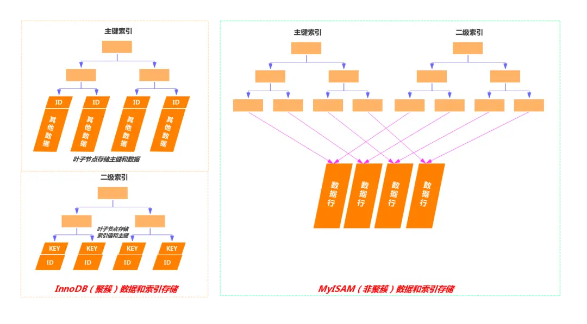\n\n\n\n

### 聚簇索引和非聚簇索引

\n\n\n\n

如上图，其主要区别在于，聚簇索引的叶子节点存的是数据本身，而非聚簇索引的叶子结点存的是指向数据的指针或者主键值。

\n\n\n\n

\n
  * **数据存储** ：在聚簇索引中，数据行按照索引键值的顺序存储，也就是说，索引的叶子节点包含了实际的数据行。这意味着索引结构本身就是数据的物理存储结构。非聚簇索引的叶子节点不包含完整的数据行，而是包含指向数据行的指针或主键值。数据行本身存储在聚簇索引中。
\n\n\n\n
  * **索引与数据关系** ：由于数据与索引紧密相连，当通过聚簇索引查找数据时，可以直接从索引中获得数据行，而不需要额外的步骤去查找数据所在的位置。当通过非聚簇索引查找数据时，首先在非聚簇索引中找到对应的主键值，然后通过这个主键值回溯到聚簇索引中查找实际的数据行，这个过程称为“回表”。
\n\n\n\n
  * **唯一性** ：聚簇索引通常是基于主键构建的，因此每个表只能有一个聚簇索引，因为数据只能有一种物理排序方式。一个表可以有多个非聚簇索引，因为它们不直接影响数据的物理存储位置。
\n\n\n\n
  * **效率** ：对于范围查询和排序查询，聚簇索引通常更有效率，因为它避免了额外的寻址开销。非聚簇索引在使用覆盖索引进行查询时效率更高，因为它不需要读取完整的数据行。但是需要进行回表的操作，使用非聚簇索引效率比较低，因为需要进行额外的回表操作。
\n
\n\n\n\n\n
  * 如果更新的数据是非索引数据，也就是普通的用户记录，那么存储结构是不会发生变化
\n\n\n\n
  * 如果更新的数据是索引数据，那么存储结构是有变化的，因为要维护 b+树的有序性
\n
\n\n\n\n

### 什么字段适合做主键？

\n\n\n\n

\n
  * 字段具有唯一性，且不能为空的特性
\n\n\n\n
  * 字段最好的是有递增的趋势的，如果字段的值是随机无序的，可能会引发页分裂的问题，造型性能影响。
\n\n\n\n
  * 不建议用业务数据作为主键，比如会员卡号、订单号、学生号之类的，因为我们无法预测未来会不会因为业务需要，而出现业务字段重复或者重用的情况。
\n\n\n\n
  * 通常情况下会用自增字段来做主键，对于单机系统来说是没问题的。但是，如果有多台服务器，各自都可以录入数据，那就不一定适用了。因为如果每台机器各自产生的数据需要合并，就可能会出现主键重复的问题，这时候就需要考虑分布式 id 的方案了。
\n
\n\n\n\n

不建议针对性别字段加索引。

\n\n\n\n

实际上与索引创建规则之一区分度有关，性别字段假设有100w数据，50w男、50w女，区别度几乎等于 0 。

\n\n\n\n

区分度的计算方式 ：select count(DISTINCT sex)/count(*) from sys_user

\n\n\n\n

实际上对于性别字段不适合创建索引，是因为select * 操作，还得进行50w次回表操作，根据主键从聚簇索引中找到其他字段 ，这一部分开销从上面的测试来说还是比较大的，所以从性能角度来看不建议性别字段加索引，加上索引并不是索引失效，而是回表操作使得变慢的。

\n\n\n\n

既然走索引的查询的成本比全表扫描高，优化器就会选择全表扫描的方向进行查询，这时候建立的性别字段索引就没有启到加快查询的作用，反而还因为创建了索引占用了空间。

\n\n\n\n

## B＋树的好处

\n\n\n\n

B 树和 B+ 都是通过多叉树的方式，会将树的高度变矮，所以这两个数据结构非常适合检索存于磁盘中的数据。

\n\n\n\n

但是 MySQL 默认的存储引擎 InnoDB 采用的是 B+ 作为索引的数据结构，原因有：

\n\n\n\n

\n
  * B+ 树的非叶子节点不存放实际的记录数据，仅存放索引，因此数据量相同的情况下，相比存储即存索引又存记录的 B 树，B+树的非叶子节点可以存放更多的索引，因此 B+ 树可以比 B 树更「矮胖」，查询底层节点的磁盘 I/O次数会更少。
\n\n\n\n
  * B+ 树有大量的冗余节点（所有非叶子节点都是冗余索引），这些冗余索引让 B+ 树在插入、删除的效率都更高，比如删除根节点的时候，不会像 B 树那样会发生复杂的树的变化；
\n\n\n\n
  * B+ 树叶子节点之间用链表连接了起来，有利于范围查询，而 B 树要实现范围查询，因此只能通过树的遍历来完成范围查询，这会涉及多个节点的磁盘 I/O 操作，范围查询效率不如 B+ 树。
\n
\n\n\n\n

建立联合索引时的字段顺序，对索引效率也有很大影响。越靠前的字段被用于索引过滤的概率越高，实际开发工作中**建立联合索引时，要把区分度大的字段排在前面，这样区分度大的字段越有可能被更多的 SQL 使用到** 。

\n\n\n\n

### 索引失效的情况：

\n\n\n\n

\n
  * 当我们使用左或者左右模糊匹配的时候，也就是 like %xx 或者 like %xx%这两种方式都会造成索引失效；
\n\n\n\n
  * 当我们在查询条件中对索引列使用函数，就会导致索引失效。
\n\n\n\n
  * 当我们在查询条件中对索引列进行表达式计算，也是无法走索引的。
\n\n\n\n
  * MySQL 在遇到字符串和数字比较的时候，会自动把字符串转为数字，然后再进行比较。如果字符串是索引列，而条件语句中的输入参数是数字的话，那么索引列会发生隐式类型转换，由于隐式类型转换是通过 CAST 函数实现的，等同于对索引列使用了函数，所以就会导致索引失效。
\n\n\n\n
  * 联合索引要能正确使用需要遵循最左匹配原则，也就是按照最左优先的方式进行索引的匹配，否则就会导致索引失效。
\n\n\n\n
  * 在 WHERE 子句中，如果在 OR 前的条件列是索引列，而在 OR 后的条件列不是索引列，那么索引会失效。
\n
\n\n\n\n

**如果查询的数据不在二级索引里，就会先检索二级索引，找到对应的叶子节点，获取到主键值后，然后再检索主键索引，就能查询到数据了，这个过程就是回表** 。

\n\n\n\n

覆盖索引的含义：

\n\n\n\n

覆盖索引是指一个索引包含了查询所需的所有列，因此不需要访问表中的数据行就能完成查询。

\n\n\n\n

## 数据库的几种连接

\n\n\n\n连接类型| 描述| 核心特点  
---|---|---  
**INNER JOIN**|  返回两个表**匹配成功** 的行| 默认连接方式  
**LEFT JOIN**|  返回左表**所有行**  \+ 右表**匹配的行** （不匹配的右表字段显示为 `NULL`）| 左表为主，右表补充  
**RIGHT JOIN**|  返回右表**所有行**  \+ 左表**匹配的行** （不匹配的左表字段显示为 `NULL`）| 右表为主，左表补充  
**FULL OUTER JOIN**|  返回两个表**所有行** （不匹配的字段均显示为 `NULL`）| 合并左右表所有数据  
\n\n\n\n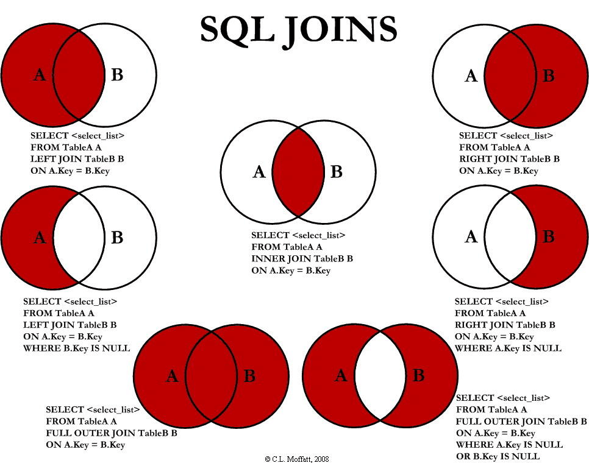\n\n\n\n

### example

\n\n\n\n

#### 1️⃣ **employees 表**

\n\n\n\nid| name| department_id  
---|---|---  
1| Alice| 1  
2| Bob| 1  
3| Charlie| 2  
4| David| NULL  
\n\n\n\n

#### 2️⃣ **departments 表**

\n\n\n\nid| name  
---|---  
1| Engineering  
2| Marketing  
3| HR  
\n\n\n\n

### left join

\n\n\n\n
    
    
    SELECT * \nFROM employees\nLEFT JOIN departments \nON employees.department_id = departments.id;

\n\n\n\nid| name| department_id| id| name  
---|---|---|---|---  
1| Alice| 1| 1| Engineering  
2| Bob| 1| 1| Engineering  
3| Charlie| 2| 2| Marketing  
4| David| NULL| NULL| NULL  
\n\n\n\n

### right join

\n\n\n\n
    
    
    SELECT * \nFROM employees\nRIGHT JOIN departments \nON employees.department_id = departments.id;

\n\n\n\nid| name| department_id| id| name  
---|---|---|---|---  
1| Alice| 1| 1| Engineering  
2| Bob| 1| 1| Engineering  
3| Charlie| 2| 2| Marketing  
NULL| NULL| NULL| 3| HR  
\n\n\n\n

### FULL OUTER JOIN（全连接）

\n\n\n\n

（在 MySQL 中需用 `UNION` 模拟）：

\n\n\n\n
    
    
    SELECT * FROM employees LEFT JOIN departments ON employees.department_id = departments.id\nUNION\nSELECT * FROM employees RIGHT JOIN departments ON employees.department_id = departments.id;

\n\n\n\nid| name| department_id| id| name  
---|---|---|---|---  
1| Alice| 1| 1| Engineering  
2| Bob| 1| 1| Engineering  
3| Charlie| 2| 2| Marketing  
4| David| NULL| NULL| NULL  
NULL| NULL| NULL| 3| HR  
\n\n\n\n

### in和exist的差别

\n\n\n\n

当使用 IN 时，MySQL 会首先执行子查询，然后将子查询的结果集用于外部查询的条件。这意味着子查询的结果集需要全部加载到内存中。

\n\n\n\n

而 EXISTS 会对外部查询的每一行，执行一次子查询。如果子查询返回任何行，则 `EXISTS` 条件为真。`EXISTS` 关注的是子查询是否返回行，而不是返回的具体值。

\n\n\n\n
    
    
    -- IN 的临时表可能成为性能瓶颈\nSELECT * FROM users \nWHERE id IN (SELECT user_id FROM orders WHERE amount > 100);\n\n-- EXISTS 可以利用关联索引\nSELECT * FROM users u\nWHERE EXISTS (SELECT 1 FROM orders o \n            WHERE o.user_id = u.id AND o.amount > 100);

\n\n\n\n

## 事务

\n\n\n\n

### 事务的特性：（ACID）

\n\n\n\n

\n
  * **原子性（Atomicity）** ：一个事务中的所有操作，要么全部完成，要么全部不完成，不会结束在中间某个环节，而且事务在执行过程中发生错误，会被回滚到事务开始前的状态，就像这个事务从来没有执行过一样，就好比买一件商品，购买成功时，则给商家付了钱，商品到手；购买失败时，则商品在商家手中，消费者的钱也没花出去。
\n\n\n\n
  * **一致性（Consistency）** ：是指事务操作前和操作后，数据满足完整性约束，数据库保持一致性状态。比如，用户 A 和用户 B 在银行分别有 800 元和 600 元，总共 1400 元，用户 A 给用户 B 转账 200 元，分为两个步骤，从 A 的账户扣除 200 元和对 B 的账户增加 200 元。一致性就是要求上述步骤操作后，最后的结果是用户 A 还有 600 元，用户 B 有 800 元，总共 1400 元，而不会出现用户 A 扣除了 200 元，但用户 B 未增加的情况（该情况，用户 A 和 B 均为 600 元，总共 1200 元）。
\n\n\n\n
  * **隔离性（Isolation）** ：数据库允许多个并发事务同时对其数据进行读写和修改的能力，隔离性可以防止多个事务并发执行时由于交叉执行而导致数据的不一致，因为多个事务同时使用相同的数据时，不会相互干扰，每个事务都有一个完整的数据空间，对其他并发事务是隔离的。也就是说，消费者购买商品这个事务，是不影响其他消费者购买的。
\n\n\n\n
  * **持久性（Durability）** ：事务处理结束后，对数据的修改就是永久的，即便系统故障也不会丢失。
\n
\n\n\n\n\n
  * **持久性是通过 redo log （重做日志）来保证的；**
\n\n\n\n
  * **原子性是通过 undo log（回滚日志） 来保证的；**
\n\n\n\n
  * **隔离性是通过 MVCC（多版本并发控制） 或锁机制来保证的；**
\n\n\n\n
  * **一致性则是通过持久性+原子性+隔离性来保证；**
\n
\n\n\n\n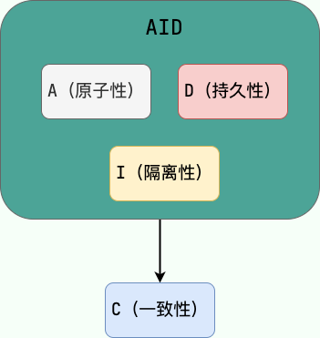\n\n\n\n

### 并发事务造成的问题

\n\n\n\n

#### 脏读

\n\n\n\n

一个事务读取数据并且对数据进行了修改，这个修改对其他事务来说是可见的，即使当前事务没有提交。这时另外一个事务读取了这个还未提交的数据，但第一个事务突然回滚，导致数据并没有被提交到数据库，那第二个事务读取到的就是脏数据，这也就是脏读的由来。

\n\n\n\n

#### 修改丢失

\n\n\n\n

在一个事务读取一个数据时，另外一个事务也访问了该数据，那么在第一个事务中修改了这个数据后，第二个事务也修改了这个数据。这样第一个事务内的修改结果就被丢失，因此称为丢失修改。

\n\n\n\n

例如：事务 1 读取某表中的数据 A=20，事务 2 也读取 A=20，事务 1 先修改 A=A-1，事务 2 后来也修改 A=A-1，最终结果 A=19，事务 1 的修改被丢失。

\n\n\n\n

#### 不可重复读

\n\n\n\n

指在一个事务内多次读同一数据。在这个事务还没有结束时，另一个事务也访问该数据。那么，在第一个事务中的两次读数据之间，由于第二个事务的修改导致第一个事务两次读取的数据可能不太一样。这就发生了在一个事务内两次读到的数据是不一样的情况，因此称为不可重复读。

\n\n\n\n

例如：事务 1 读取某表中的数据 A=20，事务 2 也读取 A=20，事务 1 修改 A=A-1，事务 2 再次读取 A =19，此时读取的结果和第一次读取的结果不同。

\n\n\n\n

#### 幻读

\n\n\n\n

幻读与不可重复读类似。它发生在一个事务读取了几行数据，接着另一个并发事务插入了一些数据时。在随后的查询中，第一个事务就会发现多了一些原本不存在的记录，就好像发生了幻觉一样，所以称为幻读。

\n\n\n\n

例如：事务 2 读取某个范围的数据，事务 1 在这个范围插入了新的数据，事务 2 再次读取这个范围的数据发现相比于第一次读取的结果多了新的数据。

\n\n\n\n

**TIP：不可重复读的重点是内容修改或者记录减少比如多次读取一条记录发现其中某些记录的值被修改；幻读的重点在于记录新增比如多次执行同一条查询语句（DQL）时，发现查到的记录增加了。**

\n\n\n\n

### 并发事务的控制方式

\n\n\n\n

MySQL 中并发事务的控制方式无非就两种：**锁** 和 **MVCC** 。锁可以看作是悲观控制的模式，多版本并发控制（MVCC，Multiversion concurrency control）可以看作是乐观控制的模式。

\n\n\n\n

读写锁可以做到读读并行，但是无法做到写读、写写并行。另外，根据根据锁粒度的不同，又被分为 **表级锁(table-level locking)** 和 **行级锁(row-level locking)** 。InnoDB 不光支持表级锁，还支持行级锁，默认为行级锁。行级锁的粒度更小，仅对相关的记录上锁即可（对一行或者多行记录加锁），所以对于并发写入操作来说， InnoDB 的性能更高。不论是表级锁还是行级锁，都存在共享锁（Share Lock，S 锁）和排他锁（Exclusive Lock，X 锁）这两类。

\n\n\n\n

#### MVCC

\n\n\n\n

MVCC 是一种并发控制机制，用于在多个并发事务同时读写数据库时保持数据的一致性和隔离性。它是通过在每个数据行上维护多个版本的数据来实现的。当一个事务要对数据库中的数据进行修改时，MVCC 会为该事务创建一个数据快照，而不是直接修改实际的数据行。

\n\n\n\n

1.**读操作（SELECT）：**

\n\n\n\n

当一个事务执行读操作时，它会使用快照读取。快照读取是基于事务开始时数据库中的状态创建的，因此事务不会读取其他事务尚未提交的修改。具体工作情况如下：

\n\n\n\n

\n
  * 对于读取操作，事务会查找符合条件的数据行，并选择符合其事务开始时间的数据版本进行读取。
\n\n\n\n
  * 如果某个数据行有多个版本，事务会选择不晚于其开始时间的最新版本，确保事务只读取在它开始之前已经存在的数据。
\n\n\n\n
  * 事务读取的是快照数据，因此其他并发事务对数据行的修改不会影响当前事务的读取操作。
\n
\n\n\n\n

**2.写操作（INSERT、UPDATE、DELETE）：**

\n\n\n\n

当一个事务执行写操作时，它会生成一个新的数据版本，并将修改后的数据写入数据库。具体工作情况如下：

\n\n\n\n

\n
  * 对于写操作，事务会为要修改的数据行创建一个新的版本，并将修改后的数据写入新版本。
\n\n\n\n
  * 新版本的数据会带有当前事务的版本号，以便其他事务能够正确读取相应版本的数据。
\n\n\n\n
  * 原始版本的数据仍然存在，供其他事务使用快照读取，这保证了其他事务不受当前事务的写操作影响。
\n
\n\n\n\n

**3、事务提交和回滚：**

\n\n\n\n

\n
  * 当一个事务提交时，它所做的修改将成为数据库的最新版本，并且对其他事务可见。
\n\n\n\n
  * 当一个事务回滚时，它所做的修改将被撤销，对其他事务不可见。
\n
\n\n\n\n

**4、版本的回收：**

\n\n\n\n

为了防止数据库中的版本无限增长，MVCC 会定期进行版本的回收。回收机制会删除已经不再需要的旧版本数据，从而释放空间。

\n\n\n\n

MVCC 通过创建数据的多个版本和使用快照读取来实现并发控制。读操作使用旧版本数据的快照，写操作创建新版本，并确保原始版本仍然可用。这样，不同的事务可以在一定程度上并发执行，而不会相互干扰，从而提高了数据库的并发性能和数据一致性。

\n\n\n\n

### 讲一下mysql里有哪些锁？

\n\n\n\n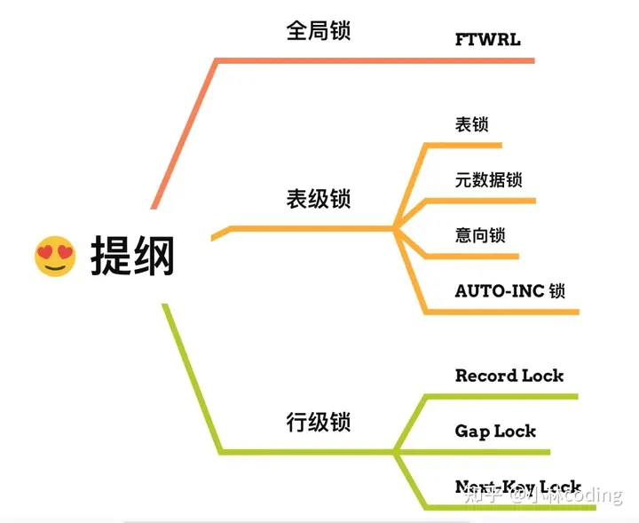\n\n\n\n

**全局锁** ：通过flush tables with read lock 语句会将整个数据库就处于只读状态了，这时其他线程执行以下操作，增删改或者表结构修改都会阻塞。全局锁主要应用于做**全库逻辑备份** ，这样在备份数据库期间，不会因为数据或表结构的更新，而出现备份文件的数据与预期的不一样。

\n\n\n\n

**表级锁** ：MySQL 里面表级别的锁有这几种：

\n\n\n\n

\n
  * 表锁：通过lock tables 语句可以对表加表锁，表锁除了会限制别的线程的读写外，也会限制本线程接下来的读写操作。
\n\n\n\n
  * 元数据锁：当我们对数据库表进行操作时，会自动给这个表加上 MDL，对一张表进行 CRUD 操作时，加的是 **MDL 读锁** ；对一张表做结构变更操作的时候，加的是 **MDL 写锁** ；MDL 是为了保证当用户对表执行 CRUD 操作时，防止其他线程对这个表结构做了变更。
\n\n\n\n
  * 意向锁：当执行插入、更新、删除操作，需要先对表加上「意向独占锁」，然后对该记录加独占锁。**意向锁的目的是为了快速判断表里是否有记录被加锁** 。
\n
\n\n\n\n\n
  * **行级锁** ：InnoDB 引擎是支持行级锁的，而 MyISAM 引擎并不支持行级锁。
\n\n\n\n
  * 记录锁，锁住的是一条记录。而且记录锁是有 S 锁和 X 锁之分的，满足读写互斥，写写互斥
\n\n\n\n
  * 间隙锁，只存在于可重复读隔离级别，目的是为了解决可重复读隔离级别下幻读的现象。
\n\n\n\n
  * Next-Key Lock 称为临键锁，是 Record Lock + Gap Lock 的组合，锁定一个范围，并且锁定记录本身。
\n
\n\n\n\n

### 数据库的表锁和行锁有什么作用？

\n\n\n\n

表锁的作用：

\n\n\n\n

\n
  * **整体控制** ：表锁可以用来控制整个表的并发访问，当一个事务获取了表锁时，其他事务无法对该表进行任何读写操作，从而确保数据的完整性和一致性。
\n\n\n\n
  * **粒度大** ：表锁的粒度比较大，在锁定表的情况下，可能会影响到整个表的其他操作，可能会引起锁竞争和性能问题。
\n\n\n\n
  * **适用于大批量操作** ：表锁适合于需要大批量操作表中数据的场景，例如表的重建、大量数据的加载等。
\n
\n\n\n\n

行锁的作用：

\n\n\n\n

\n
  * **细粒度控制** ：行锁可以精确控制对表中某行数据的访问，使得其他事务可以同时访问表中的其他行数据，在并发量大的系统中能够提高并发性能。
\n\n\n\n
  * **减少锁冲突** ：行锁不会像表锁那样造成整个表的锁冲突，减少了锁竞争的可能性，提高了并发访问的效率。
\n\n\n\n
  * **适用于频繁单行操作** ：行锁适合于需要频繁对表中单独行进行操作的场景，例如订单系统中的订单修改、删除等操作。
\n
\n\n\n\n

\n