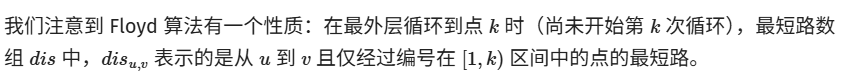
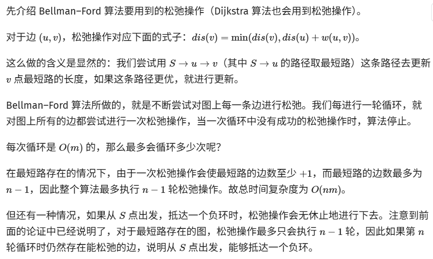
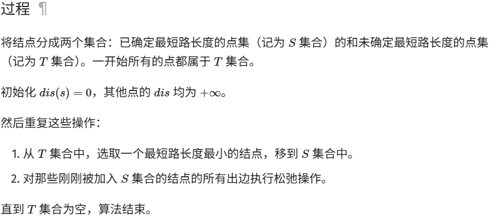

## TrieTree[(前缀树)](<https://leetcode.cn/problems/implement-trie-prefix-tree/>)

**[Trie](<https://baike.baidu.com/item/%E5%AD%97%E5%85%B8%E6%A0%91/9825209?fr=aladdin>)** （发音类似 "try"）或者说 **前缀树**  是一种树形数据结构，用于高效地存储和检索字符串数据集中的键。这一数据结构有相当多的应用情景，例如自动补全和拼写检查。

    
    package DSA;
class TrieNode{
    private char c;
    private boolean isEnd;
    private TrieNode[] children;
    private static final int ALPHABET_SIZE = 26;
    public TrieNode(){
        this.children = new TrieNode[ALPHABET_SIZE];
        this.isEnd = false;
    }
    public TrieNode(char c){
        this();
        this.c = c;
    }
    public boolean isStartWith(char c){
        return this.c == c;
    }
    public boolean isEnd(){
        return this.isEnd;
    }
    public TrieNode[] getChildren(){
        return this.children;
    }
    public void setEnd(boolean isEnd){
        this.isEnd = isEnd;
    }
}
public class TrieTree {
    TrieNode root;
    public TrieTree(){
        this.root = new TrieNode();
    }
    public void insert(String word){
        TrieNode cur = root;
        for(char c:word.toCharArray()){
            int index = c - 'a';
            if(cur.getChildren()[index] == null){
                cur.getChildren()[index] = new TrieNode(c);
            }
            cur = cur.getChildren()[index];
        }
        cur.setEnd(true);
    }
    public boolean search(String word){
        TrieNode cur = root;
        for(char c:word.toCharArray()){
            int index = c - 'a';
            if(cur.getChildren()[index] == null){
                System.out.println("Not Found");
                return false;
            }
            cur = cur.getChildren()[index];
        }
        return cur.isEnd();
    }
    public boolean startsWith(String prefix){
        TrieNode cur = root;
        for(char c:prefix.toCharArray()){
            int index = c - 'a';
            if(cur.getChildren()[index] == null){
                System.out.println("Not Found");
                return false;
            }
            cur = cur.getChildren()[index];
        }
        return true;
    }
    public static void main(String[] args){
        TrieTree trie = new TrieTree();
        trie.insert("apple");
        System.out.println(trie.search("apple"));   // returns true
        System.out.println(trie.search("app"));     // returns false
        System.out.println(trie.startsWith("app")); // returns true
        trie.insert("app");
        System.out.println(trie.search("app"));     // returns true
    }
}

## LRU cache

LRU是Least Recently Used的缩写，即最近最少使用，是一种常用的[页面置换算法](<https://baike.baidu.com/item/%E9%A1%B5%E9%9D%A2%E7%BD%AE%E6%8D%A2%E7%AE%97%E6%B3%95/7626091?fromModule=lemma_inlink>)，选择最近最久未使用的页面予以淘汰。该算法赋予每个[页面](<https://baike.baidu.com/item/%E9%A1%B5%E9%9D%A2/5544813?fromModule=lemma_inlink>)一个访问字段，用来记录一个页面自上次被访问以来所经历的时间 t，当须淘汰一个页面时，选择现有页面中其 t 值最大的，即最近最少使用的页面予以淘汰。对应的，这里的cache就是采用lru策略的一个缓存系统。

    
    package DSA;
import java.util.HashMap;
import java.util.Map;
class ListNode<T>{
    public T val;
    public int key;
    ListNode<T> next;
    ListNode<T> before;
    public ListNode(int key, T val){
        this.key = key;
        this.val = val;
    }
    public ListNode(int key, T val, ListNode<T> next){
        this.key = key;
        this.val = val;
        this.next = next;
    }
    public ListNode(int key, T val, ListNode<T> next, ListNode<T> before){
        this.key = key;
        this.val = val;
        this.next = next;
        this.before = before;
    }
}
public class LRUcache<T> {
    private Map<Integer,ListNode<T>> map = new HashMap<>();
    ListNode<T> head;
    ListNode<T> tail;
    int capacity;
    public LRUcache(){
        this.head = new ListNode<T>(0, null);
        this.tail = new ListNode<T>(0, null);
        this.head.next = tail;
        this.tail.before = head;
        this.capacity = 0;
    }
    public LRUcache(int capacity){
        this.head = new ListNode<T>(0, null);
        this.tail = new ListNode<T>(0, null);
        this.head.next = tail;
        this.tail.before = head;
        this.capacity = capacity;
    }
    public void put(int key,T val){
        if(map.containsKey(key)){
            ListNode<T> node = map.get(key);
            node.val = val;
            removeNode(node);
            moveToHead(node);
            return;
        }
        map.put(key, new ListNode<T>(key, val));
        if(map.size() > capacity){
            ListNode<T> node = tail.before;
            map.remove(node.key);
            tail.before = node.before;
            node.before.next = tail;
        }
        moveToHead(map.get(key));
    }
    public T get(int key){
        if(map.containsKey(key)){
            ListNode<T> node = map.get(key);
            removeNode(node);
            moveToHead(node);
            return node.val;
        }else{
            return null;
        }
    }

    void moveToHead(ListNode<T> node){
        if(head.next == node){
            return;
        }
        node.before = head;
        node.next = head.next;
        head.next.before = node;
        head.next = node;
    }
    void removeNode(ListNode<T> node){
        node.before.next = node.next;
        node.next.before = node.before;
    }
    public int size(){
        return map.size();
    }
    public void print(){
        ListNode<T> cur = head.next;
        while(cur != tail){
            System.out.print(cur.key + " ");
            cur = cur.next;
        }
        System.out.println();
    }
    public static void main(String[] args) {
        LRUcache<String> cache = new LRUcache<>(3);
        cache.put(1, "haha1");
        cache.put(2, "haha2");
        cache.put(3, "haha3");
        cache.print(); // 1 2 3
        System.out.println(cache.get(3)); // haha3
        cache.put(4, "haha4");
        cache.print(); // 2 3 4
        System.out.println(cache.get(1)); // null
    }
}

## 最短路径Algorithm

### Floyd算法

是用来求任意两个结点之间的最短路的。

复杂度比较高，但是常数小，容易实现（只有三个 `for`）。

适用于任何图，不管有向无向，边权正负，但是最短路必须存在。（不能有个负环）

我们定义一个数组 `f[k][x][y]`，表示只允许经过结点  到 （也就是说，在子图  中的路径，注意， 与  不一定在这个子图中），结点  到结点  的最短路长度。

很显然，`f[n][x][y]` 就是结点  到结点  的最短路长度（因为  即为  本身，其表示的最短路径就是所求路径）。

    
    for (k = 1; k <= n; k++) {
  for (x = 1; x <= n; x++) {
    for (y = 1; y <= n; y++) {
      f[x][y] = min(f[x][y], f[x][k] + f[k][y]);
    }
  }
}

by the way……

### 最小环（using floyd）

    
    int val[MAXN + 1][MAXN + 1];  // 原图的邻接矩阵
int floyd(const int &n) {
  static int dis[MAXN + 1][MAXN + 1];  // 最短路矩阵
  for (int i = 1; i <= n; ++i)
    for (int j = 1; j <= n; ++j) dis[i][j] = val[i][j];  // 初始化最短路矩阵
  int ans = inf;
  for (int k = 1; k <= n; ++k) {
    for (int i = 1; i < k; ++i)
      for (int j = 1; j < i; ++j)
        ans = std::min(ans, dis[i][j] + val[i][k] + val[k][j]);  // 更新答案
    for (int i = 1; i <= n; ++i)
      for (int j = 1; j <= n; ++j)
        dis[i][j] = std::min(
            dis[i][j], dis[i][k] + dis[k][j]);  // 正常的 floyd 更新最短路矩阵
  }
  return ans;
}

### Bellman–Ford 算法

Bellman–Ford 算法是一种基于松弛（relax）操作的最短路算法，可以求出有负权的图的最短路，并可以对最短路不存在的情况进行判断。

在国内 OI 界，你可能听说过的「SPFA」，就是 Bellman–Ford 算法的一种实现。

    
    class Edge:
    def __init__(self, u=0, v=0, w=0):
        self.u = u
        self.v = v
        self.w = w

INF = 0x3F3F3F3F
edge = []

def bellmanford(n, s):
    dis = [INF] * (n + 1)
    dis[s] = 0
    for i in range(1, n + 1):
        flag = False
        for e in edge:
            u, v, w = e.u, e.v, e.w
            if dis[u] == INF:
                continue
            # 无穷大与常数加减仍然为无穷大
            # 因此最短路长度为 INF 的点引出的边不可能发生松弛操作
            if dis[v] > dis[u] + w:
                dis[v] = dis[u] + w
                flag = True
        # 没有可以松弛的边时就停止算法
        if not flag:
            break
    # 第 n 轮循环仍然可以松弛时说明 s 点可以抵达一个负环
    return flag

**队列优化：SPFA**

很多时候我们并不需要那么多无用的松弛操作。

很显然，只有上一次被松弛的结点，所连接的边，才有可能引起下一次的松弛操作。

那么我们用队列来维护「哪些结点可能会引起松弛操作」，就能只访问必要的边了。

    
    struct edge {
  int v, w;
};
vector<edge> e[MAXN];
int dis[MAXN], cnt[MAXN], vis[MAXN];
queue<int> q;
bool spfa(int n, int s) {
  memset(dis, 0x3f, (n + 1) * sizeof(int));
  dis[s] = 0, vis[s] = 1;
  q.push(s);
  while (!q.empty()) {
    int u = q.front();
    q.pop(), vis[u] = 0;
    for (auto ed : e[u]) {
      int v = ed.v, w = ed.w;
      if (dis[v] > dis[u] + w) {
        dis[v] = dis[u] + w;
        cnt[v] = cnt[u] + 1;  // 记录最短路经过的边数
        if (cnt[v] >= n) return false;
        // 在不经过负环的情况下，最短路至多经过 n - 1 条边
        // 因此如果经过了多于 n 条边，一定说明经过了负环
        if (!vis[v]) q.push(v), vis[v] = 1;
      }
    }
  }
  return true;
}

### Dijkstra 算法

两种实现：

    
    struct edge {
  int v, w;
};
vector<edge> e[MAXN];
int dis[MAXN], vis[MAXN];
void dijkstra(int n, int s) {
  memset(dis, 0x3f, (n + 1) * sizeof(int));
  dis[s] = 0;
  for (int i = 1; i <= n; i++) {
    int u = 0, mind = 0x3f3f3f3f;
    for (int j = 1; j <= n; j++)
      if (!vis[j] && dis[j] < mind) u = j, mind = dis[j];
    vis[u] = true;
    for (auto ed : e[u]) {
      int v = ed.v, w = ed.w;
      if (dis[v] > dis[u] + w) dis[v] = dis[u] + w;
    }
  }
}

    
    struct edge {
  int v, w;
};
struct node {
  int dis, u;
  bool operator>(const node& a) const { return dis > a.dis; }
};
vector<edge> e[MAXN];
int dis[MAXN], vis[MAXN];
priority_queue<node, vector<node>, greater<node>> q;
void dijkstra(int n, int s) {
  memset(dis, 0x3f, (n + 1) * sizeof(int));
  memset(vis, 0, (n + 1) * sizeof(int));
  dis[s] = 0;
  q.push({0, s});
  while (!q.empty()) {
    int u = q.top().u;
    q.pop();
    if (vis[u]) continue;
    vis[u] = 1;
    for (auto ed : e[u]) {
      int v = ed.v, w = ed.w;
      if (dis[v] > dis[u] + w) {
        dis[v] = dis[u] + w;
        q.push({dis[v], v});
      }
    }
  }
}

java版本：

    
    import java.util.Scanner;
import java.util.*;
// 注意类名必须为 Main, 不要有任何 package xxx 信息
public class Main {
    // 定义一个静态内部类，用于表示图中的边
    static class Edge {
        int to;     // 边的目标节点
        int weight; // 边的权重
        public Edge(int to, int weight) {
            this.to = to;
            this.weight = weight;
        }
    }
    // Dijkstra 算法主函数
    public static int[] dijkstra(List<List<Edge>> graph, int start) {
        int n = graph.size(); // 节点数量
        int[] dist = new int[n]; // 存储从起点到每个节点的最短距离
        Arrays.fill(dist, Integer.MAX_VALUE); // 初始化为无穷大
        dist[start] = 0; // 起点到自身的距离为 0
        // 使用优先队列（最小堆），按照距离从小到大排序
        PriorityQueue<int[]> pq = new PriorityQueue<>(Comparator.comparingInt(
                    a -> a[1]));
        pq.offer(new int[] {start, 0}); // 将起点加入队列：[节点编号, 当前距离]
        // 主循环
        while (!pq.isEmpty()) {
            int[] current = pq.poll();
            int u = current[0]; // 当前节点
            int currentDist = current[1]; // 当前节点的距离
            // 如果当前距离大于已知的最短距离，则跳过
            if (currentDist > dist[u]) {
                continue;
            }
            // 遍历当前节点的所有邻接边
            for (Edge edge : graph.get(u)) {
                int v = edge.to; // 邻接节点
                int weight = edge.weight; // 边的权重
                int newDist = dist[u] + weight; // 计算新的距离
                // 如果找到更短的路径，更新距离并加入队列
                if (newDist < dist[v]) {
                    dist[v] = newDist;
                    pq.offer(new int[] {v, newDist});
                }
            }
        }
        return dist; // 返回从起点到所有节点的最短距离
    }

    public static void main(String[] args) {
        Scanner in = new Scanner(System.in);
        int n = in.nextInt(), m = in.nextInt(), q = in.nextInt();
        List<List<Edge>> graph = new ArrayList<>();
        int u, v, w;
        for (int i = 0; i <= n; i++){
            graph.add(new ArrayList<>());
        }
        for (int i = 0; i < m; i++) {
            u = in.nextInt();
            v = in.nextInt();
            w = in.nextInt();
            graph.get(u).add(new Edge(v,w));
        }
        int[] dist =dijkstra(graph,1);
        int[] ans = new int[q];
        int ret=0;
        for(int i=0;i<q;i++){
            ret+=2*dist[in.nextInt()];
        }
        System.out.println(ret);
    }
}
