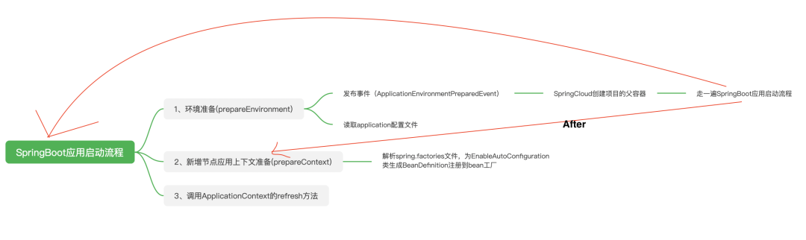
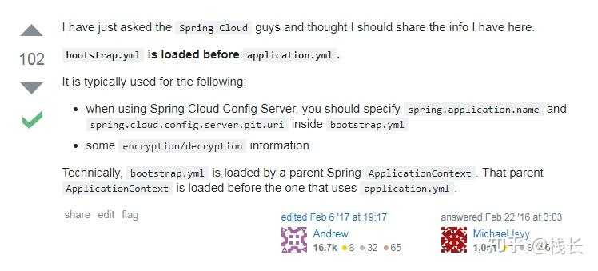

\n

写过SpringBoot应用的都知道，在启动一个springboot应用时，我们通常会上手去写一个application.yml或者application.properties去配置一些启动参数，比如说server.port，datasource相关的一些参数等等。这些参数写在application这个文件中之后，启动时就会自动加载。但最近在我写一些springcloud相关的应用时，发现有类似的bootstrap文件对于springcloud的服务进行配置，不过在一次配置datasource参数失败后，GPT建议我在application文件中再写一遍，发现application.yml的配置对于springcloud同样适用，那么，他们究竟是什么关系呢？如果同时存在的话又是先加载哪一个，覆盖情况如何呢？

\n\n\n\n

在官方的文档中这样写的（参考了知乎博主的手动解释）：

\n\n\n\n

Spring Cloud 构建于 Spring Boot 之上，在 Spring Boot 中有两种上下文，一种是 bootstrap, 另外一种是 application, bootstrap 是应用程序的父上下文，也就是说 bootstrap 加载优先于 applicaton。bootstrap 主要用于从额外的资源来加载配置信息，还可以在本地外部配置文件中解密属性。这两个上下文共用一个环境，它是任何Spring应用程序的外部属性的来源。bootstrap 里面的属性会优先加载，它们默认也不能被本地相同配置覆盖。

\n\n\n\n

**因此，对比 application 配置文件，bootstrap 配置文件具有以下几个特性。**

\n\n\n\n

\n
  * boostrap 由父 ApplicationContext 加载，比 applicaton 优先加载
\n\n\n\n
  * boostrap 里面的属性不能被覆盖
\n
\n\n\n\n

我们先来回顾一下**springboot应用的启动流程：**

\n\n\n\n

第一步：准备环境`Environment`。此时会发送一个`ApplicationEnvironmentPreparedEvent`事件（应用环境准备事件），事件是同步消费的。当事件监听器都被调用完后，`Spring Boot`继续完成环境`Environment`的准备工作，加载`application.yaml`以及所有的`ActiveProfiles`对应的`application-[activeProfile].yaml`配置文件。

\n\n\n\n

第二步：准备`ApplicationContext`容器。我们在`spring.factories`文件中配置的`EnableAutoConfiguration`就是在此时被读取的，并且根据配置的类名加载类，为类生成`BeanDefinition`注册到`bean`工厂中。

\n\n\n\n

第三步：一切准备就绪后再刷新`ApplicationContext`。

\n\n\n\n

**对于SpringCloud 而言，启动顺序是近似的**

\n\n\n\n

`Spring Cloud`项目可以在`spring.factories`配置文件中配置一种`BootstrapConfiguration`类，这与`Spring Boot`提供的`EnableAutoConfiguration`类并没有什么区别，只是它们作用在不同的`ApplicationContext`容器中。

\n\n\n\n

当项目中添加`Spring Cloud`的依赖时，`SpringApplication`的`run`方法启动的就会是两个容器，即两个`ApplicationContext`。原本的应用启动流程也有所变化。

\n\n\n\n

`Spring Cloud`的`BootstrapApplicationListener`监听`ApplicationEnvironmentPreparedEvent`事件，在监听到事件时开启一个新的`ApplicationContext`容器，我们可以称这个`ApplicationContext`容器为`Spring Cloud`的`Bootstrap`容器。

\n\n\n\n

`Bootstrap`容器被用来注册`spring.factories`配置文件中配置的所有`BootstrapConfiguration`，并在`Bootstrap`容器初始化完成后将其`Bean`工厂作为原本`Spring Boot`启动的`ApplicationContext`容器的`Bean`工厂的父工厂。

\n\n\n\n\n\n\n\n

在stackoverflow上也有这样的回答：

\n\n\n\n\n\n\n\n

下面是一个例子： **bootstrap.yml**

\n\n\n\n
    
    
    spring:\n　application:\n　　name: foo\n　　cloud:\n　　config:\n　　uri: ${SPRING_CONFIG_URI:http://localhost:8888}

\n\n\n\n

推荐在`bootstrap.yml` or `application.yml`里面配置`spring.application.name`. 你可以通过设置`spring.cloud.bootstrap.enabled=false`来禁用`bootstrap`。

\n\n\n\n

<https://www.cnblogs.com/cy0628/p/15193872.html>

\n\n\n\n

\n