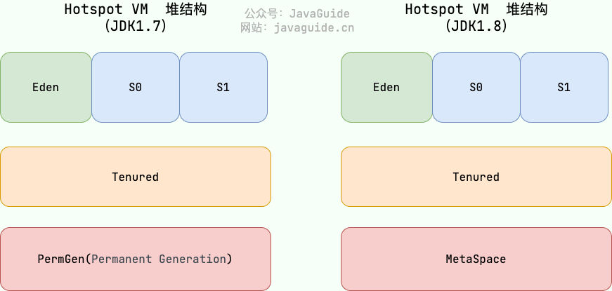
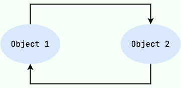
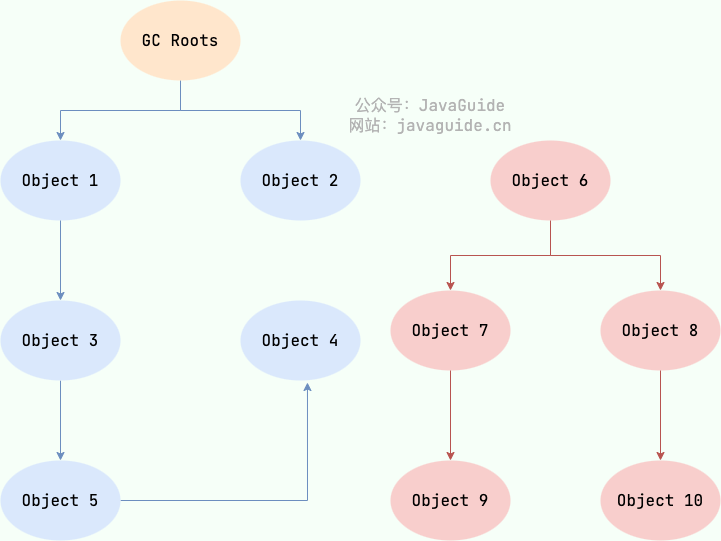
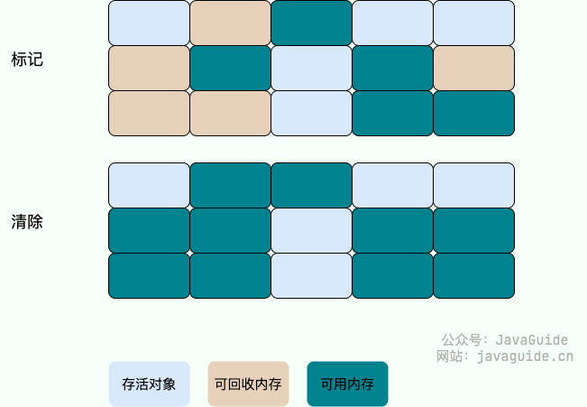
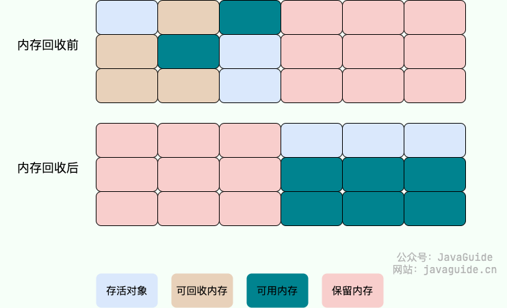

\n

Java的自动内存管理主要针对对象内存的回收和分配，同时，java自动内存管理最核心的功能就是堆内存中对象的分配和回收

\n\n\n\n

Java 堆是垃圾收集器管理的主要区域，因此也被称作 **GC 堆（Garbage Collected Heap）** 。

\n\n\n\n

垃圾回收可以通过很多种方式触发：

\n\n\n\n

\n
  * **内存不足时** ：当JVM检测到堆内存不足，无法为新的对象分配内存时，会自动触发垃圾回收。
\n\n\n\n
  * **手动请求** ：虽然垃圾回收是自动的，开发者可以通过调用 `System.gc()` 或 `Runtime.getRuntime().gc()` 建议 JVM 进行垃圾回收。不过这只是一个建议，并不能保证立即执行。
\n\n\n\n
  * **JVM参数** ：启动 Java 应用时可以通过 JVM 参数来调整垃圾回收的行为，比如：`-Xmx`（最大堆大小）、`-Xms`（初始堆大小）等。
\n\n\n\n
  * **对象数量或内存使用达到阈值** ：垃圾收集器内部实现了一些策略，以监控对象的创建和内存使用，达到某个阈值时触发垃圾回收。
\n
\n\n\n\n

从垃圾回收的视角看，由于现代收集器基本都会采用分代的垃圾收集算法，所以java堆被划分为了几个不同的区域，这样我们可以根据各个区域的特征选择合适的算法去回收

\n\n\n\n

在 JDK 7 版本及 JDK 7 版本之前，堆内存被通常分为下面三部分：

\n\n\n\n

\n
  1. 新生代内存(Young Generation)
\n\n\n\n
  2. 老生代(Old Generation)
\n\n\n\n
  3. 永久代(Permanent Generation)
\n
\n\n\n\n

在JDK8之后，永久代被元空间取代，具体示意图如下：

\n\n\n\n\n\n\n\n

## 内存分配

\n\n\n\n

在考虑垃圾回收之前，我们首先来接触一下对象内存的分配规则以及转化

\n\n\n\n

大多数情况下，**对象优先在eden（新生代）中进行分配。** 当Eden区没有足够空间分配时，虚拟机会发起一次Minor GC。

\n\n\n\n

如果是足够大的对象（大数组、字符串等需要大量连续空间的对象），**系统会直接分配到老年代** 。

\n\n\n\n

并且伴随着对象存活时间，虚拟机给每个对象设置一个对象年龄计数器，如果在第一次minor GC后仍然可以存货，系统会把这些对象移动到survivor空间中。对象在 Survivor 中每熬过一次 MinorGC,年龄就增加 1 岁，当它的年龄增加到一定程度（默认为 15 岁），就会被晋升到老年代中。

\n\n\n\n

## 主要回收算法（判断垃圾）

\n\n\n\n

### 1.引用计数法

\n\n\n\n

\n
  * **原理** ：为每个对象分配一个引用计数器，每当有一个地方引用它时，计数器加1；当引用失效时，计数器减1。当计数器为0时，表示对象不再被任何变量引用，可以被回收。
\n\n\n\n
  * **缺点** ：不能解决循环引用的问题，即两个对象相互引用，但不再被其他任何对象引用，这时引用计数器不会为0，导致对象无法被回收。
\n
\n\n\n\n\n\n\n\n

### 2.可达性分析算法（实际使用的GC）

\n\n\n\n

这个算法的基本思想就是通过一系列的称为 **“GC Roots”**  的对象作为起点，从这些节点开始向下搜索，节点所走过的路径称为引用链，当一个对象到 GC Roots 没有任何引用链相连的话，则证明此对象是不可用的，需要被回收。

\n\n\n\n

下图中的 `Object 6 ~ Object 10` 之间虽有引用关系，但它们到 GC Roots 不可达，因此为需要被回收的对象。

\n\n\n\n\n\n\n\n

**哪些对象可以作为 GC Roots 呢？**

\n\n\n\n

\n
  * 虚拟机栈(栈帧中的局部变量表)中引用的对象
\n\n\n\n
  * 本地方法栈(Native 方法)中引用的对象
\n\n\n\n
  * 方法区中类静态属性引用的对象
\n\n\n\n
  * 方法区中常量引用的对象
\n\n\n\n
  * 所有被同步锁持有的对象
\n\n\n\n
  * JNI（Java Native Interface）引用的对象
\n
\n\n\n\n

#### tip：对象可以被回收，代表一定会被回收吗？

\n\n\n\n

即使在可达性分析法中不可达的对象，也并非是“非死不可”的，这时候它们暂时处于“缓刑阶段”，要真正宣告一个对象死亡，至少要经历两次标记过程；可达性分析法中不可达的对象被第一次标记并且进行一次筛选，筛选的条件是此对象是否有必要执行 `finalize` 方法。当对象没有覆盖 `finalize` 方法，或 `finalize` 方法已经被虚拟机调用过时，虚拟机将这两种情况视为没有必要执行。

\n\n\n\n

被判定为需要执行的对象将会被放在一个队列中进行第二次标记，除非这个对象与引用链上的任何一个对象建立关联，否则就会被真的回收。

\n\n\n\n

、、`Object` 类中的 `finalize` 方法一直被认为是一个糟糕的设计，成为了 Java 语言的负担，影响了 Java 语言的安全和 GC 的性能。JDK9 版本及后续版本中各个类中的 `finalize` 方法会被逐渐弃用移除。忘掉它的存在吧！<https://mp.weixin.qq.com/s/LW-paZAMD08DP_3-XCUxmg>

\n\n\n\n

## 垃圾回收算法

\n\n\n\n

### **标记-清除算法** ：

\n\n\n\n

标记-清除算法分为“标记”和“清除”两个阶段，首先通过可达性分析，标记出所有需要回收的对象，然后统一回收所有被标记的对象。标记-清除算法有两个缺陷，一个是效率问题，标记和清除的过程效率都不高，另外一个就是，清除结束后会造成大量的碎片空间。有可能会造成在申请大块内存的时候因为没有足够的连续空间导致再次 GC。

\n\n\n\n

问题：

\n\n\n\n

**效率问题** ：标记和清除两个过程效率都不高。

\n\n\n\n

**空间问题** ：标记清除后会产生大量不连续的内存碎片。

\n\n\n\n\n\n\n\n

如果按照前者的理解，整个标记-清除过程大致是这样的：

\n\n\n\n

\n
  1. 当一个对象被创建时，给一个标记位，假设为 0 (false)；
\n\n\n\n
  2. 在标记阶段，我们将所有可达对象（或用户可以引用的对象）的标记位设置为 1 (true)；
\n\n\n\n
  3. 扫描阶段清除的就是标记位为 0 (false)的对象。
\n
\n\n\n\n

### 复制算法

\n\n\n\n

为了解决标记-清除算法的效率和内存碎片问题，复制（Copying）收集算法出现了。它可以将内存分为大小相同的两块，每次使用其中的一块。当这一块的内存使用完后，就将还存活的对象复制到另一块去，然后再把使用的空间一次清理掉。这样就使每次的内存回收都是对内存区间的一半进行回收。

\n\n\n\n

**问题：**

\n\n\n\n

\n
  * **可用内存变小** ：可用内存缩小为原来的一半。
\n\n\n\n
  * **不适合老年代** ：如果存活对象数量比较大，复制性能会变得很差。
\n
\n\n\n\n\n