\n

## Quality Attributes

\n\n\n\n

### Availability可用性

\n\n\n\n

def:系统在给定时间段内能够正常运行并提供服务的能力，通常以百分比（如99.9%）表示。

\n\n\n\n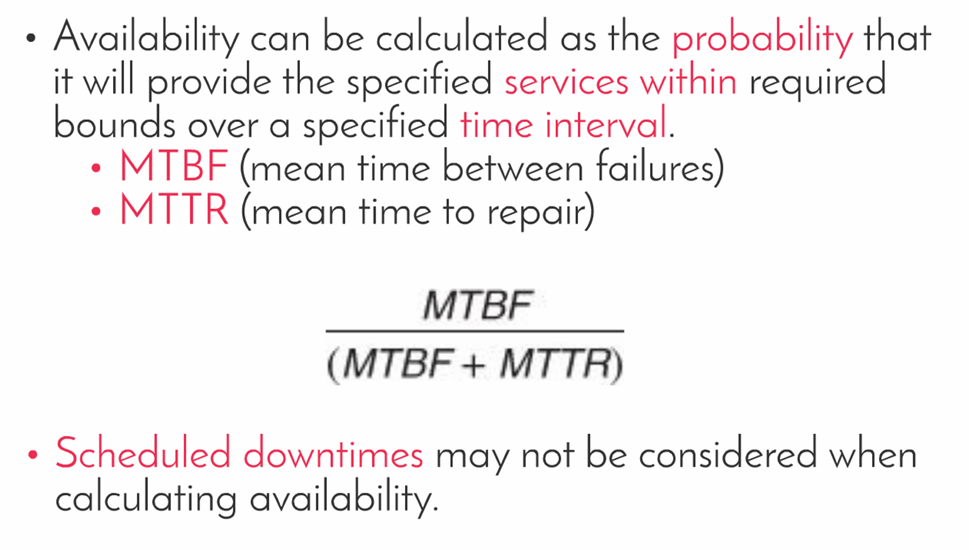\n\n\n\n

针对availability，有SLA（与客户签订协议），planning for failure等方式稳固。

\n\n\n\n

以下是对应general的 scenario

\n\n\n\n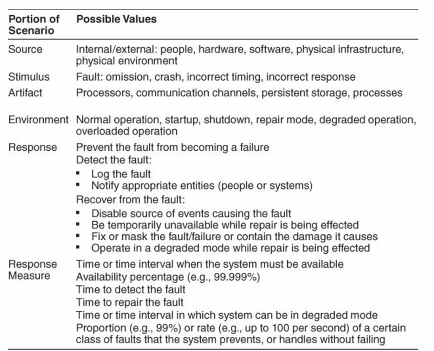\n\n\n\n

对应的tactics:

\n\n\n\n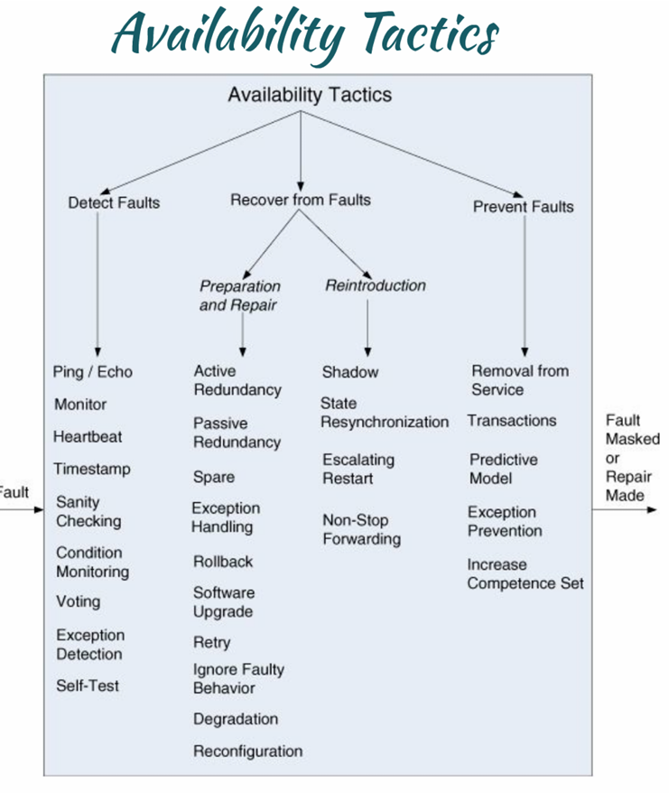\n\n\n\n

### Interoperability（互操作性）

\n\n\n\n

def:系统与不同厂商或技术的其他系统协同工作以交换和使用信息的能力。（强调正确交换并且能正确解释）

\n\n\n\n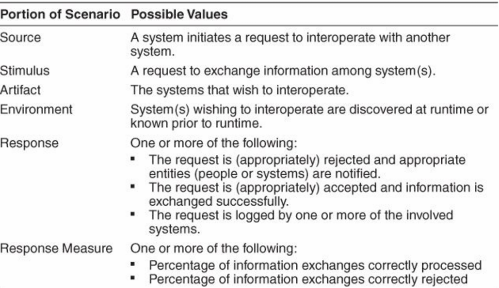\n\n\n\n

### Modifiablity

\n\n\n\n

def:系统能够适应需求变化或功能扩展的能力，通常涉及架构的灵活性。强调的是变更所需的时间和金钱成本，包含扩展是否会影响别的功能或者质量属性。

\n\n\n\n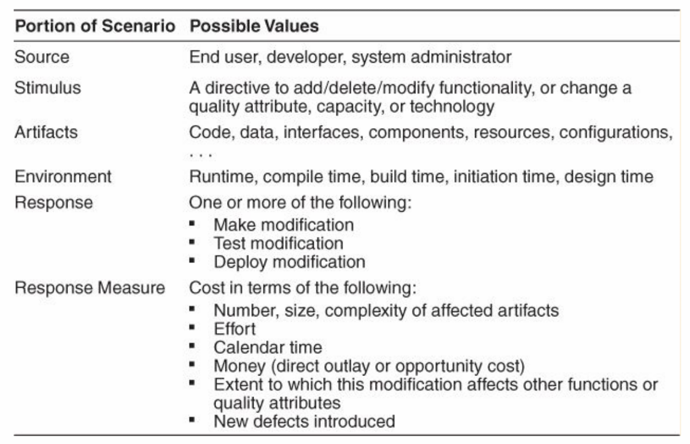\n\n\n\n

\n\n\n\n

## ADD3.0方法

\n\n\n\n

## Architecture Pattern

\n\n\n\n

### Pipe-and-Filter模式

\n\n\n\n

Pipe-and-Filter模式是一种软件架构模式，特别适用于数据流处理系统。它通过一系列转换组件（称为过滤器，Filters）将输入数据逐步转换为输出数据，这些过滤器通过管道（Pipes）连接。模式的核心思想是将数据处理分解为多个独立步骤，每个步骤由一个过滤器负责执行，从而实现模块化、可重用性和并行处理。

\n\n\n\n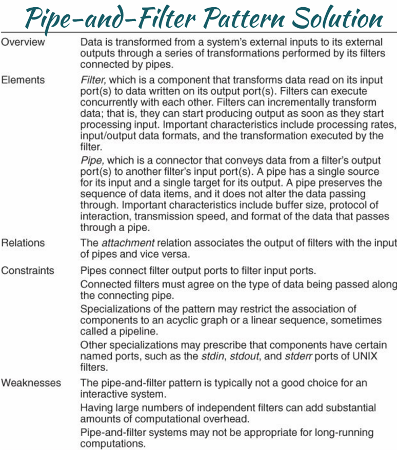\n\n\n\n

#### 概述

\n\n\n\n

数据从系统的外部输入通过一系列转换逐步处理，最终生成外部输出。这些转换由过滤器执行，过滤器通过管道连接。管道负责数据的传输，而过滤器负责数据的转换和处理。

\n\n\n\n

#### 主要元素

\n\n\n\n

\n
  * **Filter（过滤器）** ：\n\n
    * 是一个组件，负责读取输入端口的数据，进行转换后写入输出端口。
\n\n\n\n
    * 过滤器可以并行执行，也可以逐步增量处理数据。
\n\n\n\n
    * 关键特性包括：支持并发执行、处理输入后立即产生输出、定义输入/输出数据格式、影响处理速率。
\n\n\n\n
    * 示例：一个过滤器可能负责数据清洗，另一个负责数据聚合。
\n\n
\n\n\n\n
  * **Pipe（管道）** ：\n\n
    * 是一种连接器，将一个过滤器的输出端口连接到另一个过滤器的输入端口。
\n\n\n\n
    * 管道具有单一数据源，确保数据按顺序传递。
\n\n\n\n
    * 关键特性包括：缓冲区大小、交互协议、传输速度、数据格式。
\n\n\n\n
    * 示例：管道可以是内存缓冲区或文件流。
\n\n
\n
\n\n\n\n

#### 关系

\n\n\n\n

\n
  * **Attachment Relation（附件关系）** ：将过滤器的输出与管道的输入关联，反之亦然。
\n
\n\n\n\n

#### 约束

\n\n\n\n

\n
  * **连接规则** ：管道连接过滤器的输出端口到输入端口。
\n\n\n\n
  * **数据一致性** ：相连的过滤器必须同意传输的数据类型。
\n\n\n\n
  * **结构限制** ：\n\n
    * 模式可能限制为无环图或线性序列（称为流水线，Pipeline）。
\n\n\n\n
    * 某些变体可能要求组件具有特定命名端口（如UNIX的stdin、stdout、stderr）。
\n\n
\n
\n\n\n\n

#### 弱点

\n\n\n\n

\n
  * **不适合交互系统** ：该模式通常不适用于需要频繁用户交互的系统。
\n\n\n\n
  * **性能开销** ：大量过滤器的使用可能带来显著的计算开销。
\n\n\n\n
  * **不适合长计算** ：Pipe-and-Filter系统可能不适用于长时间运行的计算任务。
\n
\n\n\n\n

\n\n\n\n

### Client-Server Pattern

\n\n\n\n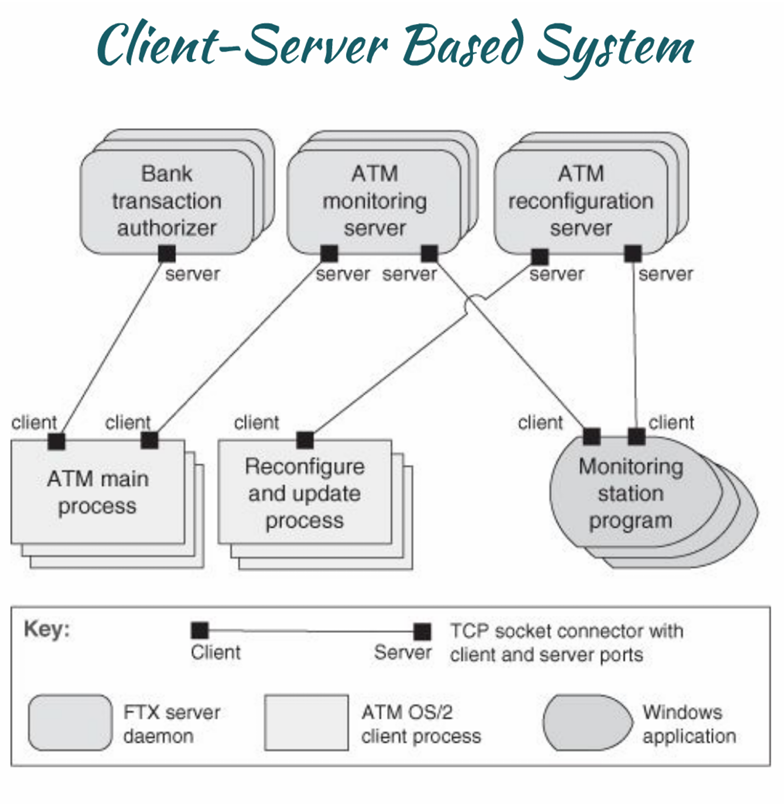\n\n\n\n

客户端-服务器模式（Client-Server Pattern）是一种分布式系统架构模式，广泛用于网络应用程序中。它通过将系统功能划分为客户端（Client）和服务器（Server）两个主要角色，客户端负责发起请求并与用户交互，而服务器负责提供服务和处理请求。

\n\n\n\n

#### 概述

\n\n\n\n

客户端主动与服务器发起交互，调用所需的服務，并等待结果。這種模式適用于需要集中式資源管理或遠程服務調用的場景，例如Web應用、數據庫訪問或文件共享系統。

\n\n\n\n

#### 主要元素

\n\n\n\n

\n
  * **Client（客户端）** ：\n\n
    * 是一个组件，负责调用服务器的服务。
\n\n\n\n
    * 客户端拥有描述其需求的端口，定义了它所请求的服务类型。
\n\n\n\n
    * 关键特性：用户界面交互、请求发起。
\n\n
\n\n\n\n
  * **Server（服务器）** ：\n\n
    * 是一个组件，负责向客户端提供服务。
\n\n\n\n
    * 服务器拥有描述其提供的服务的端口，关键特性包括服务性质（例如有多少客户端可以连接）、性能特性（例如最大服务速率和调用频率）。
\n\n
\n\n\n\n
  * **Request/Reply Connector（请求/回复连接器）** ：\n\n
    * 是一种数据连接器，采用请求/回复协议，允许客户端调用服务器服务。
\n\n\n\n
    * 关键特性包括调用是本地还是远程、数据是否加密。
\n\n
\n
\n\n\n\n

#### 关系

\n\n\n\n

\n
  * **Attachment Relation（附件关系）** ：将客户端与服务器关联起来。
\n
\n\n\n\n

#### 约束

\n\n\n\n

\n
  * **连接规则** ：客户端通过请求/回复连接器与服务器连接。
\n\n\n\n
  * **服务器支持** ：服务器组件可以接受来自多个客户端的请求。
\n\n\n\n
  * **特殊限制** ：\n\n
    * 可能限制每个端口的连接数量。
\n\n\n\n
    * 组件可以按功能分组为层，逻辑上相关功能可能共享主机计算环境。
\n\n
\n\n\n\n
  * **灵活性** ：服务器可以充当其他服务器的客户端。
\n
\n\n\n\n

#### 弱点

\n\n\n\n

\n
  * **性能瓶颈** ：服务器可能是系统的性能瓶颈。
\n\n\n\n
  * **单点故障** ：服务器可能成为单点故障来源。
\n\n\n\n
  * **功能分配复杂** ：决定将功能放在客户端还是服务器上往往复杂且在系统建成后更改成本高。
\n
\n\n\n\n

* * *

\n\n\n\n

### 工作流程

\n\n\n\n

\n
  1. **客户端请求** ：\n\n
     * 客户端通过用户输入或程序逻辑发起服务请求。
\n\n
\n\n\n\n
  2. **连接器传输** ：\n\n
     * 请求/回复连接器将请求发送到服务器，可能涉及网络传输和加密。
\n\n
\n\n\n\n
  3. **服务器处理** ：\n\n
     * 服务器接收请求，执行相应服务逻辑，生成结果。
\n\n
\n\n\n\n
  4. **回复客户端** ：\n\n
     * 服务器通过连接器将结果返回给客户端，客户端更新界面或继续处理。
\n\n
\n
\n\n\n\n

* * *

\n\n\n\n

### 应用例子

\n\n\n\n

\n
  1. **Web浏览器与Web服务器** ：\n\n
     * **场景** ：用户通过浏览器访问网站。
\n\n\n\n
     * **客户端** ：浏览器，发起HTTP请求（如GET /index.html）。
\n\n\n\n
     * **服务器** ：Web服务器（如Apache或Nginx），提供HTML页面或动态内容。
\n\n\n\n
     * **连接器** ：HTTP协议。
\n\n\n\n
     * **优势** ：集中式内容管理，客户端轻量化。
\n\n
\n\n\n\n
  2. **数据库客户端与服务器** ：\n\n
     * **场景** ：应用程序查询数据库。
\n\n\n\n
     * **客户端** ：数据库客户端（如JDBC或ODBC驱动），发送SQL查询。
\n\n\n\n
     * **服务器** ：数据库服务器（如MySQL或PostgreSQL），执行查询并返回结果。
\n\n\n\n
     * **连接器** ：TCP/IP或专用数据库协议。
\n\n\n\n
     * **优势** ：数据集中存储，支持多用户访问。
\n\n
\n\n\n\n
  3. **文件共享系统** ：\n\n
     * **场景** ：用户通过网络访问共享文件。
\n\n\n\n
     * **客户端** ：文件浏览器或专用客户端，请求文件下载。
\n\n\n\n
     * **服务器** ：文件服务器（如FTP服务器或NAS），提供文件访问。
\n\n\n\n
     * **连接器** ：FTP或SMB协议。
\n\n\n\n
     * **优势** ：资源集中管理，便于权限控制。
\n\n
\n
\n\n\n\n

### Service-Oriented Pattern

\n\n\n\n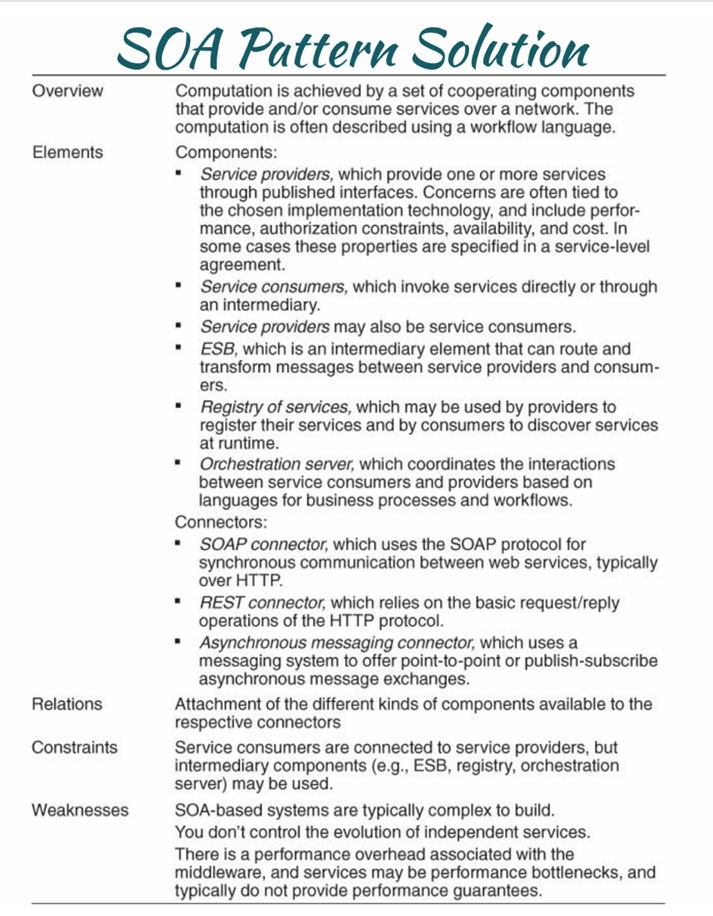\n\n\n\n

\n\n\n\n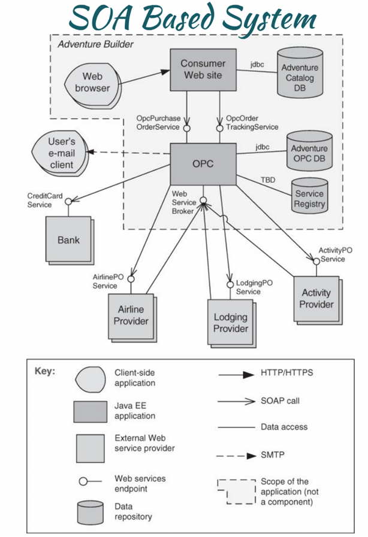\n\n\n\n

该图展示了一个基于面向服务架构（Service-Oriented Architecture, SOA）的系统，具体以“Adventure Builder”为例。该系统通过服务提供者（Service Providers）和服务消费者（Service Consumers）之间的协作，实现了分布式功能。以下是图的详细解释：

\n\n\n\n

* * *

\n\n\n\n

#### 系统概述

\n\n\n\n

\n
  * **Adventure Builder**  是一个SOA系统，旨在为用户提供旅行相关服务（如预订机票、住宿等）。
\n\n\n\n
  * 系统通过一个中心化的**Web Broker（Web服务代理）**和** OPC（Order Processing Center，订单处理中心）**协调各种服务。
\n\n\n\n
  * 服务通过标准协议（如HTTP/HTTPS、SOAP、SMTP）在网络上交互，支持动态发现和松耦合设计。
\n
\n\n\n\n

* * *

\n\n\n\n

#### 主要组件

\n\n\n\n

\n
  1. **Consumer Web site（服务消费者网站）** ：\n\n
     * 核心组件，代表用户交互界面（如旅行预订网站）。
\n\n\n\n
     * 通过JDBC访问**Adventure Catalogue DB** 和**Adventure OPC DB** ，获取目录和订单数据。
\n\n\n\n
     * 调用服务包括：\n\n
       * **OpcPurchase OrderService** ：处理购买订单。
\n\n\n\n
       * **OpcOrder TrackingService** ：跟踪订单状态。
\n\n
\n\n\n\n
     * 与**Web Browser** 和**User's e-mail client** 交互，分别用于网页浏览和邮件通知。
\n\n
\n\n\n\n
  2. **OPC（Order Processing Center）** ：\n\n
     * 订单处理中心，负责协调订单相关服务。
\n\n\n\n
     * 连接**TBD Service Registry** （待定服务注册中心），动态发现可用服务。
\n\n\n\n
     * 与外部服务提供者（如Airline Provider、Lodging Provider）交互。
\n\n
\n\n\n\n
  3. **Web Service Broker** ：\n\n
     * 作为中介，管理服务发现和调用。
\n\n\n\n
     * 连接OPC与外部服务提供者，处理服务请求的分发。
\n\n
\n\n\n\n
  4. **Service Providers（服务提供者）** ：\n\n
     * **Airline Provider** ：通过**AirlinePO Service** 提供机票预订服务。
\n\n\n\n
     * **Lodging Provider** ：通过**LodgingPO Service** 提供住宿预订服务。
\n\n\n\n
     * **Activity Provider** ：通过**ActivityPO Service** 提供活动相关服务。
\n\n\n\n
     * **Bank** ：通过**CreditCard Service** 处理支付服务。
\n\n\n\n
     * 这些提供者是外部Web服务，独立运行，通过标准接口与系统集成。
\n\n
\n\n\n\n
  5. **Data Repositories（数据仓库）** ：\n\n
     * **Adventure Catalogue DB** ：存储旅行目录数据。
\n\n\n\n
     * **Adventure OPC DB** ：存储订单处理数据。
\n\n
\n
\n\n\n\n

* * *

\n\n\n\n

#### 连接与协议

\n\n\n\n

\n
  * **HTTP/HTTPS** ：用于浏览器到Web站点的通信。
\n\n\n\n
  * **SOAP call** ：用于服务之间的正式调用（如OPC与服务提供者）。
\n\n\n\n
  * **Data access** ：JDBC用于数据库访问。
\n\n\n\n
  * **SMTP** ：用于邮件通知（如发送订单确认）。
\n\n\n\n
  * **Scope of the application (not a component)** ：表示应用范围，非具体组件。
\n
\n\n\n\n

* * *

\n\n\n\n

#### 工作流程

\n\n\n\n

\n
  1. **用户交互** ：\n\n
     * 用户通过**Web Browser** 访问**Consumer Web site** ，选择旅行服务。
\n\n
\n\n\n\n
  2. **服务请求** ：\n\n
     * Web站点通过**OpcPurchase OrderService** 和**OpcOrder TrackingService** 向OPC发送订单请求。
\n\n\n\n
     * OPC通过**Web Service Broker** 动态发现外部服务（如AirlinePO Service、LodgingPO Service）。
\n\n
\n\n\n\n
  3. **服务处理** ：\n\n
     * 外部服务提供者（如Airline Provider、Lodging Provider）处理请求，返回结果。
\n\n\n\n
     * **CreditCard Service** 处理支付，涉及Bank交互。
\n\n
\n\n\n\n
  4. **数据更新与通知** ：\n\n
     * 数据更新到**Adventure OPC DB** ，并通过**User's e-mail client** 发送确认邮件。
\n\n
\n\n\n\n
  5. **跟踪与反馈** ：\n\n
     * 用户可通过**OpcOrder TrackingService** 跟踪订单状态。
\n\n
\n
\n\n\n\n

* * *

\n\n\n\n

#### 关键特点

\n\n\n\n

\n
  * **松耦合** ：服务提供者独立运行，消费者通过Broker动态调用。
\n\n\n\n
  * **异构支持** ：使用SOAP和HTTP等标准协议，适配不同平台。
\n\n\n\n
  * **可扩展性** ：新增服务（如新的Activity Provider）只需注册到TBD Service Registry。
\n
\n\n\n\n

* * *

\n\n\n\n

#### 示例场景

\n\n\n\n

\n
  * 用户在Adventure Builder网站上预订了一趟旅行，包括机票、酒店和活动。
\n\n\n\n
  * 系统通过OPC调用AirlinePO Service预订机票，LodgingPO Service预订酒店，ActivityPO Service安排活动。
\n\n\n\n
  * 支付通过CreditCard Service完成，订单状态更新到OPC DB，用户收到邮件确认。
\n
\n\n\n\n

* * *

\n\n\n\n

### 总结

\n\n\n\n

这个SOA系统通过Web Service Broker和OPC实现了服务的高效协作，适合复杂的旅行预订场景。它的设计强调服务重用和动态集成，体现了SOA的优点

\n\n\n\n

### Map—reduce Pattern

\n\n\n\n

### Map-Reduce Pattern 介绍

\n\n\n\n

Map-Reduce模式是一种分布式计算架构模式，旨在高效处理和分析大规模数据集。它通过将数据处理任务分解为两个主要阶段——Map（映射）和Reduce（归约）——并在多处理器上并行执行，从而实现低延迟和高可用性。该模式广泛应用于大数据处理框架，如Hadoop和Google的MapReduce。

\n\n\n\n

#### 概述

\n\n\n\n

Map-Reduce模式提供了一个框架，用于分析大规模分布式数据集。该模式通过并行化处理在多个处理器上执行，允许低延迟和高可用性。Map阶段负责数据的提取和转换，Reduce阶段负责结果的加载。整个过程常被描述为Extract-Transform-Load（ETL，提取-转换-加载）流程。

\n\n\n\n

#### 主要元素

\n\n\n\n

\n
  * **Map（映射）** ：
\n\n\n\n
  * 是一个函数，部署多个实例分布在多个处理器上，执行数据的提取和转换。
\n\n\n\n
  * 每个Map实例独立处理数据片段，负责分析的初始阶段。
\n\n\n\n
  * **Reduce（归约）** ：
\n\n\n\n
  * 是一个函数，可以部署为单个实例或多个实例分布在处理器上，执行结果的加载和汇总。
\n\n\n\n
  * Reduce实例将Map输出的中间结果聚合为最终输出。
\n\n\n\n
  * **Infrastructure（基础设施）** ：
\n\n\n\n
  * 负责部署Map和Reduce实例，管理数据流转，检测和恢复故障。
\n\n\n\n
  * 包括调度、监控和控制功能，确保任务顺利完成。
\n
\n\n\n\n

#### 关系

\n\n\n\n

\n
  * **Deploy on（部署于）** ：定义Map或Reduce实例与处理器的绑定关系。
\n\n\n\n
  * **Instantiate, monitor, and control（实例化、监控和控制）** ：表示基础设施与Map/Reduce实例之间的管理关系。
\n
\n\n\n\n

#### 约束

\n\n\n\n

\n
  * **数据格式** ：待分析的数据必须以文件集的形式存在。
\n\n\n\n
  * **Map无状态** ：Map函数是无状态的，多个Map实例之间不直接通信。
\n\n\n\n
  * **通信限制** ：Map实例与Reduce实例之间的唯一通信是通过Map实例发出的`<key, value>`对。
\n\n\n\n
  * **唯一数据流** ：数据仅从Map实例流向Reduce实例。
\n
\n\n\n\n

#### 弱点

\n\n\n\n

\n
  * **数据规模不足** ：如果数据量不大，Map-Reduce的开销可能不值得。
\n\n\n\n
  * **数据分割困难** ：如果无法将数据分为相似大小的子集，并行化的优势会丧失。
\n\n\n\n
  * **多Reduce复杂性** ：需要多个Reduce操作的场景，协调难度较高。
\n
\n\n\n\n

* * *

\n\n\n\n

### 工作流程

\n\n\n\n

\n
  1. **数据输入** ：
\n
\n\n\n\n\n
  * 大规模数据集以文件集形式提供，分为多个子集分配给Map实例。
\n
\n\n\n\n\n
  1. **Map阶段** ：
\n
\n\n\n\n\n
  * 每个Map实例并行处理其分配的数据子集，执行提取和转换，生成`<key, value>`对。
\n\n\n\n
  * 示例：从日志文件中提取单词并计数。
\n
\n\n\n\n\n
  1. **数据分发** ：
\n
\n\n\n\n\n
  * Infrastructure将Map输出的`<key, value>`对按键（key）分组，发送给相应的Reduce实例。
\n
\n\n\n\n\n
  1. **Reduce阶段** ：
\n
\n\n\n\n\n
  * Reduce实例对接收到的`<key, value>`对进行聚合和加载，生成最终结果。
\n\n\n\n
  * 示例：对每个单词的计数求和。
\n
\n\n\n\n\n
  1. **结果输出** ：
\n
\n\n\n\n\n
  * 最终结果存储或输出给用户。
\n
\n\n\n\n

* * *

\n\n\n\n

### 应用例子

\n\n\n\n

\n
  1. **单词计数** ：
\n
\n\n\n\n\n
  * **场景** ：统计大量文本文件中每个单词的出现次数。
\n\n\n\n
  * **Map** ：每个Map实例读取文件子集，输出`<单词, 1>`对。
\n\n\n\n
  * **Reduce** ：每个Reduce实例按单词聚合，计算总计数。
\n\n\n\n
  * **优势** ：并行处理大量文件，降低延迟。
\n
\n\n\n\n\n
  1. **日志分析** ：
\n
\n\n\n\n\n
  * **场景** ：分析Web服务器日志，计算每个IP的请求数量。
\n\n\n\n
  * **Map** ：提取日志中的IP和请求数，输出`<IP, 1>`。
\n\n\n\n
  * **Reduce** ：按IP汇总请求总数。
\n\n\n\n
  * **优势** ：适合分布式日志数据处理。
\n
\n\n\n\n\n
  1. **数据聚合** ：
\n
\n\n\n\n\n
  * **场景** ：从传感器数据中计算平均温度。
\n\n\n\n
  * **Map** ：将温度数据分组，输出`<时间段, 温度值>`。
\n\n\n\n
  * **Reduce** ：计算每个时间段的平均值。
\n\n\n\n
  * **优势** ：高效处理实时流数据。
\n
\n\n\n\n

* * *

\n\n\n\n

### 总结

\n\n\n\n

Map-Reduce模式通过Map和Reduce的协作，实现了大规模数据的并行处理，特别适合大数据分析场景。其无状态设计和基础设施支持确保了扩展性和容错能力，但对数据规模和分割的要求较高，不适合小数据集或复杂多Reduce任务。

\n\n\n\n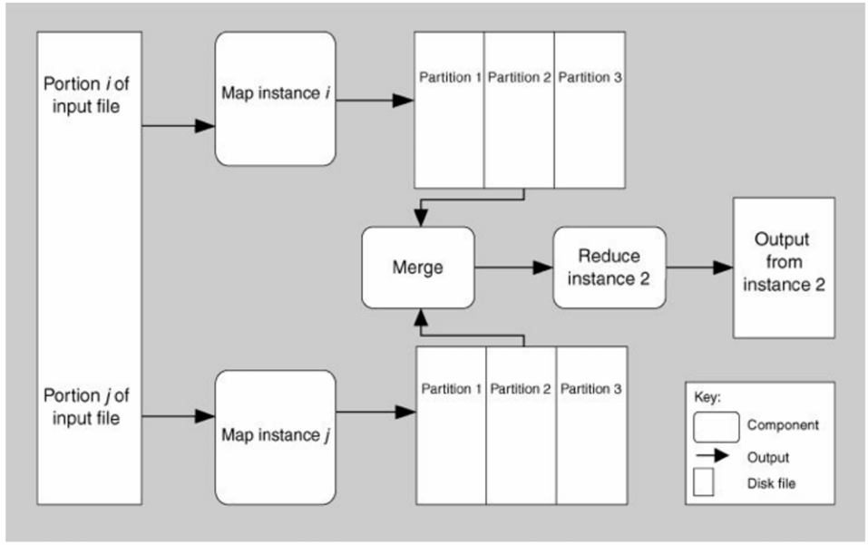\n\n\n\n

### Multi-Tier Pattern

\n\n\n\n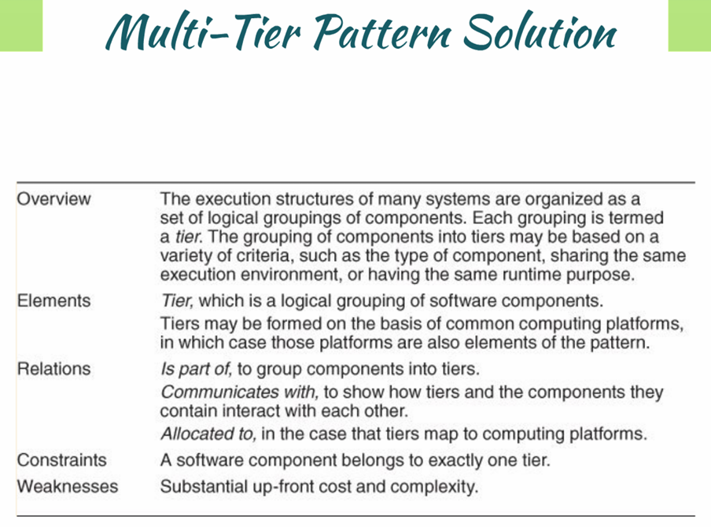\n\n\n\n

多层模式（Multi-Tier Pattern）是一种软件架构模式，旨在将系统的执行结构组织为多个逻辑分组，称为“层”（Tiers）。这种模式通过将组件按功能、执行环境或运行时目的分组，增强系统的模块化、可维护性和可扩展性，特别是在分布式系统中。

\n\n\n\n

#### 概述

\n\n\n\n

许多系统的执行结构被组织为一组逻辑组件的分组，每个分组称为一个“层”。这些层的划分可以基于多种标准，例如组件类型、共享相同的执行环境，或具有相同的运行时目的。这种分层设计常见于企业级应用和Web系统。

\n\n\n\n

#### 主要元素

\n\n\n\n

\n
  * **Tier（层）** ：\n\n
    * 是一个逻辑分组，包含一组软件组件。
\n\n\n\n
    * 层的形成可能基于共同的计算平台，在这种情况下，这些平台也成为模式的一部分。
\n\n\n\n
    * 示例：表示层可以是表示层（UI）、业务逻辑层或数据访问层。
\n\n
\n
\n\n\n\n

#### 关系

\n\n\n\n

\n
  * **Is part of（属于）** ：将组件分组到特定的层中。
\n\n\n\n
  * **Communicates with（通信）** ：展示层及其包含的组件之间的交互方式。
\n\n\n\n
  * **Allocated to（分配到）** ：在层映射到计算平台的情况下，定义层与平台的映射关系。
\n
\n\n\n\n

#### 约束

\n\n\n\n

\n
  * **单一归属** ：每个软件组件必须严格属于单一层，不允许跨层重复。
\n
\n\n\n\n

#### 弱点

\n\n\n\n

\n
  * **前期成本与复杂性** ：设计和实现多层架构需要较高的前期投入和复杂性管理。
\n
\n\n\n\n

* * *

\n\n\n\n

### 工作流程

\n\n\n\n

\n
  1. **组件分组** ：\n\n
     * 系统组件按逻辑功能或技术需求分组为不同层，例如前端层、应用层和数据库层。
\n\n
\n\n\n\n
  2. **层间通信** ：\n\n
     * 各层通过定义的接口或协议交互，遵循自底向上的数据流或自上而下的请求处理。
\n\n
\n\n\n\n
  3. **平台分配** ：\n\n
     * 如果层映射到物理计算平台（如服务器或云实例），资源分配确保层功能正常运行。
\n\n
\n\n\n\n
  4. **功能隔离** ：\n\n
     * 每层负责特定职责，减少耦合，提高独立性。
\n\n
\n
\n\n\n\n

* * *

\n\n\n\n

### 应用例子

\n\n\n\n

\n
  1. **三层Web应用** ：\n\n
     * **场景** ：一个在线购物网站。
\n\n\n\n
     * **层** ：\n\n
       * **表示层（Presentation Tier）** ：用户界面（如HTML/CSS/JavaScript），运行在用户浏览器上。
\n\n\n\n
       * **应用层（Application Tier）** ：业务逻辑（如订单处理），运行在应用服务器上。
\n\n\n\n
       * **数据层（Data Tier）** ：数据库（如MySQL），存储产品和订单信息。
\n\n
\n\n\n\n
     * **通信** ：表示层通过HTTP请求与应用层交互，应用层通过SQL查询数据层。
\n\n\n\n
     * **优势** ：职责分离，便于扩展（如增加服务器）。
\n\n
\n\n\n\n
  2. **企业资源计划（ERP）系统** ：\n\n
     * **场景** ：管理公司财务和人力资源。
\n\n\n\n
     * **层** ：\n\n
       * **用户界面层** ：桌面客户端或Web界面。
\n\n\n\n
       * **业务逻辑层** ：运行在中间件服务器上，处理财务计算。
\n\n\n\n
       * **数据存储层** ：企业数据库存储交易记录。
\n\n
\n\n\n\n
     * **通信** ：层间通过API或消息队列交互。
\n\n\n\n
     * **优势** ：支持分布式部署，易于维护。
\n\n
\n\n\n\n
  3. **移动应用后端** ：\n\n
     * **场景** ：一个移动购物应用。
\n\n\n\n
     * **层** ：\n\n
       * **客户端层** ：手机应用界面。
\n\n\n\n
       * **服务层** ：云端API处理订单。
\n\n\n\n
       * **持久层** ：云数据库存储用户数据。
\n\n
\n\n\n\n
     * **通信** ：RESTful API连接客户端与服务层。
\n\n\n\n
     * **优势** ：支持跨平台，易于扩展。
\n\n
\n
\n\n\n\n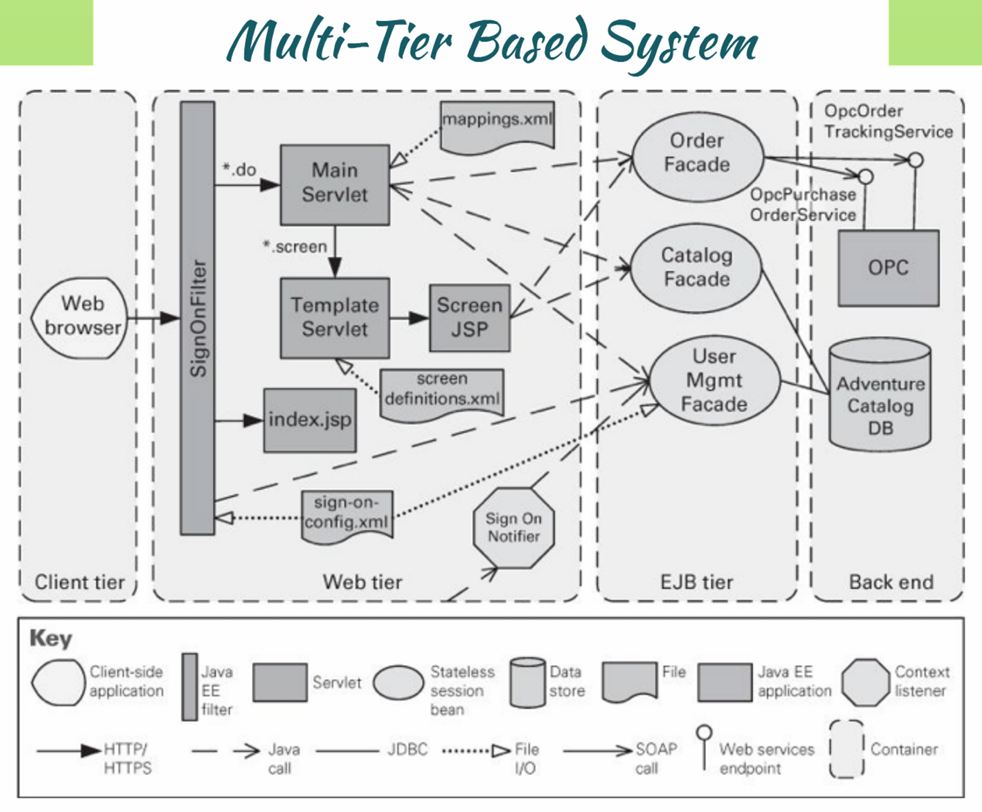\n\n\n\n

### 架构模式与策略（Architecture Patterns and Tactics）

\n\n\n\n

#### 英文版本 (English Version)

\n\n\n\n

\n
  * Tactics are simpler than patterns; they use a single structure or mechanism to address a single architectural force.
\n\n\n\n
  * Patterns typically combine multiple design decisions into a package.
\n\n\n\n
  * Patterns and tactics together constitute the software architect's primary tools.
\n\n\n\n
  * Tactics are "building blocks" of design from which architectural patterns are created.
\n\n\n\n
  * Most patterns consist of several different tactics that may:
\n\n\n\n
  * all serve a common purpose,
\n\n\n\n
  * be often chosen to promise different quality attributes.
\n\n\n\n
  * Example: layered pattern
\n\n\n\n
  * Increase semantic coherence
\n\n\n\n
  * Restrict dependencies
\n
\n\n\n\n

#### 中文版本 (Chinese Version)

\n\n\n\n

\n
  * 策略（Tactics）比模式（Patterns）简单；它们使用单一结构或机制来解决单一的架构驱动力。
\n\n\n\n
  * 模式通常将多个设计决策组合成一个整体。
\n\n\n\n
  * 模式和策略共同构成了软件架构师的主要工具。
\n\n\n\n
  * 策略是“构建模块”，用于创建架构模式。
\n\n\n\n
  * 大多数模式由若干不同的策略组成，这些策略可能：
\n\n\n\n
  * 都服务于共同的目的，
\n\n\n\n
  * 常被选择以承诺不同的质量属性。
\n\n\n\n
  * 示例：分层模式（Layered Pattern）
\n\n\n\n
  * 提高语义一致性（Increase semantic coherence）
\n\n\n\n
  * 限制依赖关系（Restrict dependencies）
\n
\n\n\n\n

* * *

\n\n\n\n

### 总结

\n\n\n\n

\n
  * **策略（Tactics）** ：针对单一问题，提供具体解决方案，类似于设计中的基础单元。
\n\n\n\n
  * **模式（Patterns）** ：整合多个策略，形成综合的架构方案，解决复杂问题。
\n\n\n\n
  * **关系** ：策略是模式的构建基础，模式通过组合策略实现特定目标（如分层模式的语义一致性和依赖限制）。
\n
\n\n\n\n

\n