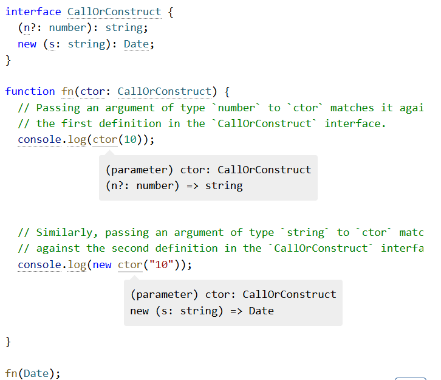

\n

typescript是对于Javascript的一种安全封转，因此大部分对于typescript的操作都要转换成JavaScript进行处理，并且会多出一些d.ts的类型定义文件以保证类型安全性的扩展。

\n\n\n\n

对于ts来说，有如下这一些基本的结构会出现：

\n\n\n\n

\n
  * **声明部分** ：包括类型声明、接口声明等。
\n\n\n\n
  * **变量声明** ：包括 `let`, `const` 和 `var` 的使用。
\n\n\n\n
  * **函数声明** ：包括普通函数和箭头函数。
\n\n\n\n
  * **类声明** ：用于定义类及其成员。
\n\n\n\n
  * **接口与类型别名** ：描述类型的结构。
\n\n\n\n
  * **模块化** ：通过 `import` 和 `export` 组织代码。
\n\n\n\n
  * **类型断言** ：强制类型转换。
\n\n\n\n
  * **泛型** ：使代码具备更多的复用性。
\n\n\n\n
  * **注释** ：增加代码的可读性。
\n\n\n\n
  * **类型推断** ：自动推断类型。
\n\n\n\n
  * **类型守卫** ：缩小类型范围。
\n\n\n\n
  * **异步编程** ：支持 `async/await`。
\n\n\n\n
  * **错误处理** ：通过 `try/catch` 进行错误捕捉。
\n
\n\n\n\n

我们按章节处理这些基本的定义，其实在Java这种更加OOP的语言中，以上情况也是常见的，不过作为多线程的语言，Java和js的核心理念还是有所区别的，并且js,ts在类型上是独特于Java的一种动态类型，ts在保证安全性的情况下有更安全的类型扩展，比Python的超级弱类型更加的容易管理一些，不过也会出现一些静态检查上的分析误差，这些都要在开发的时候要注意。

\n\n\n\n

## 一、声明部分（Declarations）

\n\n\n\n

**类型声明：** TypeScript 是一种静态类型的语言，可以通过类型声明来定义变量、函数、类等的类型。类型声明可以帮助代码更具可维护性和可读性。

\n\n\n\n

**接口声明：** 用于定义对象的结构，包括对象的属性和方法。

\n\n\n\n
    
    
    interface Person {\n    name: string;\n    age: number;\n}

\n\n\n\n

**变量声明：** 可以使用let, const,var三种方式完成对变量的声明，各自有区分，具体的场景如下

\n\n\n\n

推荐使用 let 和 const，var 用法不再推荐。

\n\n\n\n
    
    
    let age: number = 25;\nconst pi: number = 3.14;

\n\n\n\n

**函数声明** ：TypeScript 允许声明带有类型注解的函数，包括参数类型和返回值类型。

\n\n\n\n
    
    
    function greet(name: string): string {\n    return "Hello, " + name;\n}

\n\n\n\n

**箭头函数：** TypeScript 同样支持 ES6 的箭头函数，使用简洁的语法来声明函数。

\n\n\n\n
    
    
    const greet = (name: string): string => "Hello, " + name;

\n\n\n\n

**类声明：** TypeScript 提供对面向对象编程的支持，允许定义类和类的方法、属性。

\n\n\n\n
    
    
    class Person {\n    name: string;\n    age: number;\n    \n    constructor(name: string, age: number) {\n    this.name = name;\n    this.age = age;\n    }\n    \n    greet() {\n    return `Hello, my name is ${this.name}`;\n    }\n}

\n\n\n\n

**接口** （Interface）：用于描述对象的形状，接口可以继承和扩展。

\n\n\n\n
    
    
    interface Animal {\n    name: string;\n    sound: string;\n    makeSound(): void;\n}

\n\n\n\n

**类型别名（Type Alias）：** 允许为对象类型、联合类型、交叉类型等定义别名。

\n\n\n\n
    
    
    type ID = string | number;

\n\n\n\n

**泛型：** 泛型允许在定义函数、接口或类时不指定具体类型，而是使用占位符，让用户在使用时传入具体类型。泛型能够增加代码的复用性和类型安全性。

\n\n\n\n
    
    
    function identity<T>(arg: T): T {\n    return arg;\n}

\n\n\n\n

**类型推断：** TypeScript 在某些情况下会自动推断变量的类型。例如，在声明变量并赋值时，TypeScript 会推断出该变量的类型。

\n\n\n\n
    
    
    let num = 10;  // TypeScript 推断 num 为 number 类型

\n\n\n\n

### 类型守卫

\n\n\n\n

TypeScript 提供了类型守卫（如 typeof 和 instanceof），用于在运行时缩小变量的类型范围

\n\n\n\n
    
    
    function isString(value: any): value is string {\n    return typeof value === 'string';\n}

\n\n\n\n

\n\n\n\n

\n\n\n\n

### 类型擦除

\n\n\n\n

Javascript有非常变态的类型擦除，在 JavaScript/TypeScript 中，对象 _不是_ 单一的精确类型。例如，如果我们构造一个满足接口的对象，我们可以在需要该接口的地方使用该对象，即使两者之间没有声明性关系。

\n\n\n\n
    
    
    interface Pointlike {\n  x: number;\n  y: number;\n}\ninterface Named {\n  name: string;\n}\n \nfunction logPoint(point: Pointlike) {\n  console.log("x = " + point.x + ", y = " + point.y);\n}\n \nfunction logName(x: Named) {\n  console.log("Hello, " + x.name);\n}\n \nconst obj = {\n  x: 0,\n  y: 0,\n  name: "Origin",\n};\n \nlogPoint(obj);\nlogName(obj);

\n\n\n\n

TypeScript 的类型系统是 _结构_ 性的，而不是名义性的：我们可以将 `obj` 用作 `Pointlike`，因为它具有 `x` 和 `y` 属性，这两个属性都是数字。类型之间的关系由它们包含的属性决定，而不是由它们是否使用某种特定关系声明。

\n\n\n\n

因此，推荐我们用集合论的观点去看类型（types），我们可以将 `obj` 视为 `Pointlike` 值集和 `Named` 值集的成员。TypeScript 的类型系统也没有 _具体化  _：运行时没有任何东西可以告诉我们 `obj` 是 `Pointlike`。事实上，`Pointlike` 类型在运行时不 _以任何形式_ 存在。

\n\n\n\n

BUT REMEMBER:

\n\n\n\n

**Remember** : Type annotations never change the runtime behavior of your program.  
**请记住  **：类型注释永远不会更改程序的运行时行为。

\n\n\n\n

#### Empty Types  空类型

\n\n\n\n

The first is that the _empty type_  seems to defy expectation:  
首先是 _empty 类型_ 似乎出乎意料：

\n\n\n\n
    
    
    class Car {\n  drive() {\n    // hit the gas\n  }\n}\nclass Golfer {\n  drive() {\n    // hit the ball far\n  }\n}\n// No error?\nlet w: Car = new Golfer();

\n\n\n\n

TypeScript 通过查看提供的参数是否为有效的 `Empty` 来确定此处对 `fn` 的调用是否有效。它通过检查 `{ k： 10 }` 和`类 Empty { }` _的结构来实现_ 此目的。我们可以看到 `{ k： 10 }` _具有  _`Empty` 的所有属性，因为 `Empty` 没有属性。因此，这是一个有效的决定！  
这可能看起来令人惊讶，但它最终与名义上的 OOP 语言中强制执行的关系非常相似。子类不能 _删除_ 其基类的属性，因为这样做会破坏派生类与其基类之间的自然子类型关系。结构类型系统只是通过根据具有兼容类型的属性来描述子类型来隐式地标识这种关系。

\n\n\n\n

导致会有如下的糟糕情况出现（作为Java程序员的我认为糟糕）

\n\n\n\n
    
    
    class Car {\n  drive() {\n    // hit the gas\n  }\n}\nclass Golfer {\n  drive() {\n    // hit the ball far\n  }\n}\n// No error?\nlet w: Car = new Golfer();

\n\n\n\n

### 反射（reflection）

\n\n\n\n

OOP 程序员习惯于能够查询任何值的类型，甚至是通用值：

\n\n\n\n
    
    
    static void LogType<T>() {\n    Console.WriteLine(typeof(T).Name);\n}

\n\n\n\n

因为 TypeScript 的类型系统被完全擦除，所以有关泛型类型参数的实例化等信息在运行时不可用。

\n\n\n\n

JavaScript 确实有一些有限的原语，如 `typeof` 和 `instanceof`，但请记住，这些运算符仍在处理类型擦除输出代码中存在的值。例如，`typeof （new Car（））` 将是 `“object”`，而不是 `Car` 或 `“Car”。`

\n\n\n\n类型| 描述| 示例  
---|---|---  
`string`| 表示文本数据| `let name: string = "Alice";`  
`number`| 表示数字，包括整数和浮点数| `let age: number = 30;`  
`boolean`| 表示布尔值 `true` 或 `false`| `let isDone: boolean = true;`  
`array`| 表示相同类型的元素数组| `let list: number[] = [1, 2, 3];`  
`tuple`| 表示已知类型和长度的数组| `let person: [string, number] = ["Alice", 30];`  
`enum`| 定义一组命名常量| `enum Color { Red, Green, Blue };`  
`any`| 任意类型，不进行类型检查| `let value: any = 42;`  
`void`| 无返回值（常用于函数）| `function log(): void {}`  
`null`| 表示空值| `let empty: null = null;`  
`undefined`| 表示未定义| `let undef: undefined = undefined;`  
`never`| 表示不会有返回值| `function error(): never { throw new Error("error"); }`  
`object`| 表示非原始类型| `let obj: object = { name: "Alice" };`  
`union`| 联合类型，表示可以是多种类型之一| `let id: string|number  
`unknown`| 不确定类型，需类型检查后再使用| `let value: unknown = "Hello";`  
\n\n\n\n

## 二、类型

\n\n\n\n

在声明一块中已经强调了大部分的类型相关的内容，JavaScript也是需要“先声明后使用”的，这点非常重要。

\n\n\n\n

### 基元类型（PRIMITIVES）

\n\n\n\n

JavaScript 有三个非常常用[的原语 ](<https://developer.mozilla.org/en-US/docs/Glossary/Primitive>)：`string`、`number` 和 `boolean`。每个在 TypeScript 中都有相应的类型。正如你所料，如果你对这些类型的值使用 JavaScript `typeof` 运算符，这些名称与你看到的名称相同：

\n\n\n\n

### Array

\n\n\n\n

要指定数组的类型，如 `[1， 2， 3]`，你可以使用语法 `number[]`;此语法适用于任何类型（例如 `string[]` 是字符串数组，依此类推）。您可能还会看到它写成 `Array<number>`，这意味着相同的内容。在介绍 _泛型_ 时，我们将了解有关语法 `T<U>` 的更多信息。

\n\n\n\n

Note that `[number]` is a different thing; refer to the section on [Tuples](<https://www.typescriptlang.org/docs/handbook/2/objects.html#tuple-types>).  
请注意，`[number]` 是另一回事;请参阅 [Tuples](<https://www.typescriptlang.org/docs/handbook/2/objects.html#tuple-types>) 部分。

\n\n\n\n

### any

\n\n\n\n

TypeScript 还有一个特殊的类型 `any`，当你不希望特定值导致类型检查错误时，你可以使用它。

\n\n\n\n

<https://www.allthingstypescript.dev/p/why-avoid-the-any-type-in-typescript>

\n\n\n\n

### Object Types对象类型

\n\n\n\n

除了基元之外，您遇到的最常见的类型是 _对象类型  _。这指的是任何具有属性的 JavaScript 值，这几乎是所有属性！要定义对象类型，我们只需列出其属性及其类型

\n\n\n\n
    
    
    function printCoord(pt: { x: number; y: number }) {\n  console.log("The coordinate's x value is " + pt.x);\n  console.log("The coordinate's y value is " + pt.y);\n}\nprintCoord({ x: 3, y: 7 });

\n\n\n\n

在这里，我们使用具有两个属性（`x` 和 `y`）的类型对参数进行批注，这两个属性都是 `number` 类型。您可以使用 `，` 或 `;` 来分隔属性，并且最后一个分隔符是可选的。

\n\n\n\n

#### Optional Properties  可选属性

\n\n\n\n

对象类型还可以指定其部分或全部属性 _是可选的  _。为此，请在属性名称后添加 `？`：

\n\n\n\n
    
    
    function printName(obj: { first: string; last?: string }) {\n  // ...\n}\n// Both OK\nprintName({ first: "Bob" });\nprintName({ first: "Alice", last: "Alisson" });

\n\n\n\n

在 JavaScript 中，如果你访问一个不存在的属性，你将得到值 `undefined`，而不是运行时错误。因此，当你从可选属性 _中读取_ 时，你必须在使用它之前检查 `undefined`。

\n\n\n\n
    
    
    function printName(obj: { first: string; last?: string }) {\n  // Error - might crash if 'obj.last' wasn't provided!\n  console.log(obj.last.toUpperCase());\n              ！！！！！ 'obj.last' is possibly 'undefined'.\n  if (obj.last !== undefined) {\n    // OK\n    console.log(obj.last.toUpperCase());\n  }\n \n  // A safe alternative using modern JavaScript syntax:\n  console.log(obj.last?.toUpperCase());\n}

\n\n\n\n

### Union Types联合类型

\n\n\n\n

TypeScript 的类型系统允许您使用各种运算符从现有类型中构建新类型。现在我们已经知道如何编写一些类型，是时候开始以有趣的方式 _组合_ 它们了。

\n\n\n\n

比如下面这个示例就又可以对字符串又可以对数字进行操作

\n\n\n\n
    
    
    function printId(id: number | string) {\n  console.log("Your ID is: " + id);\n}\n// OK\nprintId(101);\n// OK\nprintId("202");\n// Error\nprintId({ myID: 22342 });

\n\n\n\n

union 成员的分隔符允许在第一个元素之前使用，因此您也可以编写以下内容：

\n\n\n\n
    
    
    function printTextOrNumberOrBool(\n  textOrNumberOrBool:\n    | string\n    | number\n    | boolean\n) {\n  console.log(textOrNumberOrBool);\n}

\n\n\n\n

但是务必注意：TypeScript _仅在对联合_ 的每个成员都有效时才允许作。例如，如果你有 union `string | number`，则不能使用仅在 `string` 上可用的方法。

\n\n\n\n

所以这更像是一种语法层面的设计模式运用。给每个类型自动套上一层适配器，然后就可以一起使用了。

\n\n\n\n

解决方案是 _缩小_ 与代码的联合，就像在没有类型注释的 JavaScript 中一样。 当 TypeScript 可以根据代码的结构为值推断出更具体的类型时，就会发生 _收缩  _。

\n\n\n\n
    
    
    function printId(id: number | string) {\n  if (typeof id === "string") {\n    // In this branch, id is of type 'string'\n    console.log(id.toUpperCase());\n  } else {\n    // Here, id is of type 'number'\n    console.log(id);\n  }\n}

\n\n\n\n

另一类则是使用类似类型库中函数来判断一样的：

\n\n\n\n
    
    
    function welcomePeople(x: string[] | string) {\n  if (Array.isArray(x)) {\n    // Here: 'x' is 'string[]'\n    console.log("Hello, " + x.join(" and "));\n  } else {\n    // Here: 'x' is 'string'\n    console.log("Welcome lone traveler " + x);\n  }\n}

\n\n\n\n

所以理论上来说，JavaScript和typescript中的union类型是类型的交集，使用其共同的属性进行工作，并且在必要情况下对类型进行narrowing

\n\n\n\n

> <https://www.typescriptlang.org/docs/handbook/2/everyday-types.html>
> 
> 类型 _联合_ 似乎具有这些类型属性的 _交集  _，这可能会令人困惑。这不是偶然的 - _union_  这个名字来自类型理论。 _union_`number | string` 是通过获取每种类型的 _值的  _union 组成的。请注意，给定两个集合，每个集合都有相应的事实，只有这些事实的 _交集_ 适用于集合本身的 _并集  _。例如，如果我们有一个房间是戴帽子的高个子，另一个房间是戴着帽子的讲西班牙语的人，那么把这些房间合并后，我们对 _每个人_ 的唯一了解就是他们一定戴着帽子。

\n\n\n\n

### 类型别名（Type Aliases）

\n\n\n\n

其实很像是有名的union，或者把“像”去掉也对， _类型别名_ 就是 _\- 任何类型的名称  _。类型别名的语法为：

\n\n\n\n
    
    
    type Point = {\n  x: number;\n  y: number;\n};\n \n// Exactly the same as the earlier example\nfunction printCoord(pt: Point) {\n  console.log("The coordinate's x value is " + pt.x);\n  console.log("The coordinate's y value is " + pt.y);\n}\n \nprintCoord({ x: 100, y: 100 });

\n\n\n\n

### 类型别名和接口（Interface）的区别

\n\n\n\n`Interface`| `Type`  
---|---  
Extending an interface  
`interface Animal { name: string; }  
interface Bear extends Animal { honey: boolean; `  
`}  
const bear = getBear(); `  
`bear.name; `  
`bear.honey;`| Extending a type via intersections  
`type Animal = { name: string; }  
type Bear = Animal & { honey: boolean; `  
`}  
const bear = getBear(); `  
`bear.name; `  
`bear.honey;`  
\n\n\n\nAdding new fields to an existing interface  
`interface Window { title: string; }  
interface Window { ts: TypeScriptAPI; }  
const src = 'const a = "Hello World"'; window.ts.transpileModule(src, {});`| A type cannot be changed after being created  
`type Window = { title: string; }  
type Window = { ts: TypeScriptAPI; }  
// Error: Duplicate identifier 'Window'.`  
---|---  
\n\n\n\n

### 类型断言

\n\n\n\n

有时，你会知道typescript本身无法知道的有关值类型的信息，比如下面这个例子

\n\n\n\n

例如，如果你正在使用 `document.getElementById，TypeScript` 只知道这将返回 _某种  _`HTMLElement`，但你可能知道你的页面将始终具有具有给定 ID 的 `HTMLCanvasElement`。

\n\n\n\n
    
    
    const myCanvas = document.getElementById("main_canvas") as HTMLCanvasElement;

\n\n\n\n

与类型注释一样，类型断言由编译器删除，不会影响代码的运行时行为。

\n\n\n\n

并且下面这种尖括号语法也是被支持的

\n\n\n\n
    
    
    const myCanvas = <HTMLCanvasElement>document.getElementById("main_canvas");

\n\n\n\n

TypeScript 只允许类型断言转换为 _更具体_ 或 _不太具体的_ 类型版本。此规则可防止“不可能的”强制行为，例如什么string转number的“不可能行为”是不被支持的

\n\n\n\n

### 再叙类型守卫

\n\n\n\n

假设我们有这样一个padLeft函数

\n\n\n\n
    
    
    function padLeft(padding: number | string, input: string): string {\n  throw new Error("Not implemented yet!");\n}

\n\n\n\n

如果 `padding` 是一个`数字 `，它会将其视为我们想要在 `input` 前面添加的空格数。如果 `padding` 是一个`字符串 `，它应该只在 `input` 前面加上 `padding`。让我们尝试实现 `padLeft` 何时传递`数字`进行`填充`的逻辑。

\n\n\n\n
    
    
    function padLeft(padding: number | string, input: string): string {\n  if (typeof padding === "number") {\n    return " ".repeat(padding) + input;\n  }\n  return padding + input;\n}

\n\n\n\n

在我们的 `if` 检查中，TypeScript 看到 `typeof padding === “number”` 并将其理解为一种称为 _类型守卫_ 的特殊代码形式。TypeScript 遵循我们的程序可以采用的可能执行路径来分析给定位置最具体的可能值类型。它着眼于这些特殊检查（称为 _类型保护  _）和赋值，将类型细化为比声明的更具体的类型的过程称为 _narrowing_ 。在许多编辑器中，我们可以观察这些类型的变化，我们甚至会在示例中这样做。

\n\n\n\n

但比如说有时候我们会写出typeof B === "string" ,但actually typeof null ==="string"

\n\n\n\n

具有足够经验的用户可能不会感到惊讶，但并不是每个人都在 JavaScript 中遇到过这种情况;幸运的是，TypeScript 让我们知道 `strs` 只缩小到 `string[] | null`，而不仅仅是 `string[]。`

\n\n\n\n

因此在typescript中，缩小范围是一项极其重要的类型操作，好比cpp中习惯于手动垃圾管理、生命周期管理、类型体操等等，在typescript中，narrowing就是最重要的trick，其中无论是类型守卫narrowing，还是使用===，in等特殊运算符来narrowing，都是必要的操作以支持更加丰富的后续操作（太大的类型无法访问一些特定参数且越来越难控制）具体有哪些典型的narrowing手段可以看这里：

\n\n\n\n

<https://www.typescriptlang.org/docs/handbook/2/narrowing.html>

\n\n\n\n

### 可区分联合

\n\n\n\n

可能会遇到这样问题：

\n\n\n\n
    
    
    interface Shape {\n  kind: "circle" | "square";\n  radius?: number;\n  sideLength?: number;\n}

\n\n\n\n

请注意，我们使用字符串文本类型的联合：“`circle”` 和 `“square”` 来告诉我们应该将形状分别视为圆形还是方形。通过使用 `“circle” |“square”` 而不是 `string`，我们可以避免拼写错误的问题。

\n\n\n\n
    
    
    function getArea(shape: Shape) {\n  return Math.PI * shape.radius ** 2;\n'shape.radius' is possibly 'undefined'.\n}

\n\n\n\n

在 [`strictNullChecks`](<https://www.typescriptlang.org/tsconfig#strictNullChecks>) 下，这给我们带来了一个错误 - 这很合适，因为可能没有定义 `radius`。但是，如果我们对 `kind` 属性执行适当的检查呢？

\n\n\n\n
    
    
    function getArea(shape: Shape) {\n  if (shape.kind === "circle") {\n    return Math.PI * shape.radius ** 2;\n'shape.radius' is possibly 'undefined'.\n  }\n}

\n\n\n\n

嗯，TypeScript 仍然不知道在这里做什么。我们已经达到了一个点，**我们比类型检查器更了解我们的值** 。我们可以尝试使用非 null 断言（`shape.radius` 后面的 `！`）来表示 `radius` 肯定存在。

\n\n\n\n

`这种 Shape` 编码的问题在于，类型检查器无法根据 `kind` 属性知道 `radius` 或 `sideLength` 是否存在。我们需要将 _我们_ 所知道的传达给类型检查器。考虑到这一点，让我们再来定义`一下 Shape`。

\n\n\n\n
    
    
    interface Circle {\n  kind: "circle";\n  radius: number;\n}\n \ninterface Square {\n  kind: "square";\n  sideLength: number;\n}\n \ntype Shape = Circle | Square;

\n\n\n\n

我们再次尝试检查 `kind` 属性

\n\n\n\n
    
    
    function getArea(shape: Shape) {\n  if (shape.kind === "circle") {\n    return Math.PI * shape.radius ** 2;\n                      \n(parameter) shape: Circle\n  }\n}

\n\n\n\n

这样就消除了错误！当联合中的每个类型都包含具有 Literal 类型的公共属性时，TypeScript 会将其视为 _可区分联合  _，并且可以缩小联合的成员范围。

\n\n\n\n

## 函数Functions

\n\n\n\n

描述函数的最简单方法是使用 _函数类型表达式  _。这些类型在语法上类似于箭头函数：

\n\n\n\n
    
    
    function greeter(fn: (a: string) => void) {\n  fn("Hello, World");\n}\n \nfunction printToConsole(s: string) {\n  console.log(s);\n}\n \ngreeter(printToConsole);

\n\n\n\n

当然，我们可以使用 type alias 来命名一个函数类型：

\n\n\n\n
    
    
    type GreetFunction = (a: string) => void;\nfunction greeter(fn: GreetFunction) {\n  // ...\n}

\n\n\n\n

### 调用签名（Call Signatures）

\n\n\n\n

作为一门类型语言，typescript中的函数还有一个神奇特性，你可以把函数概括出一种类型，函数可以有其属性，并且此时函数的参数也是属性的一部分。但是，函数类型表达式语法不允许声明属性。如果我们想用属性来描述可调用的东西，我们可以在对象类型中编写 _一个调用签名  _：

\n\n\n\n
    
    
    type DescribableFunction = {\n  description: string;\n  (someArg: number): boolean;\n};\nfunction doSomething(fn: DescribableFunction) {\n  console.log(fn.description + " returned " + fn(6));\n}\n \nfunction myFunc(someArg: number) {\n  return someArg > 3;\n}\nmyFunc.description = "default description";\n \ndoSomething(myFunc);

\n\n\n\n

### 构造签名（Construct Signature）

\n\n\n\n

typescript函数特别的另一点是可以使用new运算符调用，也被称为构造函数，通常会创建一个新对象

\n\n\n\n
    
    
    type SomeConstructor = {\n  new (s: string): SomeObject;\n};\nfunction fn(ctor: SomeConstructor) {\n  return new ctor("hello");\n}

\n\n\n\n

某些对象（如 JavaScript 的 `Date` 对象）可以在有或没有 `new` 的情况下调用。您可以任意组合同一类型的 call 和 construct 签名：

\n\n\n\n\n\n\n\n

### 泛型函数

\n\n\n\n

在 TypeScript 中，当我们想要描述两个值之间的对应关系时，会使用 _泛型_ 。我们通过在函数签名中声明一个 _类型参数_ 来实现这一点：

\n\n\n\n
    
    
    function firstElement<Type>(arr: Type[]): Type | undefined {\n  return arr[0];\n}

\n\n\n\n

通过向此函数添加类型参数 `Type` 并在两个位置使用它，我们在函数的输入 （数组） 和输出 （返回值） 之间创建了一个链接。现在，当我们调用它时，会出现一个更具体的类型：

\n\n\n\n
    
    
    // s is of type 'string'\nconst s = firstElement(["a", "b", "c"]);\n// n is of type 'number'\nconst n = firstElement([1, 2, 3]);\n// u is of type undefined\nconst u = firstElement([]);

\n\n\n\n

请注意，我们不必在此示例中指定 `Type`。类型是由 TypeScript  _推断_ 的 - 自动选择的。

\n\n\n\n

#### 约束

\n\n\n\n

我们编写了一些可以处理 _任何类型的_ 值的通用函数。有时我们想关联两个值，但只能对某个值的子集进行作。在这种情况下，我们可以使用  _constraint_ 来限制类型参数可以接受的类型类型。

\n\n\n\n
    
    
    function longest<Type extends { length: number }>(a: Type, b: Type) {\n  if (a.length >= b.length) {\n    return a;\n  } else {\n    return b;\n  }\n}\n \n// longerArray is of type 'number[]'\nconst longerArray = longest([1, 2], [1, 2, 3]);\n// longerString is of type 'alice' | 'bob'\nconst longerString = longest("alice", "bob");\n// Error! Numbers don't have a 'length' property\nconst notOK = longest(10, 100);\nArgument of type 'number' is not assignable to parameter of type '{ length: number; }'.

\n\n\n\n

#### Working with Constrained Values

\n\n\n\n

以下是使用泛型约束时的常见错误：

\n\n\n\n
    
    
    function minimumLength<Type extends { length: number }>(\n  obj: Type,\n  minimum: number\n): Type {\n  if (obj.length >= minimum) {\n    return obj;\n  } else {\n    return { length: minimum };\nType '{ length: number; }' is not assignable to type 'Type'.\n  '{ length: number; }' is assignable to the constraint of type 'Type', but 'Type' could be instantiated with a different subtype of constraint '{ length: number; }'.\n  }\n}

\n\n\n\n

此函数可能看起来没问题 - `Type` 被限制为 `{ length： number }`，并且该函数返回 `Type` 或与该约束匹配的值。问题在于该函数承诺返回**与传入的 _相同_ 类型**的对象，而不仅仅是与约束匹配的 _某个_ 对象。如果此代码是合法的，则可以编写绝对不起作用的代码.

\n\n\n\n

### Specifying Type Arguments

\n\n\n\n
    
    
    function combine<Type>(arr1: Type[], arr2: Type[]): Type[] {\n  return arr1.concat(arr2);\n}

\n\n\n\n

如果使用不匹配的数组调用会出错

\n\n\n\n
    
    
    const arr = combine([1, 2, 3], ["hello"]);

\n\n\n\n

但是，如果您打算执行此作，则可以手动指定 `Type`：

\n\n\n\n
    
    
    const arr = combine<string | number>([1, 2, 3], ["hello"]);

\n\n\n\n

#### 泛型函数书写风格指导

\n\n\n\n
    
    
    function firstElement1<Type>(arr: Type[]) {\n  return arr[0];\n}\n \nfunction firstElement2<Type extends any[]>(arr: Type) {\n  return arr[0];\n}\n \n// a: number (good)\nconst a = firstElement1([1, 2, 3]);\n// b: any (bad)\nconst b = firstElement2([1, 2, 3]);

\n\n\n\n

乍一看，这些似乎是相同的，但 `firstElement1` 是编写此函数的更好方法。其推断的返回类型是 `Type`，但 `firstElement2` 推断的返回类型是 `any`，因为 TypeScript 必须使用约束类型解析 `arr[0]` 表达式，而不是在调用期间“等待”解析元素。

\n\n\n\n

\n