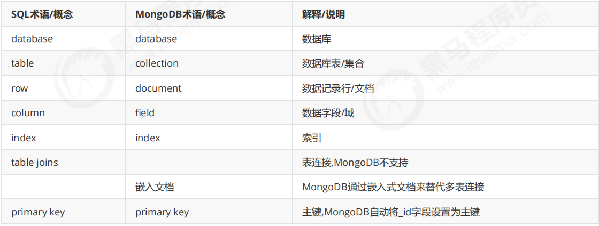
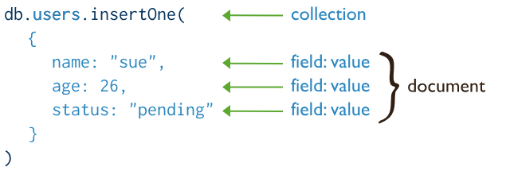
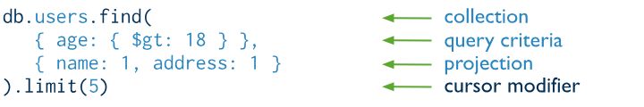
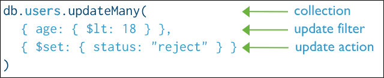

MongoDB是一个基于“分布式文件存储”的数据库，是典型的NoSQL。使用cpp编写，是一种高性能可扩展的数据存储解决方案，支持松散的数据结构（类似于json的一种bson格式）

**具体应用场景** ：

  1. 社交场景，使用 MongoDB存储存储用户信息，以及用户发表的朋友圈信息，通过地理位置索引实现附近的人、地点等功能。

  2. 游戏场景，使用 MongoDB存储游戏用户信息，用户的装备、积分等直接以内嵌文档的形式存储，方便查询、高效率存储和访问。

  3. 物流场景，使用 MongoDB存储订单信息，订单状态在运送过程中会不断更新，以 MongoDB内嵌数组的形式来存储，一次查询就能将订单所有的变更读取出来

  4. 物联网场景，使用 MongoDB存储所有接入的智能设备信息，以及设备汇报的日志信息，并对这些信息进行多维度的分析。

  5. 视频直播，使用 MongoDB存储用户信息、点赞互动信息等。

Mongo最大的特点是它支持的查询语言非常强大，其语法有点类似于面向对象的查询语言，几乎可以实现类似关系数据库单表查询的绝大部分功能，而且还支持对数据建立`索引`。首先我们从增删改查、索引、aggregate聚合三大方面来了解MongoDB的基础操作

## CRUD（增删改查）

### 创建操作

创建或插入操作用于将新[文档](<https://www.mongodb.com/zh-cn/docs/manual/core/document/#std-label-bson-document-format>)添加到[集合](<https://www.mongodb.com/zh-cn/docs/manual/core/databases-and-collections/#std-label-collections>)中。如果集合当前不存在，插入操作会创建集合。

MongoDB 提供以下方法将文档插入到集合中：

  * [`db.collection.insertOne()`](<https://www.mongodb.com/zh-cn/docs/manual/reference/method/db.collection.insertOne/#mongodb-method-db.collection.insertOne>)

  * [`db.collection.insertMany()`](<https://www.mongodb.com/zh-cn/docs/manual/reference/method/db.collection.insertMany/#mongodb-method-db.collection.insertMany>)

**MongoDB 中的所有写入操作在单个[文档](<https://www.mongodb.com/zh-cn/docs/manual/core/write-operations-atomicity/>)级别都具有[原子性](<https://www.mongodb.com/zh-cn/docs/manual/core/document/#std-label-bson-document-format>)。**

### 读取操作

读取操作用于从[集合](<https://www.mongodb.com/zh-cn/docs/manual/core/document/#std-label-bson-document-format>)中检索[文档](<https://www.mongodb.com/zh-cn/docs/manual/core/databases-and-collections/#std-label-collections>)，即查询集合中的文档。MongoDB 提供以下方法来从集合中读取文档：

### 插入行为

如果该集合当前不存在，则插入操作将创建该集合。

在MongoDB中，存储在标准集合中的每个文档都需要一个唯一的_id字段作为主键。如果插入的文档省略了`_id` 字段，则MongoDB驾驶员会自动为`_id`字段生成 ObjectId。

这也适用于通过执行 [upsert: true](<https://www.mongodb.com/zh-cn/docs/manual/reference/method/db.collection.update/#std-label-upsert-parameter>) 的更新操作插入的文档。

### 更新操作

更新操作用于修改[集合](<https://www.mongodb.com/zh-cn/docs/manual/core/document/#std-label-bson-document-format>)中的现有[文档](<https://www.mongodb.com/zh-cn/docs/manual/core/databases-and-collections/#std-label-collections>) 。MongoDB 提供以下方法来更新集合中的文档：

  * [`db.collection.updateOne()`](<https://www.mongodb.com/zh-cn/docs/manual/reference/method/db.collection.updateOne/#mongodb-method-db.collection.updateOne>)

  * [`db.collection.updateMany()`](<https://www.mongodb.com/zh-cn/docs/manual/reference/method/db.collection.updateMany/#mongodb-method-db.collection.updateMany>)

  * [`db.collection.replaceOne()`](<https://www.mongodb.com/zh-cn/docs/manual/reference/method/db.collection.replaceOne/#mongodb-method-db.collection.replaceOne>)

update支持partial的更新，而replace是直接替换

批量更新可以指定条件or过滤器

### 删除操作

删除操作用于从集合中删除文档。MongoDB 提供以下方法来删除集合中的文档：

  * [`db.collection.deleteOne()`](<https://www.mongodb.com/zh-cn/docs/manual/reference/method/db.collection.deleteOne/#mongodb-method-db.collection.deleteOne>)

  * [`db.collection.deleteMany()`](<https://www.mongodb.com/zh-cn/docs/manual/reference/method/db.collection.deleteMany/#mongodb-method-db.collection.deleteMany>)

在 MongoDB 中，删除操作针对的是单个[集合](<https://www.mongodb.com/zh-cn/docs/manual/reference/glossary/#std-term-collection>)。MongoDB 中的所有写入操作在单个文档级别都具有[原子性](<https://www.mongodb.com/zh-cn/docs/manual/core/write-operations-atomicity/>)。

您可以指定条件或过滤器来识别要删除的文档。这些[过滤器](<https://www.mongodb.com/zh-cn/docs/manual/core/document/#std-label-document-query-filter>)使用与读取操作相同的语法。

### 增删改查中的重要条件表述

在更新时，会涉及到以下三个问题：

  *  _新数据_ 

    * 默认是对原数据进行替换 

    * 若要进行修改,格式为 {修改器:{key:value}}

  * _是否新增_ 

    * 条件匹配不到数据时是否插入: true插入,false不插入(默认) 

  *  _是否修改多条_ \- 

    * 条件匹配成功的数据是否都修改: true都修改,false只修改一条(默认)

**修改器**| **作用**  
---|---  
$inc| 递增  
$rename| 重命名列  
$set| 修改列值  
$unset| 删除列  

db.集合名.update(条件, 新数据 [,是否新增, 是否修改多条])

任务：修改gcc的username为bareth，age+11，sex字段重命名为sexuality，删除address字段

    
    db.people.update({username:"gcc"},{
\t$set:{username:"bareth"},
\t$inc:{age:11},
\t$rename:{sex:"sexuality"},
\t$unset:{address:true}
})

对于查询而言，可以采取如下两种语法进行

db.集合名.find(条件 [,查询的列])   
db.集合名.find(条件 [,查询的列]).pretty() _#格式化查看_

查询的列是通过0,1分别指定的。

    
    # 查询的列(可选参数)
- 不写则查询全部列
- {key:1}\t只显示key列
- {key:0}\t除了key列都显示
- 注意:_id列都会存在

**运算符**| **作用**  
---|---  
$gt| 大于  
$gte| 大于等于  
$lt| 小于  
$lte| 小于等于  
$ne| 不等于  
$in| in  
$nin| not in  

分页查询也是内置的一种方法（可通过find,sort,skip和limit来实现）

    
    db.集合名.find().sort().skip(数字).limit(数字)[.count()]
# skip(数字)
- 指定跳过的数量(可选)
# limit(数字)
- 限制查询的数量
# count()
- 统计数量

**实战** ：数据库有1~10条数据，每页显示2条，一共5页

    
    # 数据准备
for(var i=1;i<11;i++){
\tdb.page.insert({_id:i,name:"p"+i})
}
# 分5页,每页2条显示
for(var i=0;i<10;i=i+2){
\tdb.page.find().skip(i).limit(2)
}

## 聚合查询

由于聚合功能是mongoDB特色的、强悍的一项查询+处理指令，因此单独区分开来讲解，具体的操作与实现逻辑。

aggregate查询语法如下：

    
    db.集合名.aggregate([
\t{管道:{表达式}}
\t...
])

$group| 将集合中的文档分组，用于统计结果  
---|---  
$match| 过滤数据，只输出符合条件的文档  
$sort| 聚合数据进一步排序  
$skip| 跳过指定文档数  
$limit| 限制集合数据返回文档数  

$sum| 总和（$num:1同count表示统计）  
---|---  
$avg| 平均  
$min| 最小值  
$max| 最大值  

比如有以下这些数据：

    
    db.people.insertOne({_id:1,name:"a",sex:"男",age:21})
db.people.insertOne({_id:2,name:"b",sex:"男",age:20})
db.people.insertOne({_id:3,name:"c",sex:"女",age:20})
db.people.insertOne({_id:4,name:"d",sex:"女",age:18})
db.people.insertOne({_id:5,name:"e",sex:"男",age:19})

就可以用如下办法进行聚合查询

    
    db.people.aggregate([
\t{$group:{_id:"$sex",age_sum:{$sum:"$age"}}}
])

结果是这样的：

    
    [
  { _id: '女', age_sum: 38 },
  { _id: '男', age_sum: 60 }
]

## 索引

**索引** 是一种排序好的便于快速查询数据的数据结构，用于帮助数据库高效的查询数据

**创建索引语法** ：

    
    # 创建索引
db.集合名.createIndex(待创建索引的列:方式 [,额外选项])
# 创建复合索引
db.集合名.createIndex({key1:方式,key2:方式} [,额外选项])
# 参数说明：
- `待创建索引的列:方式`：{key:1}/{key:-1}
   1表示升序，-1表示降序; 例如{age:1}表示创建age索引并按照升序方法排列
- `额外选项`：设置索引的名称或者唯一索引等
   设置名称:{name:索引名}
   唯一索引:{unique:列名}

可以使用分析来比较有索引和无索引的查找情况

    
    db.集合名.find().explain('executionStats')

## MongoDB数据库权限管理

**创建账号**

    
    db.createUser({
\t"user":"账号",
\t"pwd":"密码",
\t"roles":[{
\t\trole:"角色",
\t\tdb:"所属数据库"
\t}]
})

具体有如下角色类型

  * 超级用户角色：`root`

  * 数据库用户角色：`read`、`readWrite`

  * 数据库管理角色：`dbAdmin`、`userAdmin`

  * 集群管理角色： `clusterAdmin`、`clusterManager`、`clusterMonitor`、`hostManager`

  * 备份恢复角色： `backup`、`restore`

  * 所有数据库角色： `readAnyDatabase`、`readWriteAnyDatabase`、`userAdminAnyDatabase`、`dbAdminAnyDatabase`
