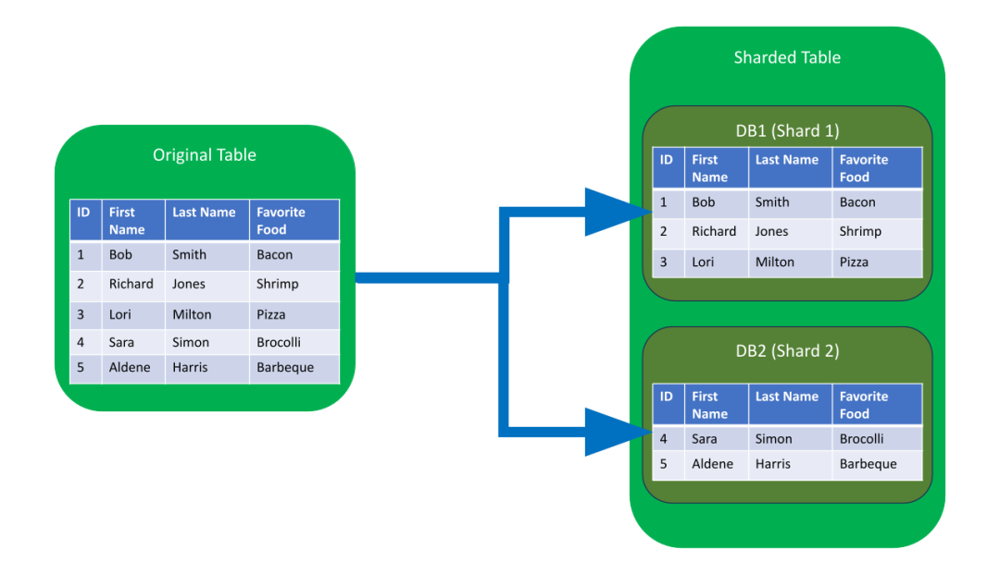

\n\n\n\n\n

任何看到显著增长的应用程序或网站，最终都需要进行扩展，以适应流量的增加。以确保数据安全性和完整性的方式进行扩展，对于数据驱动的应用程序和网站来说十分重要。人们可能很难预测某个网站或应用程序的流行程度，也很难预测这种流行程度会持续多久，这就是为什么有些机构选择“可动态扩展的”数据库架构的原因。

\n\n\n\n

近年来，分片（Sharding）一直受到很多关注

\n\n\n\n

## 什么是分片？

\n\n\n\n

分片（Sharding）是一种与水平切分（horizontal partitioning）相关的数据库架构模式——**将一个表里面的行，分成多个不同的表的做法** （称为分区）。每个区都具有相同的模式和列，但每个表有完全不同的行。同样，每个分区中保存的数据都是唯一的，并且与其他分区中保存的数据无关。

\n\n\n\n

数据库分片（Database shards）是[无共享架构](<https://zhida.zhihu.com/search?content_id=100837807&content_type=Article&match_order=1&q=%E6%97%A0%E5%85%B1%E4%BA%AB%E6%9E%B6%E6%9E%84&zhida_source=entity>)的一个例子。这意味着分片是自治的：分片间不共享任何相同的数据或服务器资源。但是在某些情况下，将某些表复制到每个分片中作为参考表是有意义的。例如，假设某个应用程序的数据库依赖于重量测量的固定转换率。通过将包含必要转换率数据的表复制到每个分片中，有助于确保查询所需的所有数据都保存在每个分片中。

\n\n\n\n

下面具体进行一个在docker-compose上模拟多机器的mongodb的分片部署

\n\n\n\n

\n