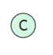
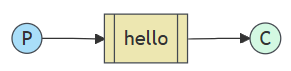
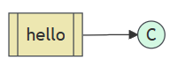
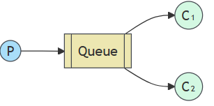
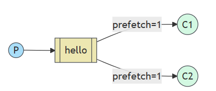
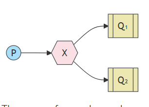
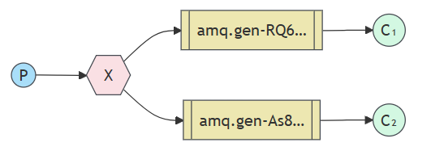
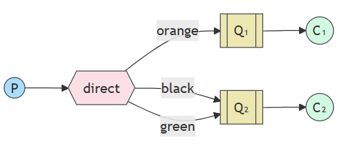
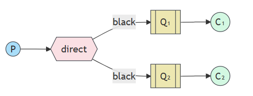
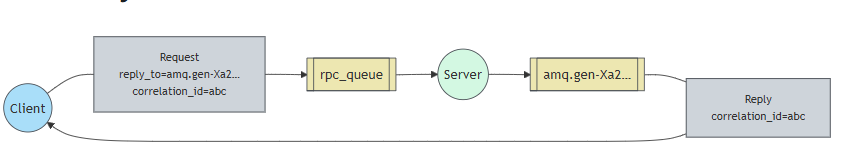

\n

RabbitMQ is a message broker: it **accepts and forwards messages.** You can think about it as a post office: when you put the mail that you want posting in a post box, you can be sure that the letter carrier will eventually deliver the mail to your recipient. In this analogy, RabbitMQ is a post box, a post office, and a letter carrier.

\n\n\n\n

 _Producing_ means**nothing more than sending**. A program that sends messages is a  _producer_ :(一个生产者就长下面这样）

\n\n\n\n\n\n\n\n

 _A queue_ is the name for the**post box** in RabbitMQ. Although messages flow through RabbitMQ and your applications, they can only be stored inside a  _queue_. A  _queue_ is **only bound by the host's memory & disk limits**（内存or磁盘均可）, it's essentially a large message buffer.

\n\n\n\n

Many _producers_  can send messages that go to one queue, and many _consumers_  can try to receive data from one _queue_.

\n\n\n\n

This is how we represent a queue:

\n\n\n\n\n\n\n\n

 _Consuming_ has a similar meaning to receiving. A  _consumer_ is a program that mostly waits to**receive messages:**

\n\n\n\n\n\n\n\n

## Hello World

\n\n\n\n

我们先使用amqp.node API来完成第一个，最简单的示例，即“Hello World”消息的发送，具体结构如下：

\n\n\n\n\n\n\n\n

RabbitMQ speaks multiple protocols. This tutorial uses AMQP 0-9-1, which is an open, general-purpose protocol for messaging. There are a number of clients for RabbitMQ in [many different languages](<https://www.rabbitmq.com/client-libraries/devtools>). We'll use the [amqp.node client](<http://www.squaremobius.net/amqp.node/>) in this tutorial.

\n\n\n\n

### Sending

\n\n\n\n

We'll call our message publisher (sender) `send.js` and our message consumer (receiver) `receive.js`. The publisher will connect to RabbitMQ, send a single message, then exit.

\n\n\n\n

In [`send.js`](<https://github.com/rabbitmq/rabbitmq-tutorials/blob/main/javascript-nodejs/src/send.js>), we need to require the library first:（不过在ts里面更推荐import的安全方式）

\n\n\n\n
    
    
    var amqp = require('amqplib/callback_api');

\n\n\n\n

然后就是连接到服务器的部分了

\n\n\n\n
    
    
    amqp.connect('amqp://localhost', function(error0, connection) {});

\n\n\n\n

对于ESM这种异步的加载而言，则是这样：

\n\n\n\n
    
    
    import amqp from 'amqplib';\nconst conn = await amqp.connect('amqp://localhost');

\n\n\n\n

不过平常一般我们会把channel和连接一起完成

\n\n\n\n
    
    
    amqp.connect('amqp://localhost', function(error0, connection) {\n  if (error0) {\n    throw error0;\n  }\n  connection.createChannel(function(error1, channel) {});\n});

\n\n\n\n

为了实现发送，我们还得定义一个队列给我们缓存数据，因此完整一些的代码如下：

\n\n\n\n
    
    
    amqp.connect('amqp://localhost', function(error0, connection) {\n  if (error0) {\n    throw error0;\n  }\n  connection.createChannel(function(error1, channel) {\n    if (error1) {\n      throw error1;\n    }\n    var queue = 'hello';\n    var msg = 'Hello world';\n\n    channel.assertQueue(queue, {\n      durable: false\n    });\n\n    channel.sendToQueue(queue, Buffer.from(msg));\n    console.log(" [x] Sent %s", msg);\n  });\n});

\n\n\n\n

### Receiving

\n\n\n\n

That's it for our publisher. Our consumer listens for messages from RabbitMQ, so unlike the publisher which publishes a single message, we'll keep the consumer running to listen for messages and print them out.

\n\n\n\n\n\n\n\n

模块加载和连接是类似的，不过需要定义不一样的函数用于消费

\n\n\n\n
    
    
    channel.consume(queue, function(msg) {\n  console.log(" [x] Received %s", msg.content.toString());\n}, {\n    noAck: true\n});

\n\n\n\n

这里设置noAck表示消费完之后不需要对应的确认过程，因此如果出现了消费失败的情况这个消息会被直接丢弃

\n\n\n\n

## Work Queues

\n\n\n\n

工作队列 (又称任务队列) ， 背后的主要思想是**避免立即执行资源密集型任务** 并**必须等待其完成** 。相反，我们将任务安排在稍后完成。我们将任务封装为消息并将其发送到队列。后台运行的工作进程将弹出任务并最终执行该任务。当你**运行多个工作进程** 时，这些任务将在它们之间共享。

\n\n\n\n\n\n\n\n

We will slightly modify the  _send.js_ code from our previous example, to allow arbitrary messages to be sent from the command line. This program will schedule tasks to our work queue, so let's name it `new_task.js`

\n\n\n\n
    
    
    var queue = 'task_queue';\nvar msg = process.argv.slice(2).join(' ') || "Hello World!";\n\nchannel.assertQueue(queue, {\n  durable: true\n});\nchannel.sendToQueue(queue, Buffer.from(msg), {\n  persistent: true\n});\nconsole.log(" [x] Sent '%s'", msg);

\n\n\n\n

Our old  _receive.js_ script also requires some changes: it needs to **fake a second of work for every dot in the message body.** It will pop messages from the queue and perform the task, so let's call it `worker.js`:

\n\n\n\n
    
    
    var queue = 'task_queue';\n\n// This makes sure the queue is declared before attempting to consume from it\nchannel.assertQueue(queue, {\n  durable: true\n});\n\nchannel.consume(queue, function(msg) {\n  var secs = msg.content.toString().split('.').length - 1;\n\n  console.log(" [x] Received %s", msg.content.toString());\n  setTimeout(function() {\n    console.log(" [x] Done");\n  }, secs * 1000);\n}, {\n  // automatic acknowledgment mode,\n  // see /docs/confirms for details\n  noAck: true\n});

\n\n\n\n

By default, RabbitMQ will send each message to the next consumer, in sequence. On average every consumer will get the same number of messages. This way of distributing messages is called round-robin.rabbitmq默认使用轮盘赌的方式给每个消费者分配相同数量的消息

\n\n\n\n

### Message Acknowledgement

\n\n\n\n

执行任务可能需要几秒钟，您可能想知道如果使用者启动了一个长任务，并且该任务在完成之前终止，会发生什么情况。使用我们当前的代码，一旦 RabbitMQ 将消息传递给使用者，它就会立即将其标记为删除。在这种情况下，如果您终止 worker，则会丢失它刚刚正在处理的消息。**已分派给此特定 worker 但尚未处理的消息也会丢失。**

\n\n\n\n

为了确保消息永远不会丢失，RabbitMQ 支持 [消息 _确认  _](<https://www.rabbitmq.com/docs/confirms>)。消费者发回一个 ack（nowledgement），告诉 RabbitMQ 已经收到、处理了一条特定的消息，RabbitMQ 可以自由地删除它。

\n\n\n\n

在消费者交付确认时强制执行超时（默认为 30 分钟）。 这有助于检测从不确认送达的有缺陷（卡住）的使用者。 您可以增加此超时，如 中所述 [Delivery Acknowledgement Timeout（送达确认超时 ](<https://www.rabbitmq.com/docs/consumers#acknowledgement-timeout>)）。

\n\n\n\n

一旦我们完成任务，是时候使用 `{noAck： false}` 选项打开它们并从 worker 发送适当的确认了。

\n\n\n\n

### Message durability

\n\n\n\n

我们已经学会了如何确保即使消费者死亡，任务也不会丢失。但是如果 RabbitMQ 服务器停止，我们的任务仍然会丢失。

\n\n\n\n

用如下的方式就可以实现持久化

\n\n\n\n
    
    
    channel.assertQueue('hello', {durable: true});

\n\n\n\n

虽然这个命令本身是正确的，但它在我们目前的设置中不起作用。那是因为我们已经定义了一个名为 `hello` 的队列 这是不持久的。RabbitMQ 不允许重新定义现有队列 使用不同的参数，并将向任何程序返回错误 它试图做到这一点。因此我们需要在一个新队列创建时就指定其持久化的功能。

\n\n\n\n

### Fair Dispatch

\n\n\n\n

您可能已经注意到，调度仍然没有完全按照我们的要求工作。例如，在有两个 worker 的情况下，当所有奇数消息都很重，偶数消息都很轻时，一个 worker 将一直忙碌，而另一个 worker 几乎不做任何工作。好吧，RabbitMQ 对此一无所知，并且仍然会均匀地发送消息。

\n\n\n\n

发生这种情况是因为 RabbitMQ 只是在消息进入队列时调度消息。它不会查看使用者的未确认消息的数量。它只是盲目地将每 n 条消息分派给第 n 个消费者。

\n\n\n\n\n\n\n\n

为了解决这个问题，我们可以使用值为 `1` 的 `prefetch` 方法。这告诉 RabbitMQ 一次不要向 worker 提供多条消息。或者，换句话说，在工作程序处理并确认前一条消息之前，不要将新消息分派给工作程序。相反，它会将其分派给下一个仍然不忙的 worker。

\n\n\n\n

## Publish/Subscribe

\n\n\n\n

在我们的日志系统中，接收器程序的每个运行副本都会收到消息。这样，我们将能够运行一个接收器并将日志定向到磁盘;同时，我们将能够运行另一个接收器并在屏幕上查看日志。

\n\n\n\n

RabbitMQ 中消息收发模型的核心思想是，生产者从不直接向队列发送任何消息。实际上，很多时候，生产者甚至不知道消息是否会被传送到任何队列。

\n\n\n\n\n\n\n\n

相反，创建者只能向  _Exchange_ 发送消息。一 交换是一件非常简单的事情。一方面，它接收来自 producers，另一端则将它们推送到队列中。交易所 必须确切地知道如何处理它收到的消息。应该是 附加到特定队列？它应该附加到许多队列中吗？ 或者它应该被丢弃。**该规则由 _exchange_ 决定**

\n\n\n\n

有几种可用的交换类型：`direct`、`topic`、`headers` 和`fanout `。我们将重点介绍最后一个 **fanout** 。让我们创建一个这种类型的交换，并将其命名为 `logs`：

\n\n\n\n
    
    
    ch.assertExchange('logs', 'fanout', {durable: false})

\n\n\n\n

fanout交换非常好理解，就是将收到的消息广播到所有他已知的队列

\n\n\n\n

在本教程的前几部分，我们对 exchange 一无所知，但仍然能够将消息发送到队列。这是可能的，因为我们使用的是默认 exchange，它由空字符串 （`“”）` 标识。

\n\n\n\n

现在，我们可以发布到我们的命名 exchange：

\n\n\n\n
    
    
    channel.publish('logs', '', Buffer.from('Hello World!'));

\n\n\n\n

空字符串作为第二个参数意味着我们不想将消息发送到任何特定队列。我们只想将其发布到我们的 'logs' 交换。

\n\n\n\n

### 临时队列

\n\n\n\n

您可能还记得，我们之前使用的是具有特定名称的队列（还记得 `hello` 和 `task_queue` 吗？能够命名队列对我们来说至关重要 - 我们需要将 worker 指向同一个队列。当您希望在创建者和使用者之间共享队列时，为队列命名非常重要。

\n\n\n\n

但对于我们的 Logger 来说，情况并非如此。我们希望听到所有日志消息，而不仅仅是其中的子集。我们也只对当前流的消息感兴趣，对旧的消息不感兴趣。要解决这个问题，我们需要两件事。

\n\n\n\n

首先，每当我们连接到 Rabbit 时，我们都需要一个新的空队列。为此，我们可以创建一个具有随机名称的队列，或者更好的是 - 让服务器为我们选择一个随机队列名称。

\n\n\n\n

其次，当我们断开消费者的连接，队列会自动删除

\n\n\n\n

在 [amqp.node](<http://www.squaremobius.net/amqp.node/>) 客户端中，当我们以空字符串形式提供队列名称时，我们会使用生成的名称创建一个非持久队列：

\n\n\n\n
    
    
    channel.assertQueue('', {\n  exclusive: true\n});

\n\n\n\n

当声明它的连接关闭时，队列将被删除，因为它被声明为独占队列

\n\n\n\n

### Bindings绑定

\n\n\n\n

We've already created a fanout exchange and a queue. Now we need to tell the exchange to send messages to our queue. That relationship between exchange and a queue is called a  _binding_.

\n\n\n\n

从现在开始，` 日志`exchange会将消息附加到我们的队列中。

\n\n\n\n
    
    
    channel.bindQueue(queue_name, 'logs', '');

\n\n\n\n\n\n\n\n

## 路由

\n\n\n\n

我们将为其添加一项功能 - 我们将使仅**订阅消息子集** 成为可能。例如，我们将能够仅将关键错误消息定向到日志文件（以节省磁盘空间），同时仍然能够在控制台上打印所有日志消息。

\n\n\n\n

除了之前fanout exchange的绑定队列方法之外，还有绑定可以采用额外的绑定键参数（上面代码中的空字符串）。这是我们使用 key 创建绑定的方法：

\n\n\n\n
    
    
    channel.bindQueue(queue_name, exchange_name, 'black');

\n\n\n\n

绑定密钥的含义取决于交换类型。这 我们之前使用的 `fanout` exchanges 只是忽略了它的值。

\n\n\n\n

### Direct exchange

\n\n\n\n

除了广播全部日志之外，我们希望将其扩展为允许根据消息的严重性筛选消息。例如，我们可能希望将日志消息写入磁盘的脚本只接收严重错误，而不会将磁盘空间浪费在警告或信息日志消息上。

\n\n\n\n

接下来我们将抛弃fanout的模式使用direct exchange，背后的路由算法很简单 - 消息将发送到其 `binding key` 与消息的 `routing key` 完全匹配。

\n\n\n\n\n\n\n\n

### multiple bindings多个绑定

\n\n\n\n\n\n\n\n

使用相同的绑定键绑定多个队列是完全合法的。在我们的示例中，我们可以在 `X` 和 `Q1` 之间添加一个绑定，绑定键为 `black`。在这种情况下，` 直接`交换的行为将类似于 `fanout`，并将消息广播到所有匹配的队列。路由键`为 black` 的消息将投递给两者 `问题 1` 和`问题 2`。

\n\n\n\n

### subscribing订阅

\n\n\n\n

接收消息的工作方式与上一个教程中一样，但有一个例外 - 我们将为我们感兴趣的每个severity创建一个新的绑定。

\n\n\n\n
    
    
    args.forEach(function(severity) {\n  channel.bindQueue(q.queue, exchange, severity);\n});

\n\n\n\n

### RPC

\n\n\n\n

尽管 RPC 在计算中是一种非常常见的模式，但它经常受到批评。当程序员不知道函数调用是本地调用还是慢速 RPC 时，就会出现问题。像这样的混淆会导致系统不可预测，并给调试增加不必要的复杂性。滥用 RPC 不仅不会简化软件，反而会导致无法维护的意大利面条式代码。

\n\n\n\n

通常，通过 RabbitMQ 执行 RPC 很容易。客户端发送请求消息，服务器使用响应消息进行回复。为了收到响应，我们需要在请求中发送一个 'callback' 队列地址。让我们试一试：

\n\n\n\n
    
    
    channel.assertQueue('', {\n  exclusive: true\n});\n\nchannel.sendToQueue('rpc_queue', Buffer.from('10'), {\n   replyTo: queue_name\n});\n\n# ... then code to read a response message from the callback queue ...

\n\n\n\n\n\n\n\n

\n