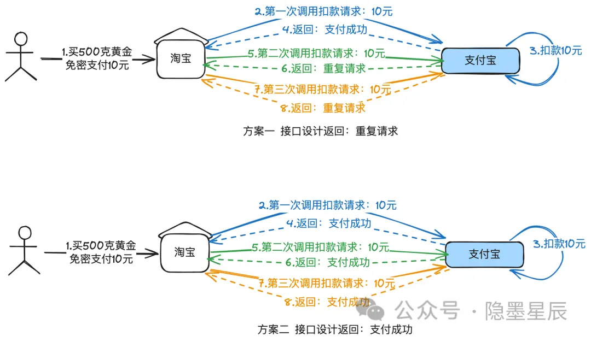
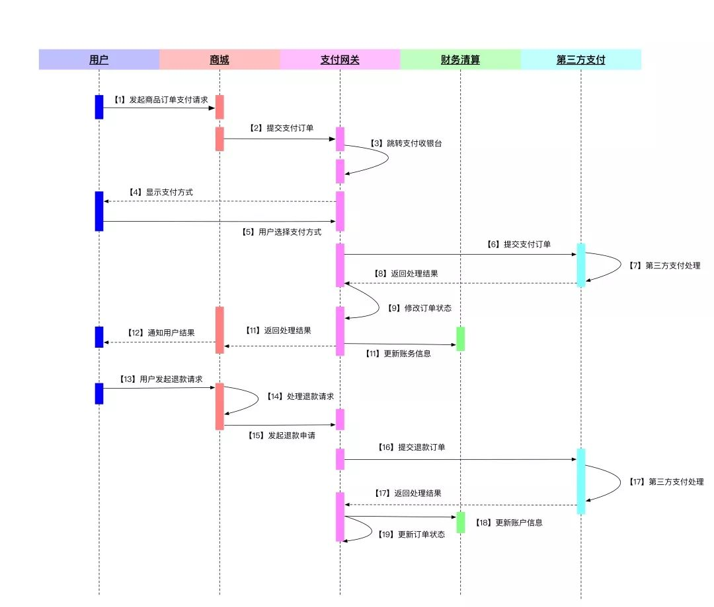
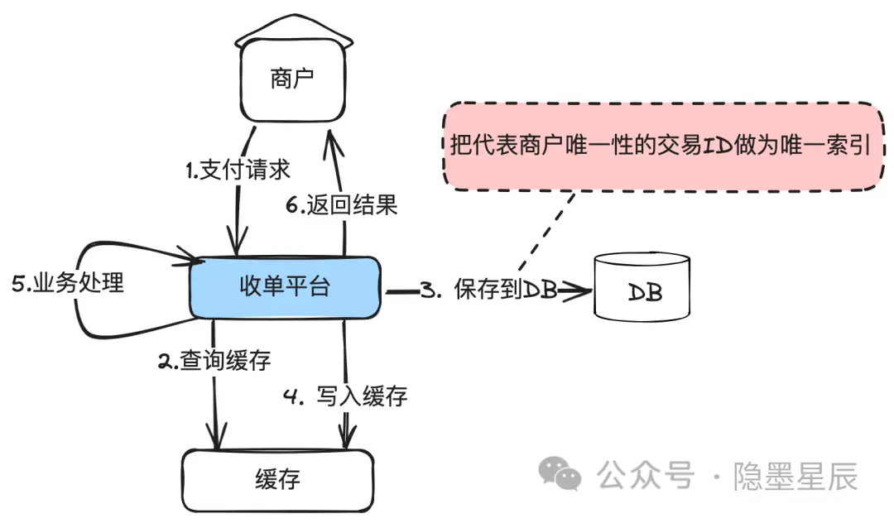
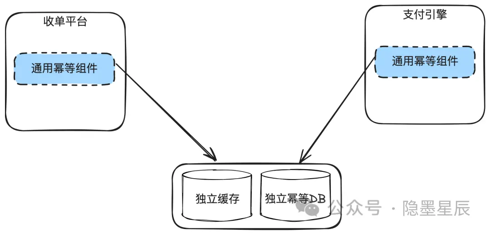
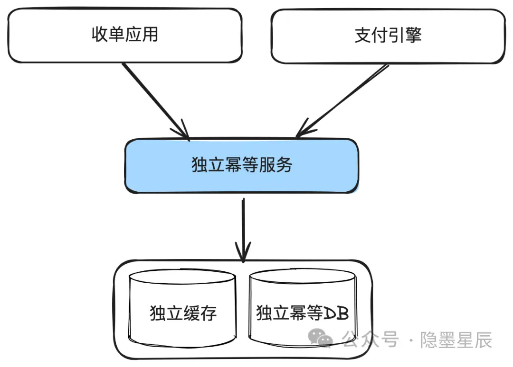
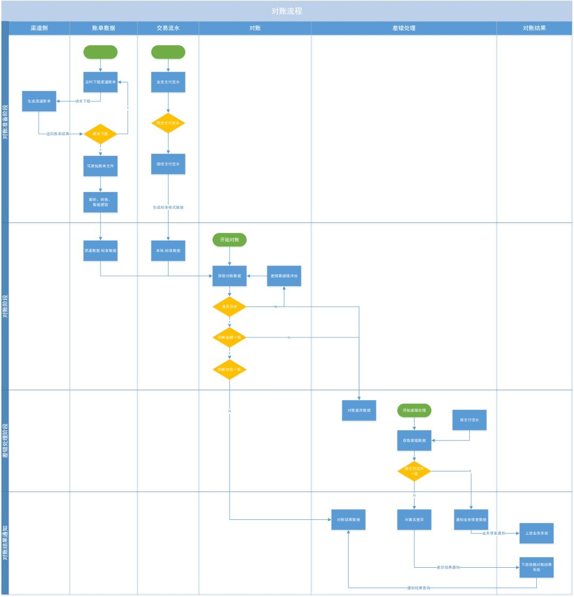

## FIRRRRRST of all

首先，在进行我们这一阶段的设计之前，我们要清楚，为什么要把支付系统设计成“高可用”的状态，也就是“高可用”在这里究竟指的是什么。

在研究这个问题时，我们要把视角转回到支付这件事本身。想象一个场景，你在进行一次网购的支付操作，你要买的这个东西10块钱，然后你点击支付，输入密码把钱付了出去，但是就在这时出现了一些网络问题，你付的钱到对面了，但是你这边由于网络不好没有收到回复，然后系统提醒你支付失败再付一次，然后店家那边也照单全收了，这对吗？由于 网络的故障，你多花了十块钱，并且商家没有合适的途径把这钱退给你（因为系统没有支持这样的断联情况），因此这样一个支付系统是完全不合情理的。

于是我们接下来首先要了解一下，一个合格的支付系统需要满足哪些条件

## 支付系统

支付系统是由多个部分组成的，具体如下：

完整的支付系统包括如下功能：

  1. 应用管理: 同时支持公司多个业务系统对接。

  2. 商户管理: 支持商户入驻，商户需要向平台方提供相关的资料备案。

  3. 渠道管理: 支持微信、支付宝、银联、京东支付等多种渠道。

  4. 账户管理: 渠道账户管理，支持共享账户（个人商户）及自有账户。

  5. 支付交易: 生成预支付订单、提供退款服务。

  6. 对账管理: 实现支付系统的交易数据与第三方支付渠道交易明细的自动核对（通常T+1），确保交易数据的准确性和一致性。

  7. 清算管理: 计算收款交易中商户的应收与支付系统收益。

  8. 结算管理: 根据清算结果，将资金划拨至商户对应的资金帐户中。

支付系统有几个关键的核心流程：支付流程、对账流程、结算流程

### 关于幂等性

对于支付而言，最重要的属性，其实也是大多数分布式服务所要最终支撑的属性：幂等性

幂等性是一个数学和计算机科学术语，用于描述无论操作执行多少次，都产生相同结果的属性。在软件行业，应用极其广泛，当我们说一个接口支持幂等时，无论调用多少次，对系统造成的结果是一致的。

注意这里说的“对系统造成的结果是一致的”是指系统内部数据或状态的变更，不是指返回值。不同的系统设计，返回值可能是不一样的。

举个例子，你在淘宝免密支付10元，淘宝针对这笔订单调用支付宝支付接口进行支付，无论是调用1次，还是调用100次，最终只扣了你10元。但是第二次有可能返回“重复请求”，也有可能返回“支付成功”，这个取决于接口设计。也就是支付宝内部只扣了你10元，但是接口可能返回给商户是是不同的结果。

### **幂等性需关注几个重点**

  * 幂等不仅仅只是一次（或多次）请求对资源没有副作用（比如查询数据库操作，没有增删改，因此没有对数据库有任何影响）

  * 幂等还包括第一次请求的时候对资源产生了副作用，但是以后的多次请求都不会再对资源产生副作用。

  * 幂等关注的是以后的多次请求是否对资源产生的副作用，而不关注结果。

  * 网络超时等问题，不是幂等性的讨论范围。

一个完整的支付流程是这样的：

支付流程说明

  1. 用户在商城选购商品并发起支付请求；

  2. 商城将支付订单通过B2C网关收款接口传送至支付网关；

  3. 用户选择网银支付及银行，支付平台将订单转送至指定银行网关界面；

  4. 用户支付完成，银行处理结果并向平台返回处理结果；

  5. 支付平台接收处理结果，落地处理并向商户返回结果；

  6. 商城接收到支付公司返回结果，落地处理（更改订单状态）并通知用户。

> “”“”
> 
> 幂等性是系统服务对外一种承诺（而不是实现），承诺只要调用接口成功，外部多次调用对系统的影响是一致的。声明为幂等的服务会认为外部调用失败是常态，并且失败之后必然会有重试。

### 如何解决幂等？

#### 1.业务幂等

所谓业务幂等，就是由各域自己把唯一性的交易ID作为数据库唯一索引，这样可以保证不会重复处理。

在数据库前面可以加一层缓存来提高性能，但是缓存只用于查询，查到数据认为就返回幂等成功，但是但不到，需要尝试插入数据库，插入成功后再刷新数据到缓存。

#### 2**.通用幂等组件**

每个域都要做幂等处理，那就单独出一个独立的幂等组件，各子业务系统通过引用这个公共JAR包解决。

#### 3.通用幂等服务

解决DB连接数不够用的第二个解决方案：幂等组件服务化。这样的坏处就是复杂度和耗时RT都会增加，而且幂等服务有可能成为瓶颈，所以一般**很少这么用。**

分布式支付系统面临的幂等性挑战核心有两点：

  1. 如何保证分布于不同地理位置数据中心的系统数据的一致性。

  2. 幂等数据和业务数据跨库事务一致性。比如幂等已经入库成功，但是业务数据库入库失败。

为了解决这些挑战，可以采取以下解决方案：

  * 使用全局唯一的交易ID，跟踪每次支付请求，防止重复处理。

  * 幂等住了之后，还需要继续查询业务数据，如果查询失败，仍然执行业务操作。

  * 构建强大的状态机推进能力，严格定义事务各个状态的转换。

  * 幂等服务的高可靠性。

#### token令牌

这种方式分成两个阶段：申请token阶段和支付阶段。 第一阶段，在进入到提交订单页面之前，需要订单系统根据用户信息向支付系统发起一次申请token的请求，支付系统将token保存到Redis缓存中，为第二阶段支付使用。 第二阶段，订单系统拿着申请到的token发起支付请求，支付系统会检查Redis中是否存在该token，如果存在，表示第一次发起支付请求，删除缓存中token后开始支付逻辑处理；如果缓存中不存在，表示非法请求。 实际上这里的token是一个信物，支付系统根据token确认，你是你妈的孩子。不足是需要系统间交互两次，流程较上述方法复杂。

#### 支付缓冲区

把订单的支付请求都快速地接下来，一个快速接单的缓冲管道。后续使用异步任务处理管道中的数据，过滤掉重复的待支付订单。优点是同步转异步，高吞吐。不足是不能及时地返回支付结果，需要后续监听支付结果的异步返回。

### 退款流程

退款流程说明

  1. 用户在商户平台发起退款申请，商户核实退款信息及申请；

  2. 商户登录支付平台账户/或者通过支付公司提供的退款接口向支付平台发起退款；

  3. 支付系统会对退款信息校验（退款订单对应的原订单是否支付成功？退款金额是否少于等于原订单金额？），校验商户账户余额是否充足等；校验不通过，则无法退款；

  4. 支付系统在商户可用余额账户扣除金额，并将退款订单发送至银行，银行完成退款操作。注意：对于网关收款的订单退款，各银行要求不一，有些银行提供的退款接口要求原订单有效期在90或180天，有些银行不提供退款接口；针对超期或者不支持接口退款的订单，支付公司通过代付通道完成退款操作。

对于收单金额未结算，还在“待结算”账户的订单，如果出现退款情况，业务流程和上述流程差不多，只是从待结算账户进行扣款。

