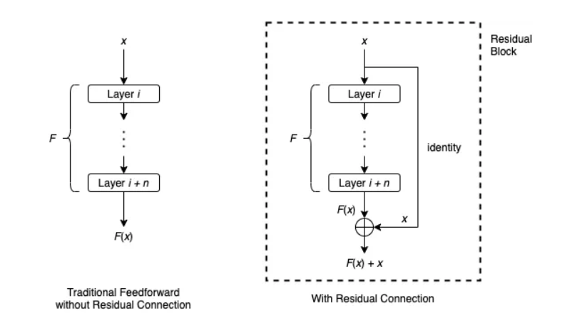
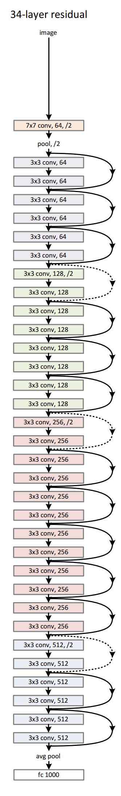
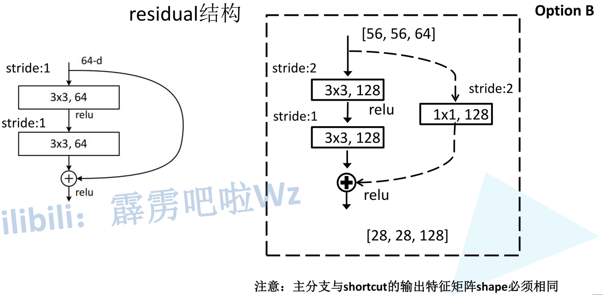

训练神经网络的一个困境是，我们通常希望更深的神经网络具有更好的准确性和性能。然而，网络越深，训练就越难收敛。这一点困扰着层数深的模型，不过Kaiming He提出的Resnet创新性的使用的残差skip的方法，有效解决了这样的极深网络的问题。

网络过深时会出现以下问题：

  1. **梯度消失或梯度爆炸：** 以梯度消失为例，反向传播过程中，每向前传播一层，都要乘以一个小于1的误差梯度。**解决梯度消失或梯度爆炸的方法有：对数据标准化处理；权重初始化；Batch Normalization（BN）**

  2. **退化问题** （degradation problem）：ResNet主要解决退化问题，提出残差结构

在传统的前馈神经网络中，数据顺序地流过每一层：一层的输出是下一层的输入。它有隐患，一旦其中某一个导数很小，多次连乘后梯度可能越来越小，**这就是常说的梯度消散** ，对于深层网络，传到浅层几乎就没了。但是如果使用了残差，**每一个导数就加上了一个恒等项1，dh/dx=d(f+x)/dx=1+df/dx** 。此时就算原来的导数df/dx很小，这时候误差仍然能够有效的反向传播，这就是核心思想。

Residual Connection通过跳过某些层为数据到达神经网络的后面部分提供了另一条路径。考虑一系列层，从层  _i_ 到层  _i + n_ ，设  _F_ 为这些层所表示的函数。用  _x_ 表示层  _i_ 的输入。在传统的前馈设置中， _x_ 将简单地一个接一个地通过这些层，并且层  _i + n_ 的结果是  _F_ （ _x_ ）。绕过这些层的剩余连接通常按以下方式工作：

剩余连接首先对  _x_ 应用恒等映射，然后执行逐元素加法  _F_ （ _x_ ）+_x_ 。在文献中，接受输入  _x_ 并产生输出  _F_ （ _x_ ）+_x_ 的整个架构通常被称为残差块或构建块。通常，残差块还将包括激活函数，例如应用于  _F_ （ _x_ ）+_x_ 的 ReLU。

强调上图中看似多余的标识映射的主要原因是，如果需要，它可以作为更复杂函数的占位符。例如，元素加法  _F_ （ _x_ ）+_x_ 只有在  _F_ （ _x_ ）和  _x_ 具有相同维数时才有意义。如果它们的维数不同，我们可以用线性变换（即乘以矩阵  _W_ ）代替单位映射，并执行  _F_ （ _x_ ）+_Wx_ 。

在ResNet原文中，分为5个版本的ResNet，这5个版本详细又能分为浅层和深层两种

**对于浅层网络（18/34）：**

  * **conv2_x第一层** 为**实线** 残差结构，因为通过最大池化下采样后得到的输出是[56,56,64]，刚好是实线残差结构所需要的输入shape

  * **conv3_x第一层** 为**虚线** 残差结构，输入特征矩阵shape是[56,56,64]，输出特征矩阵shape是[28,28,128]

**对于深层网络（50/101/152）：**

  * **conv2_x第一层** 为**虚线** 残差结构，因为通过最大池化下采样后得到的输出是[56,56,64]，而实线残差结构所需要的输入shape是[56,56,256]

  * **conv3_x第一层** 为**虚线** 残差结构，输入特征矩阵shape是[56,56,256]，输出特征矩阵shape是[28,28,512]

**无论是浅层网络还是深层网络，conv3_x、conv4_x、conv5_x的第一层都为虚线残差结构** ，因为需要将上一层输出特征矩阵的高、宽、深度调整为当前层所需输入特征矩阵的高、宽、深度（Down-sampling is performed by conv3_1、conv4_1 and conv5_1 with a stride of 2）

pytorch对于Resnet的主类实现如下：

    
    class ResNet(nn.Module):
    def __init__(
        self,
        block: type[Union[BasicBlock, Bottleneck]],
        layers: list[int],
        num_classes: int = 1000,
        zero_init_residual: bool = False,
        groups: int = 1,
        width_per_group: int = 64,
        replace_stride_with_dilation: Optional[list[bool]] = None,
        norm_layer: Optional[Callable[..., nn.Module]] = None,
    ) -> None:
        super().__init__()
        _log_api_usage_once(self)
        if norm_layer is None:
            norm_layer = nn.BatchNorm2d
        self._norm_layer = norm_layer
        self.inplanes = 64
        self.dilation = 1
        if replace_stride_with_dilation is None:
            # each element in the tuple indicates if we should replace
            # the 2x2 stride with a dilated convolution instead
            replace_stride_with_dilation = [False, False, False]
        if len(replace_stride_with_dilation) != 3:
            raise ValueError(
                "replace_stride_with_dilation should be None "
                f"or a 3-element tuple, got {replace_stride_with_dilation}"
            )
        self.groups = groups
        self.base_width = width_per_group
        self.conv1 = nn.Conv2d(3, self.inplanes, kernel_size=7, stride=2, padding=3, bias=False)
        self.bn1 = norm_layer(self.inplanes)
        self.relu = nn.ReLU(inplace=True)
        self.maxpool = nn.MaxPool2d(kernel_size=3, stride=2, padding=1)
        self.layer1 = self._make_layer(block, 64, layers[0])
        self.layer2 = self._make_layer(block, 128, layers[1], stride=2, dilate=replace_stride_with_dilation[0])
        self.layer3 = self._make_layer(block, 256, layers[2], stride=2, dilate=replace_stride_with_dilation[1])
        self.layer4 = self._make_layer(block, 512, layers[3], stride=2, dilate=replace_stride_with_dilation[2])
        self.avgpool = nn.AdaptiveAvgPool2d((1, 1))
        self.fc = nn.Linear(512 * block.expansion, num_classes)
        for m in self.modules():
            if isinstance(m, nn.Conv2d):
                nn.init.kaiming_normal_(m.weight, mode="fan_out", nonlinearity="relu")
            elif isinstance(m, (nn.BatchNorm2d, nn.GroupNorm)):
                nn.init.constant_(m.weight, 1)
                nn.init.constant_(m.bias, 0)
        # Zero-initialize the last BN in each residual branch,
        # so that the residual branch starts with zeros, and each residual block behaves like an identity.
        # This improves the model by 0.2~0.3% according to https://arxiv.org/abs/1706.02677
        if zero_init_residual:
            for m in self.modules():
                if isinstance(m, Bottleneck) and m.bn3.weight is not None:
                    nn.init.constant_(m.bn3.weight, 0)  # type: ignore[arg-type]
                elif isinstance(m, BasicBlock) and m.bn2.weight is not None:
                    nn.init.constant_(m.bn2.weight, 0)  # type: ignore[arg-type]
    def _make_layer(
        self,
        block: type[Union[BasicBlock, Bottleneck]],
        planes: int,
        blocks: int,
        stride: int = 1,
        dilate: bool = False,
    ) -> nn.Sequential:
        norm_layer = self._norm_layer
        downsample = None
        previous_dilation = self.dilation
        if dilate:
            self.dilation *= stride
            stride = 1
        if stride != 1 or self.inplanes != planes * block.expansion:
            downsample = nn.Sequential(
                conv1x1(self.inplanes, planes * block.expansion, stride),
                norm_layer(planes * block.expansion),
            )
        layers = []
        layers.append(
            block(
                self.inplanes, planes, stride, downsample, self.groups, self.base_width, previous_dilation, norm_layer
            )
        )
        self.inplanes = planes * block.expansion
        for _ in range(1, blocks):
            layers.append(
                block(
                    self.inplanes,
                    planes,
                    groups=self.groups,
                    base_width=self.base_width,
                    dilation=self.dilation,
                    norm_layer=norm_layer,
                )
            )
        return nn.Sequential(*layers)
    def _forward_impl(self, x: Tensor) -> Tensor:
        # See note [TorchScript super()]
        x = self.conv1(x)
        x = self.bn1(x)
        x = self.relu(x)
        x = self.maxpool(x)
        x = self.layer1(x)
        x = self.layer2(x)
        x = self.layer3(x)
        x = self.layer4(x)
        x = self.avgpool(x)
        x = torch.flatten(x, 1)
        x = self.fc(x)
        return x
    def forward(self, x: Tensor) -> Tensor:
        return self._forward_impl(x)

        

def _resnet(
    block: type[Union[BasicBlock, Bottleneck]],
    layers: list[int],
    weights: Optional[WeightsEnum],
    progress: bool,
    **kwargs: Any,
) -> ResNet:
    if weights is not None:
        _ovewrite_named_param(kwargs, "num_classes", len(weights.meta["categories"]))
    model = ResNet(block, layers, **kwargs)
    if weights is not None:
        model.load_state_dict(weights.get_state_dict(progress=progress, check_hash=True))
    return model
