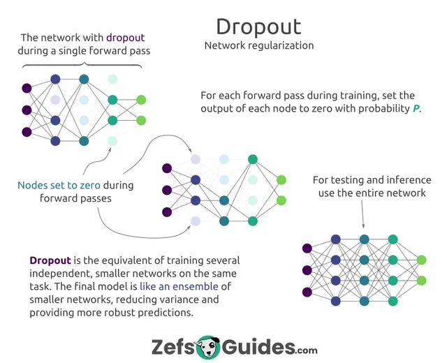

\n

**Overfitting** is a common challenge in deep learning, where a neural network performs well on training data but struggles with new, unseen data. One effective technique to combat this is **Dropout** — a regularization method that prevents overfitting by randomly “dropping” nodes in a neural network during training. 

\n\n\n\n

因此dropout的主要目的就是用随机、减少参数量的办法来避免过拟合

\n\n\n\n

这个方法在AlexNet中被完整验证和推广，作者为Alex Krizhevsky等

\n\n\n\n

为了更好地理解，让我们将使用 dropout 的神经网络与小组学习会话进行比较，在小组学习会话中，不同的学生（神经元）被随机要求在每个会话期间离开房间。剩下的学生仍然必须一起解决问题，这加强了每个人对材料的理解。

\n\n\n\n\n\n\n\n

**How Does Dropout Work?   Dropout 是如何工作的？**

\n\n\n\n

\n
  1. **During Training:** At each training iteration, dropout randomly disables a fraction (e.g., 50%) of neurons in the network. This effectively creates a new, smaller neural network with fewer neurons for that iteration. As a result, the model learns to work without depending on any one specific neuron, which reduces overfitting.  
**在训练期间：** 在每次训练迭代中，dropout 随机禁用一个分数（例如，50%）的神经元。这有效地创建了一个新的，更小的神经网络，具有更少的神经元用于该迭代。因此，模型学习工作而不依赖于任何一个特定的神经元，这减少了过度拟合。
\n\n\n\n
  2. **During Testing:** During testing or inference (when the model is predicting on new data), all neurons are active. However, the weights of the neurons are scaled down by the dropout rate to account for the different training structure. This scaling is typically by a factor of (1 — dropout rate) to ensure the same output range as during training.  
**测试期间：** 在测试或推理期间（当模型对新数据进行预测时），所有神经元都是活跃的。然而，神经元的权重会根据辍学率进行缩减，以考虑不同的训练结构。这种缩放通常是通过因子（1 -dropout率）来确保与训练期间相同的输出范围。
\n
\n\n\n\n

\n