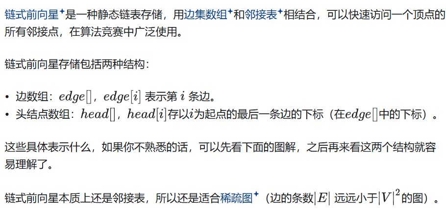

\n

在 OI 中，想要对图进行操作，就需要先学习图的存储方式。

\n\n\n\n

在Java中，图的存储方法有多种，具体取决于图的性质和你希望实现的操作。以下是一些常见的图存储方法及其Java实现：

\n\n\n\n

## 1\. 邻接矩阵（Adjacency Matrix）

\n\n\n\n

邻接矩阵是一种二维数组，用于表示图中顶点之间的连接关系。

\n\n\n\n
    
    
    public class Graph {\n    private int[][] adjacencyMatrix;\n    private int numVertices;\n \n    public Graph(int numVertices) {\n        this.numVertices = numVertices;\n        adjacencyMatrix = new int[numVertices][numVertices];\n    }\n \n    public void addEdge(int v1, int v2) {\n        adjacencyMatrix[v1][v2] = 1;\n        adjacencyMatrix[v2][v1] = 1; // 对于无向图\n    }\n \n    // 其他方法...\n}

\n\n\n\n

邻接矩阵只适用于没有重边（或重边可以忽略）的情况。

\n\n\n\n

其最显著的优点是可以 O（1）查询一条边是否存在。

\n\n\n\n

由于邻接矩阵在稀疏图上效率很低（尤其是在点数较多的图上，空间无法承受），所以一般只会在稠密图上使用邻接矩阵

\n\n\n\n

## 2\. 邻接表（Adjacency List）

\n\n\n\n

邻接表使用链表或数组来存储每个顶点的相邻顶点。

\n\n\n\n
    
    
    import java.util.ArrayList;\nimport java.util.LinkedList;\nimport java.util.List;\n \npublic class Graph {\n    private int numVertices;\n    private List<List<Integer>> adjacencyList;\n \n    public Graph(int numVertices) {\n        this.numVertices = numVertices;\n        adjacencyList = new ArrayList<>(numVertices);\n        for (int i = 0; i < numVertices; i++) {\n            adjacencyList.add(new LinkedList<>());\n        }\n    }\n \n    public void addEdge(int v1, int v2) {\n        adjacencyList.get(v1).add(v2);\n        adjacencyList.get(v2).add(v1); // 对于无向图\n    }\n \n    // 其他方法...\n}

\n\n\n\n

存各种图都很适合，除非有特殊需求（如需要快速查询一条边是否存在，且点数较少，可以使用邻接矩阵）。

\n\n\n\n

尤其适用于需要对一个点的所有出边进行排序的场合。

\n\n\n\n

### 4\. 邻接表（使用对象）

\n\n\n\n

这种方法类似于邻接表，但使用对象来表示边。

\n\n\n\n
    
    
    import java.util.ArrayList;\nimport java.util.LinkedList;\nimport java.util.List;\n \npublic class Graph {\n    private int numVertices;\n    private List<List<Edge>> adjacencyList;\n \n    public Graph(int numVertices) {\n        this.numVertices = numVertices;\n        adjacencyList = new ArrayList<>(numVertices);\n        for (int i = 0; i < numVertices; i++) {\n            adjacencyList.add(new LinkedList<>());\n        }\n    }\n \n    public void addEdge(int v1, int v2, int weight) {\n        adjacencyList.get(v1).add(new Edge(v2, weight));\n        adjacencyList.get(v2).add(new Edge(v1, weight)); // 对于无向图\n    }\n \n    // 其他方法...\n \n    private static class Edge {\n        int dest, weight;\n        Edge(int dest, int weight) {\n            this.dest = dest;\n            this.weight = weight;\n        }\n    }\n}

\n\n\n\n

这些方法各有优缺点：

\n\n\n\n

\- 邻接矩阵：查找边的时间复杂度为O(1)，但空间复杂度为O(V^2)，其中V是顶点数。  
\- 邻接表：空间复杂度为O(V+E)，其中E是边数。查找边的时间复杂度为O(度数)。  
\- 边列表：空间复杂度为O(E)，适合稀疏图。查找边的时间复杂度为O(E)。

\n\n\n\n

还有一个比邻接矩阵更适合表达稀疏矩阵的结构：

\n\n\n\n

### 链式前向星（<https://zhuanlan.zhihu.com/p/426128224>）

\n\n\n\n\n\n\n\n

链式前向星用一种链表的方式实现了邻接表的存储，并且可以完成简单的出边遍历，所以整体上还是很好用的，如下是一个可靠实现：

\n\n\n\n
    
    
    #include <iostream>\n#include <vector>\n \nusing namespace std;\n \nint n, m;\nvector<bool> vis;\nvector<int> head, nxt, to;\n \nvoid add(int u, int v) {\n  nxt.push_back(head[u]);\n  head[u] = to.size();//这里利用下标特性，对于u来说存储上一条边的下标就是to的size()，也就是对应下标\n  to.push_back(v);\n}\n \nbool find_edge(int u, int v) {\n  for (int i = head[u]; ~i; i = nxt[i]) {  // ~i 表示 i != -1\n    if (to[i] == v) {\n      return true;\n    }\n  }\n  return false;\n}\n \nvoid dfs(int u) {\n  if (vis[u]) return;\n  vis[u] = true;\n  for (int i = head[u]; ~i; i = nxt[i]) dfs(to[i]);\n}\n \nint main() {\n  cin >> n >> m;\n \n  vis.resize(n + 1, false);\n  head.resize(n + 1, -1);\n \n  for (int i = 1; i <= m; ++i) {\n    int u, v;\n    cin >> u >> v;\n    add(u, v);\n  }\n \n  return 0;\n}

\n