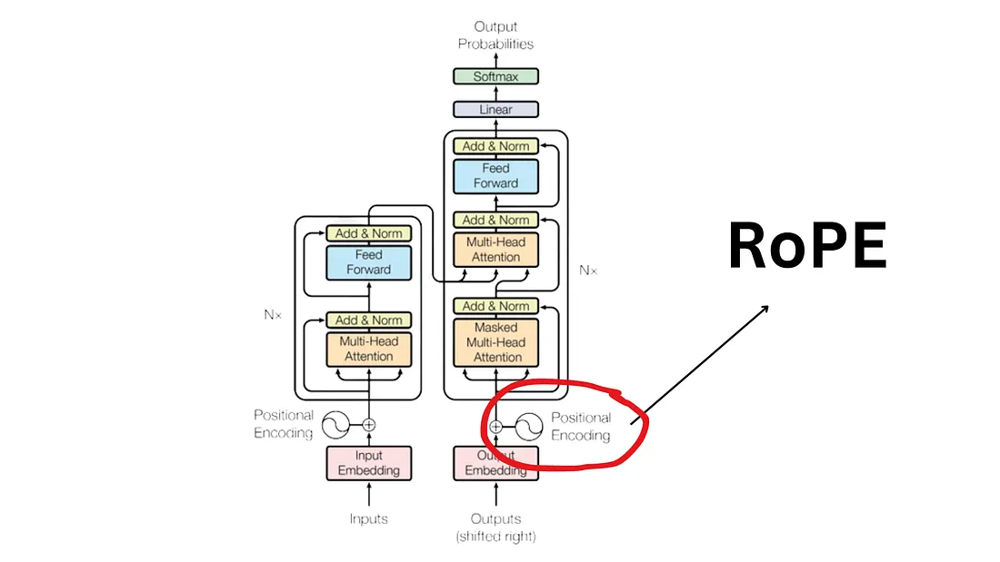
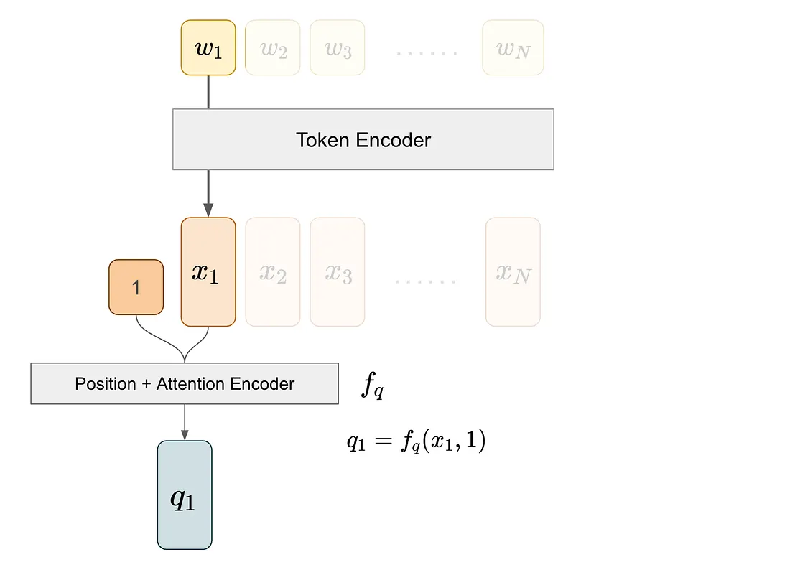
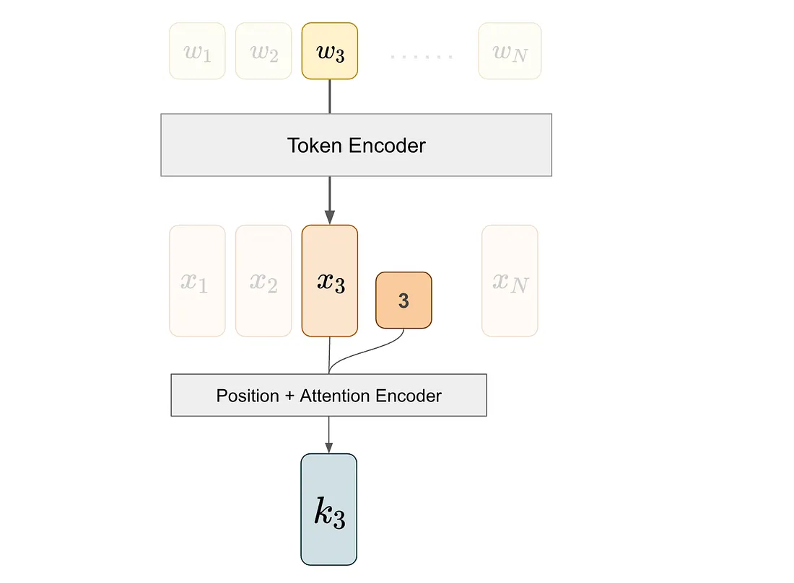

\n

引用以下文章：  
[RoPE: A Detailed Guide to Rotary Position Embedding in Modern LLMs | by Allen Liang | Medium](<https://medium.com/@mlshark/rope-a-detailed-guide-to-rotary-position-embedding-in-modern-llms-fde71785f152>)  
[Rotary Positional Embeddings: A Detailed Look and Comprehensive Understanding | by azhar | azhar labs | Medium](<https://medium.com/ai-insights-cobet/rotary-positional-embeddings-a-detailed-look-and-comprehensive-understanding-4ff66a874d83>)  

\n\n\n\n

Transformer 模型使用两种主要类型的定位嵌入：绝对定位嵌入和相对定位嵌入。绝对定位嵌入为序列中的每个位置分配一个唯一标识符，使模型能够学习和利用标记的绝对位置。另一方面，相对定位嵌入关注标记对之间的距离，从而允许模型理解和利用序列中标记的相对位置。

\n\n\n\n

[**Rotary Position Embedding (RoPE)**](<https://arxiv.org/abs/2104.09864>) has been widely applied in recent large language models (LLMs) to encode positional information, including Meta’s **LLaMA** and Google’s **PaLM**. 所以从定义上看，RoPE是一种广泛使用的Position Embedding方式，用来给tokens进行更合理的位置编码，接下来我们具体看看这一算法的工作流程

\n\n\n\n

Position is crucial in sequential models, and [position embedding plays a vital role in transformer-based architectures](<https://medium.com/@kuipasta1121/exploring-classic-position-embeddings-in-attention-based-models-3680bc2b8591>). RoPE, the rotary position embedding, use a clever method to incorporate both relative and absolute positional information.

\n\n\n\n

在介绍 RoPE 之前，让我们回顾一下注意力机制的基础。注意力机制关注于成对的关系：一个 token 有一个查询向量 q，另一个 token 有一个键向量 k。我们通过计算 q 和 k 的内积来获得注意力分数，这个内积是位置嵌入功能的关键。

\n\n\n\n\n\n\n\n

例如，为了得到(1, 3)这对的注意力分数，我们从 token 1 获取查询向量，从 token 3 获取键向量。

\n\n\n\n

我们通过首先通过 token 编码器提取其 token 嵌入来获得查询向量 q1。然后，我们将这个嵌入及其位置信息输入到位置+注意力编码器中，该编码器整合位置信息并将结果投影以产生键向量。

\n\n\n\n\n\n\n\n

我们对第三个词执行类似的处理过程以获得 k3​，即与第三个词对应的键向量。

\n\n\n\n\n