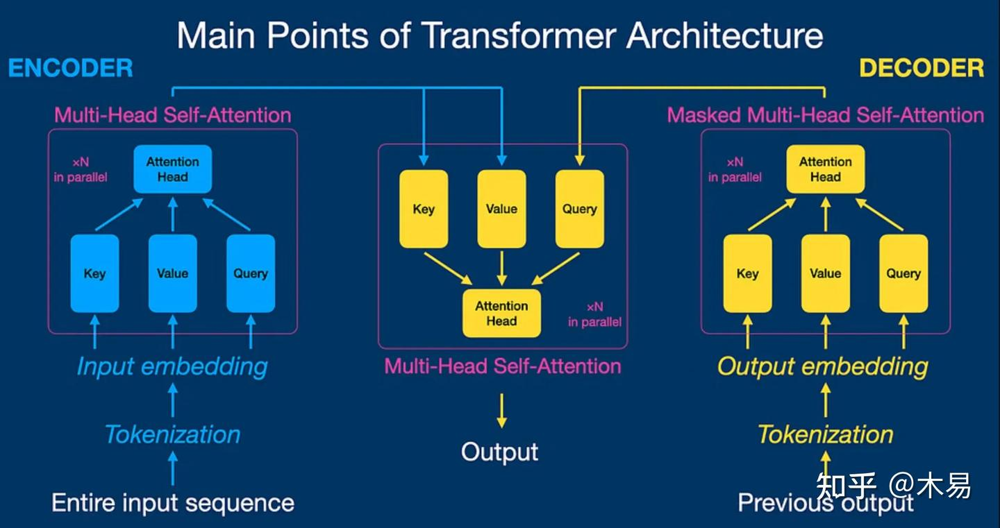
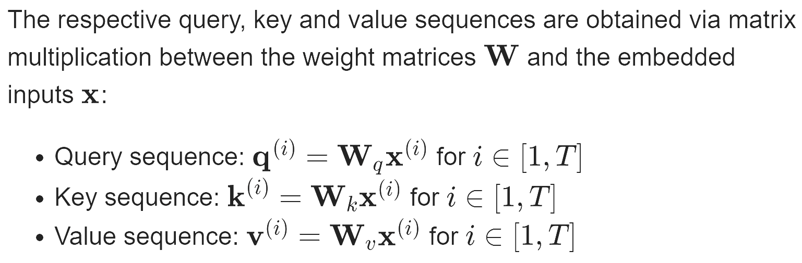
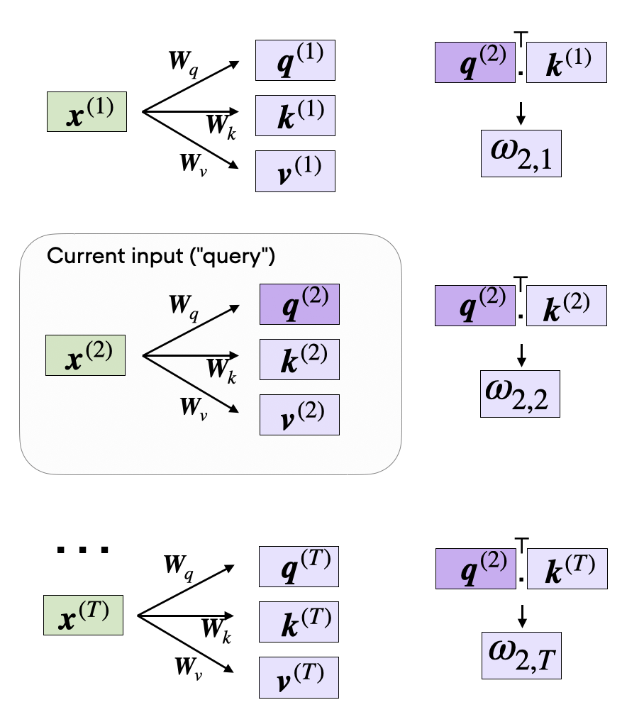
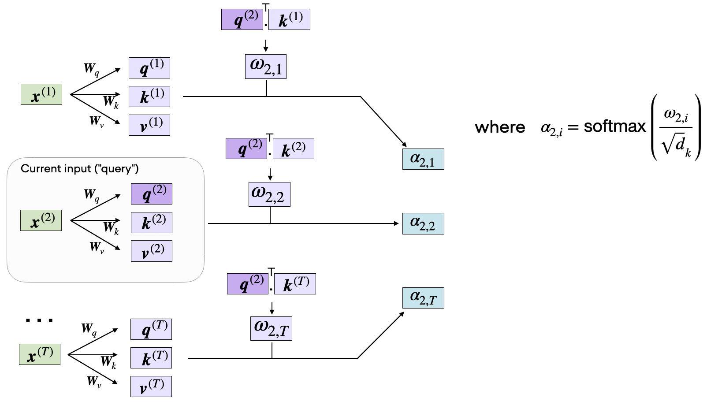
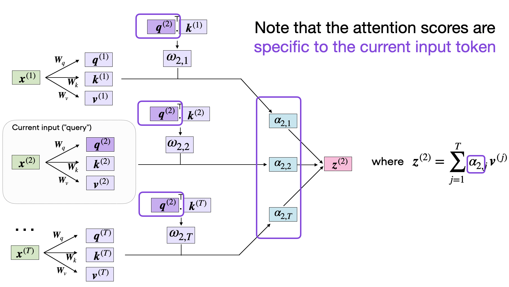

explanation cartoon recommended:[Transformer Explainer: LLM Transformer Model Visually Explained](<https://poloclub.github.io/transformer-explainer/>)

参考文章：

[(99+ 封私信 / 81 条消息) 常学常新：《Attention Is All You Need》万字解读！ - 知乎](<https://zhuanlan.zhihu.com/p/703292893>)  
[Understanding and Coding the Self-Attention Mechanism of Large Language Models From Scratch](<https://sebastianraschka.com/blog/2023/self-attention-from-scratch.html>)

Attension机制是支撑Transformer网络结构的重要机制，摒弃了传统的[循环神经网络](<https://zhida.zhihu.com/search?content_id=244417806&content_type=Article&match_order=1&q=%E5%BE%AA%E7%8E%AF%E7%A5%9E%E7%BB%8F%E7%BD%91%E7%BB%9C&zhida_source=entity>)（RNN）和[卷积神经网络](<https://zhida.zhihu.com/search?content_id=244417806&content_type=Article&match_order=1&q=%E5%8D%B7%E7%A7%AF%E7%A5%9E%E7%BB%8F%E7%BD%91%E7%BB%9C&zhida_source=entity>)（CNN）中的循环和卷积操作。

在Attention is All you Need这篇原论文种作者获得了以下的成果总结：  
通过在两项机器翻译任务上的实验，我们发现这种模型不仅在翻译质量上更胜一筹，而且在并行处理能力和训练效率上都有显著提升。在[WMT 2014](<https://zhida.zhihu.com/search?content_id=244417806&content_type=Article&match_order=1&q=WMT+2014&zhida_source=entity>)英语到德语的翻译任务中，我们的模型[BLEU](<https://zhida.zhihu.com/search?content_id=244417806&content_type=Article&match_order=1&q=BLEU&zhida_source=entity>)得分达到了28.4，相较于之前的最佳成绩，包括那些集成了多个模型的结果，我们的得分提高了2个点（BLEU）。在英语到法语的翻译任务中，我们的模型仅用3.5天和8个GPU就训练出了达到41.8 BLEU得分的单一模型，这一成本远低于文献中报道的最佳模型。此外，我们还证明了Transformer模型不仅在大规模数据集上表现出色，即使在数据有限的情况下，也能成功应用于英语句法分析任务，显示出了极强的泛化能力。

首先在了解transformer架构之前先需要了解一下基础概念和历史解决方案

### 序列转换模型（Sequence Transduction Model）

**序列转换模型** 是一类用于将一种序列数据转换为另一种序列数据的神经网络模型。这类模型的关键在于能够理解和生成序列数据，并在输入和输出序列之间建立有效的映射关系。通过这种映射关系，序列转换模型能够在输入文本和目标文本之间找到语义和语法上的对应，从而实现高质量的翻译或生成任务。因此，序列转换模型在自然语言处理（NLP）任务中广泛应用，如机器翻译、语音识别和文本生成等。

典型的序列转换模型通常包括一个**编码器** （encoder）和一个**解码器** （decoder）。编码器负责将输入序列编码成一个固定长度的隐状态表示，而解码器则利用这个隐状态表示生成目标序列。在这些模型中，循环神经网络（RNN）和卷积神经网络（CNN）是从前最常见的架构。然而，2017年以来，基于注意力机制的**Transformer架构** （即该论文介绍的架构）因其并行计算能力和处理长距离依赖关系的优势，成为序列转换任务中的新宠。

### 循环神经网络（RNN）

**循环神经网络** （Recurrent Neural Network，简称RNN）是一种用于处理序列数据的神经网络架构。与传统的前馈神经网络不同，RNN具有环形连接，使得信息能够在网络中循环流动。这种结构使RNN能够保留先前输入的信息，并将其用于当前的输出计算，因此特别适合处理时间序列数据或自然语言处理任务，如语音识别、机器翻译和文本生成。

RNN的关键特性是它的**隐状态** （hidden state），这是一个包含网络在任意时间步的信息的向量。通过隐状态，RNN可以记住前面的输入，从而在处理当前输入时考虑到上下文。然而，传统的RNN在处理长序列时会遇到**梯度消失和梯度爆炸** 问题，这限制了其记忆长距离依赖的能力。

### 卷积神经网络（CNN）

**卷积神经网络** （Convolutional Neural Network，简称CNN）是一种专门用于处理具有网格状拓扑结构数据的神经网络架构，如图像和视频。CNN通过引入卷积层和池化层，能够有效地捕捉空间结构中的局部特征，特别适合处理二维图像数据。

CNN的层次结构使其能够从低级特征到高级语义特征逐步提取信息，这种逐层提取和组合特征的方式，使得CNN在计算机视觉任务中取得了显著成功。随着深度学习的发展，CNN的变种如ResNet、Inception等也被广泛应用于各种图像处理任务中。

## Self-Attention

The concept of “attention” in deep learning [has its roots in the effort to improve Recurrent Neural Networks (RNNs)](<https://arxiv.org/abs/1409.0473>) for handling longer sequences or sentences. For instance, consider translating a sentence from one language to another. **Translating a sentence word-by-word does not work effectively.**

To overcome this issue, **attention mechanisms** were introduced to give access to all sequence elements at each time step. The key is to be selective and determine which words are most important in a specific context.

Note that there are many variants of self-attention. A particular focus has been on making self-attention more efficient. However, most papers still implement the original scaled-dot product attention mechanism discussed in this paper since it usually results in superior accuracy and because self-attention is rarely a computational bottleneck for most companies training large-scale transformers.

我们一起来进行一次完整的attention encoding首先

### Embedding an Input Sentence

Before we begin, let’s consider an input sentence  _“Life is short, eat dessert first”_ that we want to put through the self-attention mechanism. **Similar to other types of modeling approaches for processing text (e.g., using recurrent neural networks or convolutional neural networks), we create a sentence embedding first.**

For simplicity, here our dictionary `dc` is restricted to the words that occur in the input sentence. In a real-world application, we would consider all words in the training dataset (typical vocabulary sizes range between 30k to 50k).（即在真是的完整使用attention机制的模型中，需要更大的vocab词表）

    
    {'Life': 0, 'dessert': 1, 'eat': 2, 'first': 3, 'is': 4, 'short': 5}

Now, using the integer-vector representation of the input sentence, **we can use an embedding layer to encode the inputs into a real-vector embedding. Here, we will use a 16-dimensional embedding such that each input word is represented by a 16-dimensional vector.** Since the sentence consists of 6 words, this will result in a 6×16-dimensional embedding:

当然一维的表示明显不够进行本次演示，所以使用一个embedding层来表达这句话，该embedding产出的内容为16维的float

    
    torch.manual_seed(123)
embed = torch.nn.Embedding(6, 16)
embedded_sentence = embed(sentence_int).detach()
print(embedded_sentence)
print(embedded_sentence.shape)

output:

    
    tensor([[ 0.3374, -0.1778, -0.3035, -0.5880,  0.3486,  0.6603, -0.2196, -0.3792,
          0.7671, -1.1925,  0.6984, -1.4097,  0.1794,  1.8951,  0.4954,  0.2692],
        [ 0.5146,  0.9938, -0.2587, -1.0826, -0.0444,  1.6236, -2.3229,  1.0878,
          0.6716,  0.6933, -0.9487, -0.0765, -0.1526,  0.1167,  0.4403, -1.4465],
        [ 0.2553, -0.5496,  1.0042,  0.8272, -0.3948,  0.4892, -0.2168, -1.7472,
         -1.6025, -1.0764,  0.9031, -0.7218, -0.5951, -0.7112,  0.6230, -1.3729],
        [-1.3250,  0.1784, -2.1338,  1.0524, -0.3885, -0.9343, -0.4991, -1.0867,
          0.8805,  1.5542,  0.6266, -0.1755,  0.0983, -0.0935,  0.2662, -0.5850],
        [-0.0770, -1.0205, -0.1690,  0.9178,  1.5810,  1.3010,  1.2753, -0.2010,
          0.4965, -1.5723,  0.9666, -1.1481, -1.1589,  0.3255, -0.6315, -2.8400],
        [ 0.8768,  1.6221, -1.4779,  1.1331, -1.2203,  1.3139,  1.0533,  0.1388,
          2.2473, -0.8036, -0.2808,  0.7697, -0.6596, -0.7979,  0.1838,  0.2293]])
torch.Size([6, 16])

### Defining the Weight Matrices

Self-attention **utilizes three weight matrices** , referred to as Wq, Wk, and Wv, which are adjusted as model parameters during training. These matrices serve to project the inputs into query, key, and value components of the sequence, respectively.

Here, both q(i) and k(i) are vectors of dimension dk. The projection matrices Wq and Wk have a shape of dk×d, while Wv has the shape dv×d.

Since we are computing the dot-product between the query and key vectors, these two vectors have to contain the same number of elements (dq=dk). However, the number of elements in the value vector v(i), which determines the size of the resulting context vector, is arbitrary.

So, for the following code walkthrough, we will set dq=dk=24 and use dv=28, initializing the projection matrices as follows:

    
    torch.manual_seed(123)
d = embedded_sentence.shape[1]
d_q, d_k, d_v = 24, 24, 28
W_query = torch.nn.Parameter(torch.rand(d_q, d))
W_key = torch.nn.Parameter(torch.rand(d_k, d))
W_value = torch.nn.Parameter(torch.rand(d_v, d))

### Computing the Unnormalized Attention Weights

举一个计算的例子

    
    x_2 = embedded_sentence[1]
query_2 = W_query.matmul(x_2)
key_2 = W_key.matmul(x_2)
value_2 = W_value.matmul(x_2)
print(query_2.shape)
print(key_2.shape)
print(value_2.shape)

    
    torch.Size([24])
torch.Size([24])
torch.Size([28])

We can then generalize this to compute th remaining key, and value elements for all inputs as well, since we will need them in the next step when we compute the unnormalized attention weights ω:

We can then generalize this to compute th remaining key, and value elements for all inputs as well, since we will need them in the next step when we compute the unnormalized attention weights ω:

    
    keys = W_key.matmul(embedded_sentence.T).T
values = W_value.matmul(embedded_sentence.T).T
print("keys.shape:", keys.shape)
print("values.shape:", values.shape)

As illustrated in the figure above, we compute ωi,j as the dot product between the query and key sequences, ωij=q(i)⊤k(j).

### Computing the Attention Scores

The subsequent step in self-attention is to normalize the unnormalized attention weights, ω, to obtain the normalized attention weights, α, by applying the softmax function. Additionally, 1/√dk is used to scale ω before normalizing it through the softmax function, as shown below:

相当于使用softmax完成激活以及归一化

    
    import torch.nn.functional as F
attention_weights_2 = F.softmax(omega_2 / d_k**0.5, dim=0)
print(attention_weights_2)

    
    tensor([0.2912, 0.0106, 0.0982, 0.0625, 0.4917, 0.0458])

Finally, the last step is to compute the context vector z(2), which is an attention-weighted version of our original query input x(2), including all the other input elements as its context via the attention weights:

    
    context_vector_2 = attention_weights_2.matmul(values)
print(context_vector_2.shape)
print(context_vector_2)
