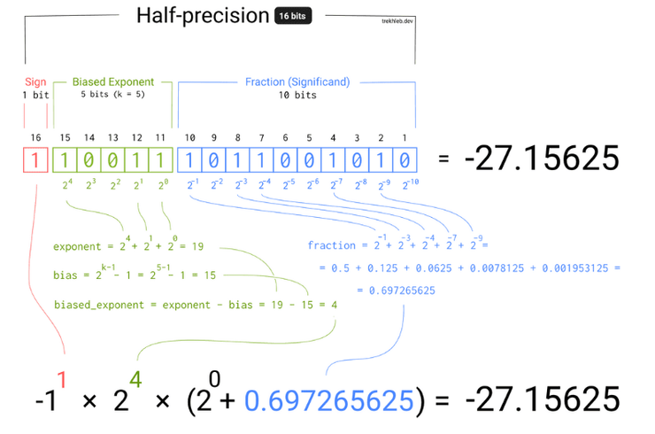
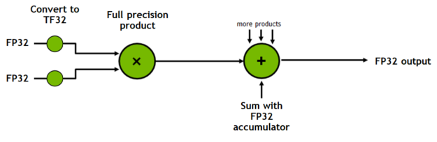
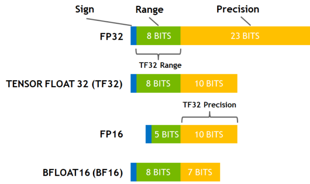

\n

引文：[淺談DeepLearning的浮點數精度FP32/FP16/TF32/BF16........(以LLM為例)](<https://vocus.cc/article/65ee9d51fd89780001eb4d59>)  
[揭开 LLMs 中的精度之谜：低比特格式如何赋能大型语言模型 | by Yogesh Kumar | Medium --- Demystifying Precision in LLMs: How Lower-Bit Formats Power Large Language Models | by Yogesh Kumar | Medium](<https://medium.com/@yogeshkumar209209209/demystifying-precision-in-llms-how-lower-bit-formats-power-large-language-models-edc9ef04d1a7>)

\n\n\n\n

在大型语言模型（LLMs）的世界里，精度的力量往往被忽视。当这些模型处理数十亿个单词和短语时，数据表示的最小变化都可能对性能、效率以及与训练和部署这些 AI 巨兽相关的计算成本产生巨大影响。LLM 架构的一个引人入胜的方面在于用于数值计算的精度格式，特别是浮点表示，如 FP16（16 位）甚至量化 4 位格式。

\n\n\n\n

Reddit上面有这样一个讨论：为什么 LLMs 要量化而不是用低精度进行训练？（[为什么 LLMs 要量化而不是用较低精度进行训练？：r/LocalLLaMA --- Why are LLMs quantized instead of being trained with lower precision? : r/LocalLLaMA](<https://www.reddit.com/r/LocalLLaMA/comments/1ccmsmu/why_are_llms_quantized_instead_of_being_trained/>)）

\n\n\n\n

其实原因解释起来也很直接：由于精度不足，**梯度会爆炸** 。这也是为什么通常使用 BF16，因为 FP16 不够稳定

\n\n\n\n

所以对于一个模型来说，更高的参数精度可以带来更好（其实是更稳定更可预测，更好是直觉）的模型效果。在IEEE定义下，我们知道一个浮点数可以分为三个部分：符号位，指数位和小数位，指数位影响精度范围，小数位影响实际的精度

\n\n\n\n\n\n\n\n

## 一些常见的浮点数精度

\n\n\n\n

\n
  * **雙精度（FP64）** ：64位浮點數，由1位符號位、11位指數位和52位小數位組成。
\n\n\n\n
  * **單精度、全精度（FP32、TF32: A100開始的）** ：32位浮點數，由1位符號位、8位指數位和23位小數位組成。
\n\n\n\n
  * **半精度（FP16、BF16）** ：16位浮點數，用於機器學習，由1位符號位、5位指數位和10位小數位組成。
\n\n\n\n
  * **8位精度（FP8）** ：非IEEE標準格式，由4位指數和3位尾數（E4M3）或5位指數和2位尾數（E5M2）組成。
\n\n\n\n
  * **4位精度（FP4、NF4）** ：NF4是一種用於量化的特殊格式，建立在分位數量化技術的基礎之上。
\n
\n\n\n\n

### 量化精度(Quantization)

\n\n\n\n

\n
  * **INT8** ：8位整數，用於量化，占用1個字節。
\n\n\n\n
  * **INT4** ：4位整數，也有其他量化格式（6位、5位甚至3位）。
\n
\n\n\n\n

### 多精度和混合精度

\n\n\n\n

**混合精度計算** ：在單個操作中使用不同的精度級別，實現計算效率，同時不犧牲精度。

\n\n\n\n

**多精度計算** ：使用不同精度進行計算，選擇最適合的一種。

\n\n\n\n

特別關注的除了****FP32**** 、****FP16 之外，**** nVidia有介紹了A100開始的TF32精度，由於我們多數仍使用nVidia作為計算的硬體，這個TF32非常值得參考與關注(當然你不一定有A100以上的卡片，但仍然應該了解一下該架構):

\n\n\n\n

<https://developer.nvidia.com/blog/accelerating-ai-training-with-tf32-tensor-cores>

\n\n\n\n\n\n\n\n\n