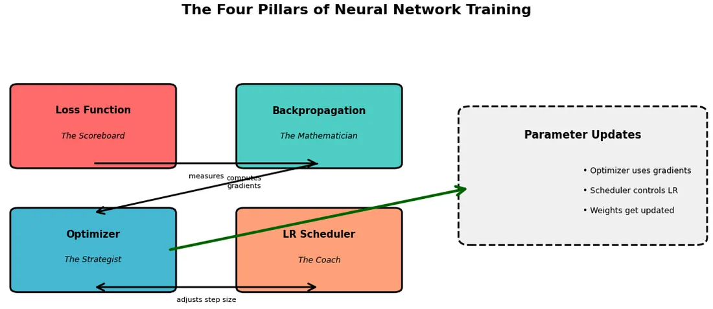

参考文章：[理解神经网络优化器：从梯度到 AdamW 之旅 | by Shashank Sane | Oct, 2025 | Medium --- Understanding Neural Network Optimizers: A Journey from Gradients to AdamW | by Shashank Sane | Oct, 2025 | Medium](<https://medium.com/@saneshashank/understanding-neural-network-optimizers-a-journey-from-gradients-to-adamw-eecf92d875a5>)  
[(99+ 封私信 / 81 条消息) 深度学习经典论文分析（八）-ADAM: A METHOD FOR STOCHASTIC OPTIMIZATION - 知乎](<https://zhuanlan.zhihu.com/p/430735296>)  

首先我们借用一下medium这篇博客中关于training四个pillars的介绍：

## The Four Pillars of Training: A Mental Model  
训练的四大支柱：一种心智模型

Think of training a neural network as navigating through a vast, multidimensional landscape where you’re searching for the lowest valley (minimum loss). Four distinct mechanisms work together:  
想象训练神经网络就像在广阔的多维景观中航行，你正在寻找最低的谷地（最小损失）。四种不同的机制协同工作：

**1\. Loss Function** : _Where are we, and how bad is it?_  
1\. 损失函数：我们现在在哪里？有多糟糕？  
The loss function is your compass — it tells you how far you are from your goal. Mean Squared Error, Cross-Entropy Loss — these are measurement tools, nothing more. They don’t tell you _how_  to move, just how well (or poorly) you’re doing.  
损失函数是你的指南针——它告诉你与目标的距离有多远。均方误差、交叉熵损失——这些都是测量工具，仅此而已。它们不会告诉你如何移动，只会告诉你做得有多好（或有多差）。

**2\. Backpropagation** : _Which direction should we move?_  
2\. 反向传播：我们应该朝哪个方向移动？  
Backpropagation computes gradients — **the slopes of the loss landscape with respect to each parameter**. It answers: “If I nudge this weight slightly, does the loss go up or down, and by how much?” It’s pure calculus, a mechanical process of calculating derivatives through the chain rule.  
反向传播计算梯度——损失函数相对于每个参数的斜率。它回答：“如果我稍微调整这个权重，损失会增加还是减少，以及增加或减少多少？”这是纯粹的微积分，通过链式法则计算导数的机械过程。

**3\. Optimizer** : _How do we take the step?_  
3\. 优化器：我们如何进行这一步？  
Here’s where the magic happens. The optimizer takes those gradients and decides _how_  to update your parameters. Should you move directly opposite to the gradient? Should you remember previous directions? Should different parameters move at different speeds? SGD, Adam, RMSprop — these are different philosophies of movement.  
这就是魔法发生的地方。优化器获取这些梯度并决定如何更新你的参数。你应该直接与梯度相反的方向移动吗？你应该记住之前的方向吗？不同的参数应该以不同的速度移动吗？SGD、Adam、RMSprop——这些都是不同的运动哲学。

**4\. Learning Rate Scheduler** : _How big should our steps be over time?_  
4\. 学习率调度器：我们的步长应该有多大？  
Even with the best optimizer, the _size_  of your steps matters. Early in training, large steps might help you explore. Near convergence, tiny steps allow precision. Schedulers dynamically adjust this step size throughout training.  
即使有最好的优化器，步长的大小也很重要。在训练初期，大步长可能有助于探索。在接近收敛时，小步长可以保证精度。调度器在整个训练过程中动态调整这个步长。

所以optimizer决定了参数更新的方式（方向，更新哪些），在neural network不断发展的过程中，出现了**SGD** （随机梯度下降），**Momentum** ，以及更智能的Adam,AdamW等，并且在最新的成果中，出现了muon这样的新星优化器。当然相比于Adam是否有更佳的使用尚需证明

这篇文章将主要讲解这些历史上以及当今主流的优化器，主要从他的原理与优缺点进行介绍

## SGD：随机梯度下降法，简单但极易掉坑

SGD 体现了一种简单的哲学：朝着梯度相反的方向移动。如果梯度说“损失会沿着这个方向增加”，SGD 就会说“那我们就朝着相反的方向走。”

甚至可以给你呈现一下SGD的实现：

    
    class SGD:
    def __init__(self, params, lr):
        self.params = list(params)
        self.lr = lr

    def step(self):
        for param in self.params:
            with torch.no_grad():
                param.data -= self.lr * param.grad

    def zero_grad(self):
        for param in self.params:
            param.grad = None

## SGD With Momentum
