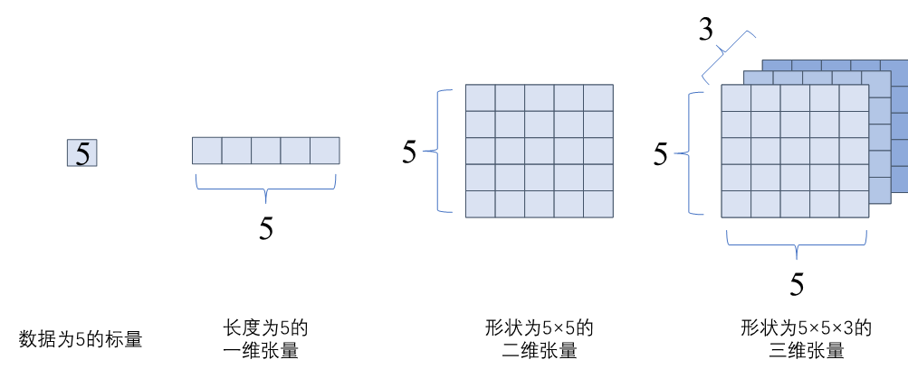
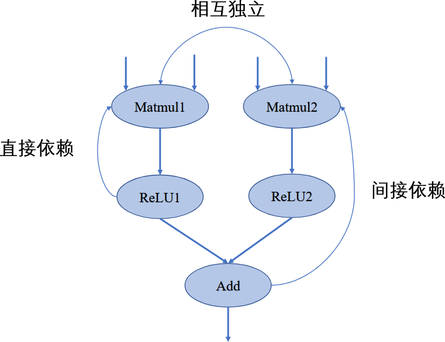
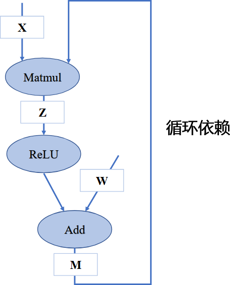
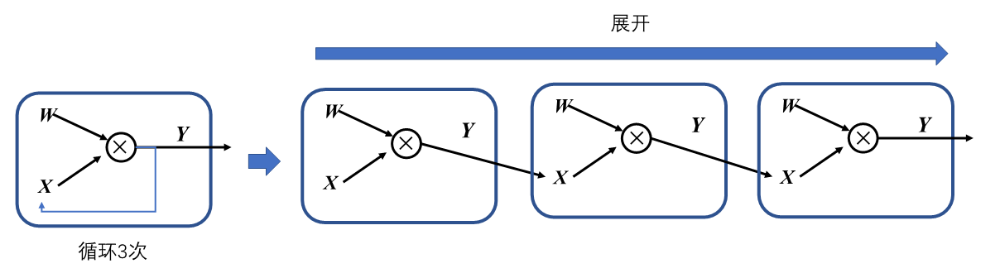
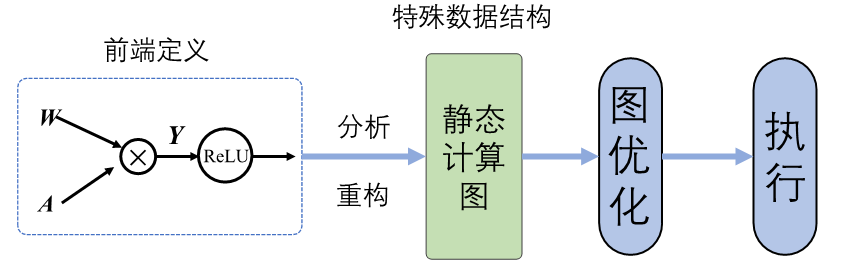
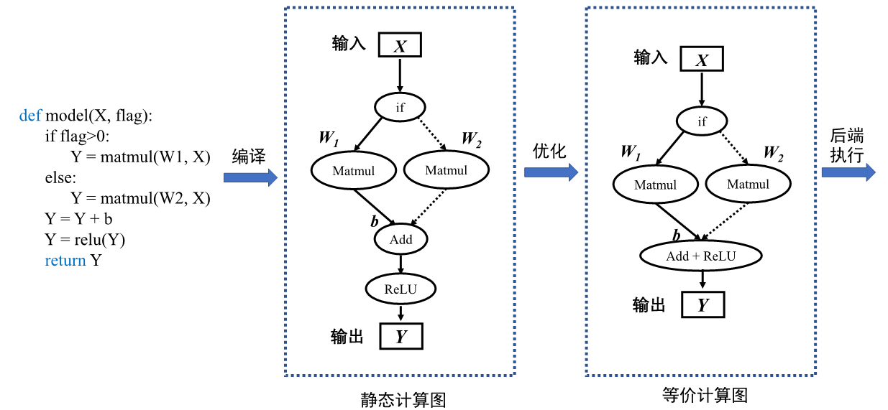
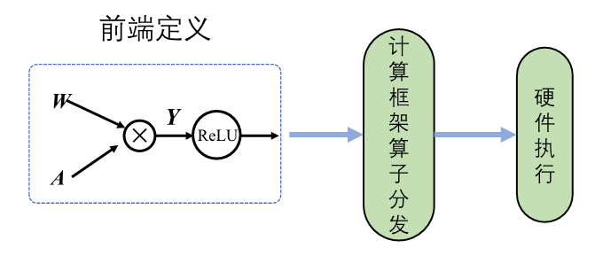
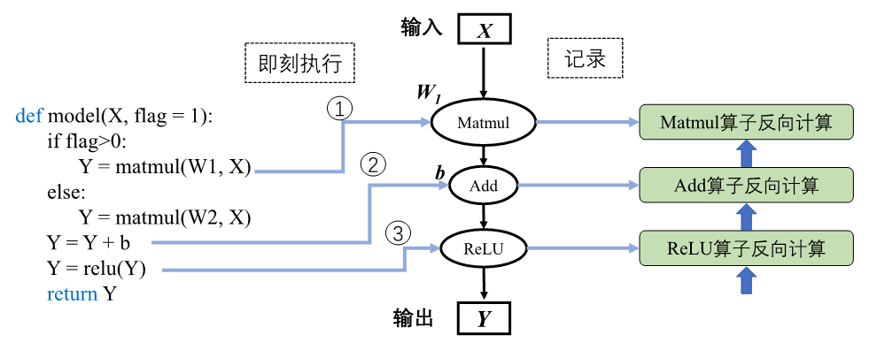

\n

参考内容：[4.1. 计算图的设计背景和作用 — 机器学习系统：设计和实现 1.0.0 documentation](<https://openmlsys.github.io/chapter_computational_graph/background_and_functionality.html>) 《机器学习系统：设计与实现》

\n\n\n\n

\n\n\n\n\n\n\n\n

早期机器学习框架主要针对全连接和卷积神经网络设计，这些神经网络的拓扑结构简单，神经网络层之间通过串行连接。因此，它们的拓扑结构可以用简易的配置文件表达（例如Caffe基于Protocol Buffer格式的模型定义）。

\n\n\n\n

现代机器学习模型的拓扑结构日益复杂，显著的例子包括混合专家模型、生成对抗网络、注意力模型等。复杂的模型结构（例如带有分支的循环结构等）需要机器学习框架能够对模型算子的执行依赖关系、梯度计算以及训练参数进行快速高效的分析，便于优化模型结构、制定调度执行策略以及实现自动化梯度计算，从而提高机器学习框架训练复杂模型的效率。因此，机器学习系统设计者需要一个通用的数据结构来理解、表达和执行机器学习模型。为了应对这个需求，如 [图4.1.1](<https://openmlsys.github.io/chapter_computational_graph/background_and_functionality.html#dag>)所示基于计算图的机器学习框架应运而生，框架延续前端语言与后端语言分离的设计。从高层次来看，计算图实现了以下关键功能：

\n\n\n\n

\n
  * **统一的计算过程表达。**
\n\n\n\n
  * **自动化计算梯度。**
\n\n\n\n
  * **分析模型变量生命周期。**
\n\n\n\n
  * **优化程序执行。**
\n
\n\n\n\n

## 计算图的基本构成

\n\n\n\n

### 1.张量

\n\n\n\n

在pytorch中一般称为tensor，可以理解为是标量与向量的推广，具备多重维度的一个数据，使用秩来表示张量的轴数或维度

\n\n\n\n\n\n\n\n

### 2.算子

\n\n\n\n

算子是构成神经网络的基本计算单元，对张量数据进行加工处理，实现了多种机器学习中常用的计算逻辑，包括数据转换、条件控制、数学运算等。为了便于梳理算子类别，按照功能将算子分类为张量操作算子、神经网络算子、数据流算子和控制流算子等。

\n\n\n\n

\n
  * **张量操作算子** ：包括张量的结构操作和数学运算。张量的结构操作通常用于张量的形状、维度调整以及张量合并等，张量相关的数学运算算子，例如矩阵乘法、计算范数、行列式和特征值计算，在机器学习模型的梯度计算中经常被使用到。
\n\n\n\n
  * **神经网络算子** ：包括特征提取、激活函数、损失函数、优化算法等，是构建神经网络模型频繁使用的核心算子。
\n\n\n\n
  * **数据流算子** ：包含数据的预处理与数据载入相关算子，数据预处理算子主要是针对图像数据和文本数据的裁剪填充、归一化、数据增强等操作。
\n\n\n\n
  * **控制流算子** ：可以控制计算图中的数据流向，当表示灵活复杂的模型时需要控制流。使用频率比较高的控制流算子有条件运算符和循环运算符。控制流操作一般分为两类，机器学习框架本身提供的控制流操作符和前端语言控制流操作符。
\n
\n\n\n\n

在计算图中，算子之间存在依赖关系，而这种依赖关系影响了算子的执行顺序与并行情况。机器学习算法模型中，计算图是一个有向无环图，即在计算图中造成循环依赖（Circular Dependency）的数据流向是不被允许的。循环依赖会形成计算逻辑上的死循环，模型的训练程序将无法正常结束，而流动在循环依赖闭环上的数据将会趋向于无穷大或者零成为无效数据。

\n\n\n\n

如图中所示，在此计算图中，若将Matmul1算子移除则该节点无输出，导致后续的激活函数无法得到输入，从而计算图中的数据流动中断，这表明计算图中的算子间具有依赖关系并且存在传递性。

\n\n\n\n\n\n\n\n\n\n\n\n

在机器学习框架中，表示循环关系（Loop Iteration）通常是以**展开** 机制（Unrolling）来实现。循环三次的计算图进行展开如 [图4.2.6](<https://openmlsys.github.io/chapter_computational_graph/components_of_computational_graph.html#unroll>)，循环体的计算子图按照迭代次数进行复制3次，将代表相邻迭代轮次的子图进行串联，相邻迭代轮次的计算子图之间是直接依赖关系。在计算图中，每一个张量和运算符都具有独特的标识符，即使是相同的操作运算，在参与循环不同迭代中的计算任务时具有不同的标识符。区分循环关系和循环依赖的关键在于，具有两个独特标识符的计算节点之间是否存在相互依赖关系。循环关系在展开复制计算子图的时候会给复制的所有张量和运算符赋予新的标识符，区分被复制的原始子图，以避免形成循环依赖。

\n\n\n\n\n\n\n\n

模型中有循环控制时，循环中的操作可以执行零次或者多次。此时采用展开机制，对每一次操作都赋予独特的运算标识符，以此来区分相同运算操作的多次调用。每一次循环都直接依赖于前一次循环的计算结果，所以在循环控制中需要维护一个张量列表，将循环迭代的中间结果缓存起来，这些中间结果将参与前向计算和梯度计算。下面这段代码描述了简单的循环控制

\n\n\n\n
    
    
    def recurrent_control(X : Tensor, W : Sequence[Tensor], cur_num = 3):\n    for i in range(cur_num):\n        X = matmul(X, W[i])\n    return X\n#利用展开机制将上述代码展开，可得到等价表示\ndef recurrent_control(X : Tensor, W : Sequence[Tensor]):\n    X1 = matmul(X, W)   #为便于表示与后续说明，此处W = W[0], W1 = W[1], W2 = W[2]\n    X2 = matmul(X1, W1)\n    Y = matmul(X2, W2)\n    return Y

\n\n\n\n

了解计算图的基本构成后，那么下一个问题就是：

\n\n\n\n

**计算图要如何自动化生成呢？**

\n\n\n\n

在机器学习框架中可以生成静态图和动态图两种计算图。静态生成可以根据前端语言描述的神经网络拓扑结构以及参数变量等信息构建一份固定的计算图。因此静态图在执行期间可以不依赖前端语言描述，常用于神经网络模型的部署，比如移动端人脸识别场景中的应用等。

\n\n\n\n

动态图则需要在每一次执行神经网络模型依据前端语言描述动态生成一份临时的计算图，这意味着计算图的动态生成过程灵活可变，该特性有助于在神经网络结构调整阶段提高效率。主流机器学习框架TensorFlow、MindSpore均支持动态图和静态图模式；PyTorch则可以通过工具将构建的动态图神经网络模型转化为静态结构，以获得高效的计算执行效率。了解两种计算图生成方式的优缺点及构建执行特点，可以针对待解决的任务需求，选择合适的生成方式调用执行神经网络模型。

\n\n\n\n

tf是典型的静态图，具备强大的执行计算和直接部署能力，但是编写网络模型和定义模型训练过程代码较为繁琐：

\n\n\n\n
    
    
    import tensorflow as tf\nimport numpy as np\n\nx = tf.placeholder(dtype=tf.float32, shape=(5,5)) #数据占位符\nw1 = tf.Variable(tf.ones([5,5]),name='w1')\nw2 = tf.Variable(tf.zeros([5,5]),name='w2')\nb = tf.Variable(tf.zeros([5,]),name='b')\ndef f1(): return tf.matmul(w1,x)\ndef f2(): return tf.matmul(w2,x)\ny1 = tf.cond(flag > 0, f1, f2) #图内条件控制算子\ny2 = tf.add(y1, b)\noutput = tf.relu(y2)\nwith tf.Session() as sess:\n    sess.run(tf.global_variables_initializer()) #静态图变量初始化\n    random_array = np.random.rand(5,5)\n    sess.run(output, feed_dict = {x:random_array, flag: [1.0]}) #静态图执行

\n\n\n\n

前端语言构建的神经网络模型经过编译后，计算图结构便固定执行阶段不再改变，并且经过优化用于执行的静态图代码与原始代码有较大的差距。代码执行过程中发生错误时，机器学习框架会返回错误在优化后的静态图代码位置。用户难以直接查看优化后的代码，因此无法定位原始代码错误位置，增加了代码调试难度。比如在代码中，若add算子和relu算子经给优化合并为一个算子，执行时合并算子报错，用户可能并不知道错误指向的是add算子错误 还是relu算子错误。

\n\n\n\n\n\n\n\n\n\n\n\n

而动态图具备用户友好的命令式编程范式，使用前端语言构建神经网络模型更加简洁，深受广大深度学习研究者青睐。

\n\n\n\n

动态图生成采用解析式的执行方式，其核心特点是编译与执行同时发生。动态图采用前端语言自身的解释器对代码进行解析，利用机器学习框架本身的算子分发功能，算子会即刻执行并输出结果。

\n\n\n\n\n\n\n\n\n\n\n\n特性| 静态图| 动态图  
---|---|---  
即时获取中间结果| 否| 是  
代码调试难易| 难| 易  
控制流实现方式| 特定的语法| 前端语言语法  
性能| 优化策略多，性能更佳| 图优化受限，性能较差  
内存占用| 内存占用少| 内存占用相对较多  
内存占用| 可直接部署| 不可直接部署  
\n\n\n\n

\n