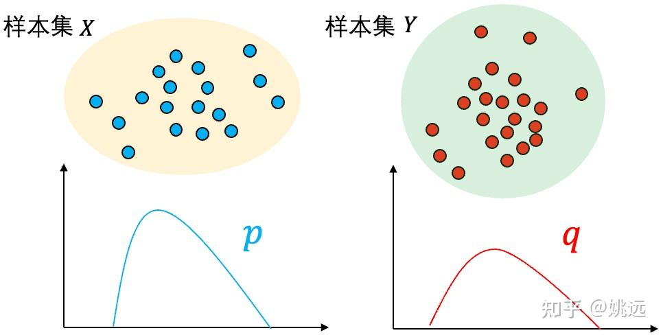
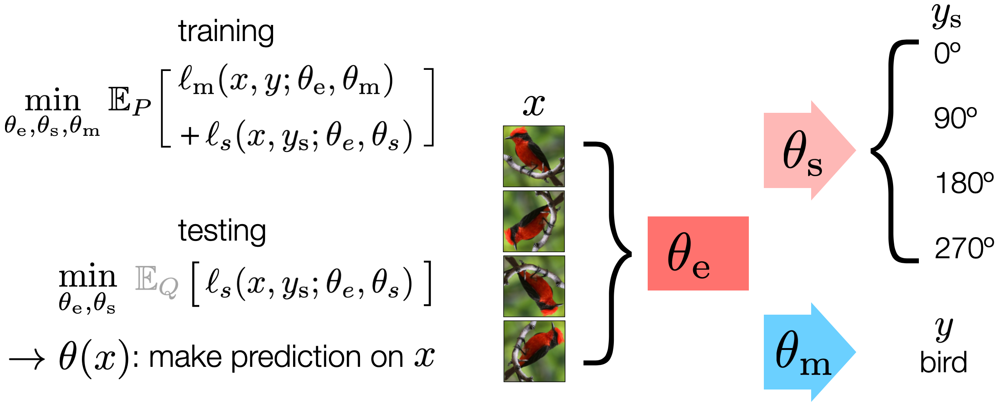

> **Most models in machine learning today are fixed during deployment. As a consequence, a trained model must prepare to be robust to all possible futures, even though only one of them is actually going to happen**
> 
> Electrical Engineering and Computer Sciences  
> University of California, Berkeley

我从UCB的TTT abstract中抽取了这句话，这句summary的起首句点名了TTT诞生的核心原因：能够robust all possible futures，是个“成长性的框架”。反正写文章的这部分时，我的理解是这样的。本篇更多是我学习TTT之间逐渐成长的理解，并非完整的、成熟的，望读者批判性阅读理解。

## 引文

[Test-Time Training Project Website](<https://yueatsprograms.github.io/ttt/home.html>)  
[EECS-2023-86.pdf](<https://www2.eecs.berkeley.edu/Pubs/TechRpts/2023/EECS-2023-86.pdf>)  
[Test-Time Training with Self-Supervision for Generalization under Distribution Shifts](<https://www.youtube.com/watch?v=NbuWxmMco30>)  

## Origin——起源

最早TTT来自于这篇论文（指正式成型而非获得idea）:[[1909.13231] Test-Time Training with Self-Supervision for Generalization under Distribution Shifts](<https://arxiv.org/abs/1909.13231>)

> 

> 
> In this paper, we propose Test-Time Training, a general approach for improving the performance of predictive models when training and test data come from different distributions. We turn a single unlabeled test sample into a self-supervised learning problem, on which we update the model parameters before making a prediction. This also extends naturally to data in an online stream. Our simple approach leads to improvements on diverse image classification benchmarks aimed at evaluating robustness to distribution shifts.
> 
> 

本文根据一种**现象** ：训练集和数据集的数据分布接近，因此可以取得较好的效果，但在现实中数据很容易产生分布上的偏移，那么有什么办法使得训练能够适配这样的shifts呢？提出了TTT

TTT is analogous to transforming a general physician into a surgeon who is now super specialized in _only_  heart valve replacements.  
TTT 类似于将普通医生转变为现在只专攻心脏瓣膜置换的外科医生。

即：**用测试样本本身，在测试时通过自监督任务“临时训练”一下模型，让它更好地适应当前数据分布。**

我这里产生了一些疑问：数据分布是什么？如何量化这个东西？这个方法根据测试任务微调，那么和“在测试集上训练”有什么区别？

一番研究后，我分别解释如下：

### 数据分布

在监督学习中，我们通常假设训练数据和测试数据是**[独立同分布](<https://zhuanlan.zhihu.com/p/52530189>)（i.i.d.）**的，即：

> 

> 
> **(x, y) ∼ P_train ≈ P_test**
> 
> 

但在现实中，**P_train ≠ P_test** ，这就是**分布偏移（distribution shift）** 。

虽然我们无法直接“看到”整个分布，但可以通过以下方式来**量化两个分布之间的差异** ：

方法| 描述| 是否可计算| 参考  
---|---|---|---  
**KL 散度（Kullback-Leibler Divergence）**|  衡量两个概率分布之间的“信息量差异”| ✅（需密度估计）| [[1]](<https://zhuanlan.zhihu.com/p/438129018>)  
**Wasserstein 距离（Earth Mover’s Distance）**|  衡量将一个分布“搬运”成另一个分布所需的最小代价| ✅（可用判别器估计）| [[2]](<https://zhuanlan.zhihu.com/p/353418080>)  
**Maximum Mean Discrepancy (MMD)**|  在再生核希尔伯特空间中衡量两个分布的均值差异| ✅（无需密度估计）| [[3]](<https://zhuanlan.zhihu.com/p/679276071>)  
**Frechet Inception Distance (FID)**|  用 Inception 网络提取特征后计算两个分布的均值和协方差差异| ✅（图像生成常用）| [4]  
**Classifier-based 方法**|  训练一个判别器区分两个数据集，准确率越高说明分布差异越大| ✅（实用性强）| [5]  
**Coverage/Confidence Drop**|  用模型在测试集上的置信度下降作为分布偏移的代理指标| ✅（无标签也可用）| [6]  

#### **二. 两样本问题（Two-sample Problem）**

假设有两组观测到的样本集X={x1....xm}X=\\\\{ {x_1....x_m} \\\\}  和Y={y1,......ym}Y = \\\\{ y_1,...... y_m \\\\} 分别独立同分布采样自分布 p 和分布 q，如何通过 和 判断分布 p 和 q 是否相同？也就是说，我们**无法直接获取到关于分布 p 和 分布 q 的任何信息** ，比如均值和方差，是否是高斯分布等，**只能基于观察到的两组样本判断它们背后是否来自于同一个分布** ？

### 和在测试集上训练的区别

我们首先看一下论文中使用的example:

他使用了两个部分来进行训练：

  1. **训练阶段（Training）** ：

     * 同时训练两个任务：

       * **主任务** ：图像分类（监督学习）

       * **辅助任务** ：图像旋转预测（自监督学习，4分类：0°、90°、180°、270°）

     * 两个任务共享一部分网络参数（特征提取器），形成一个“Y”型结构。

  2. **测试阶段（Test-Time Training）** ：

     * 每个测试样本到来时，**用它的旋转预测任务对共享特征提取器进行几步梯度更新** 。

     * 更新后再用主任务（分类器）进行预测。

     * **在线版本（TTT-Online）** ：测试样本按顺序到来时，保留上一次的参数状态，继续更新。

因此测试是仅仅是使用了测试集的x，而不使用y，进行一个自监督的训练（所以要求辅助任务必须得是一个自监督的任务）

  * TTT 在几乎所有 corruption 类型上都优于基线模型。

  * **TTT-Online** 进一步提升性能，甚至在某些情况下**超过使用整个测试集做无监督域适应的方法（UDA-SS）** 。

  * **不牺牲原始分布上的性能** ，甚至在原始测试集上略有提升。

所以通过众多数据集的实践，首先证明了这一方法的有效性。

在论文的part4，作者在理论层面对于该方法的有效性进行了证明：

  * 作者给出了一个简单的**凸模型理论分析** ，表明：如果主任务和自监督任务的梯度在共享参数上是**正相关的** ，那么 TTT 就能降低主任务损失。

（详细分析//TODO）

## Develop发展

自TTT出现后，有一系列基于TTT思想发展的方法，在EL（extended learning栏的第二篇知乎博主的文章中有做规范整理）

## Extended Learning扩展学习

1.[Learning to (Learn at Test Time): RNNs with Expressive Hidden States](<https://arxiv.org/abs/2407.04620>)

abstract:

Self-attention performs well in long context but has quadratic complexity. Existing RNN layers have linear complexity, but their performance in long context is limited by the expressive power of their hidden states. We present a practical framework for instantiating sequence modeling layers with linear complexity and expressive hidden states. The key idea is to make the hidden state a machine learning model itself, and the update rule a step of self-supervised learning. Since the hidden state is updated by training even on test sequences, our layers are called Test-Time Training (TTT) layers. We consider two instantiations: TTT-Linear and TTT-MLP, whose hidden state is a linear model and a two-layer MLP respectively. We evaluate our instantiations at the scale of 125M to 1.3B parameters, comparing with a strong Transformer and Mamba, a modern RNN. Similar to Transformer, TTT-Linear and TTT-MLP can keep reducing perplexity by conditioning on more tokens, while Mamba cannot after 16k context. TTT-MLP still faces challenges in memory I/O, but shows larger potential in long context, pointing to a promising direction for future research.  

2.[Test-Time Adaptation 1](<https://zhuanlan.zhihu.com/p/631274637>)

不同于 DA 和 DG ，TTA 方法通过在线地利用测试数据调整模型来克服 domain shift 问题，目前主流方法大致有两类：Test-Time Training 与 Fully TTA
