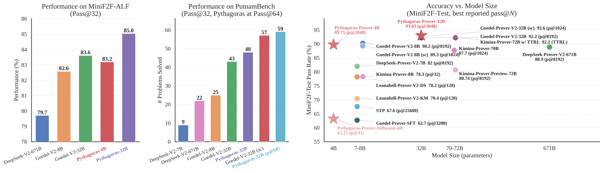
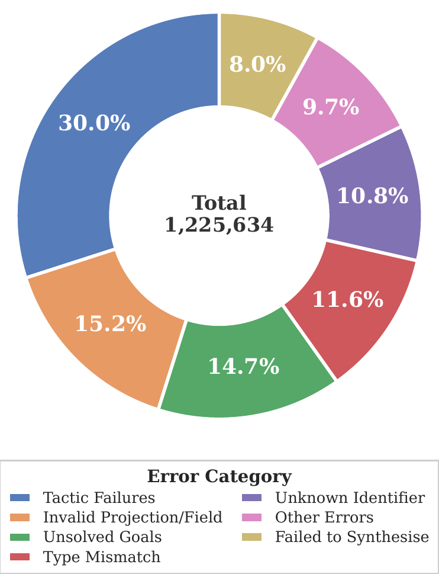
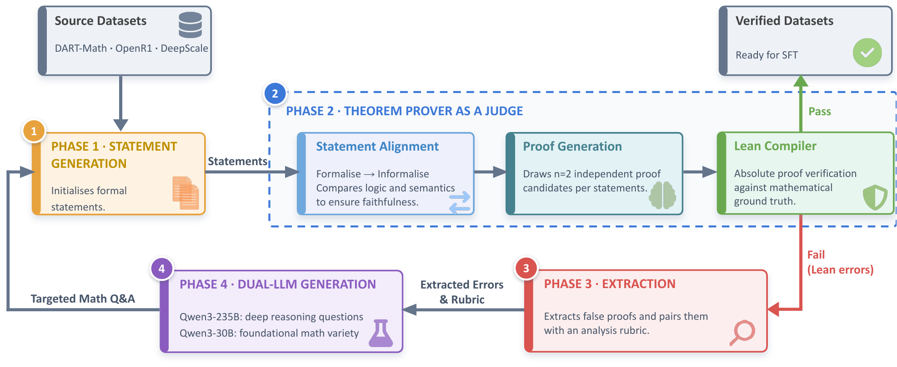
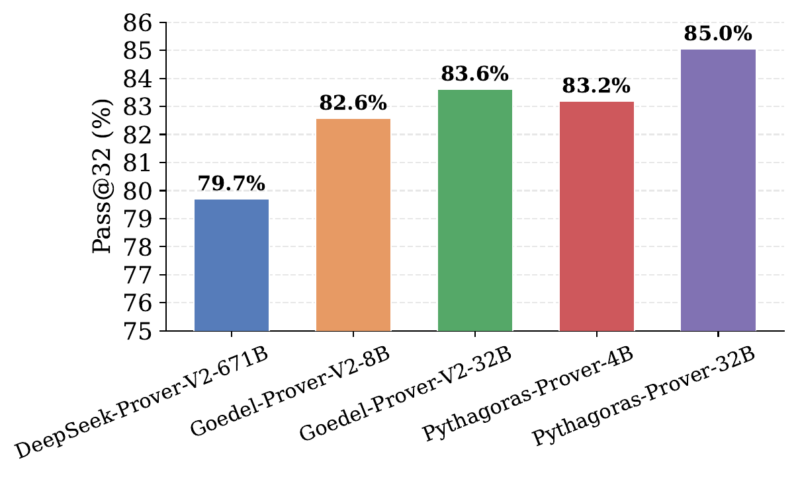
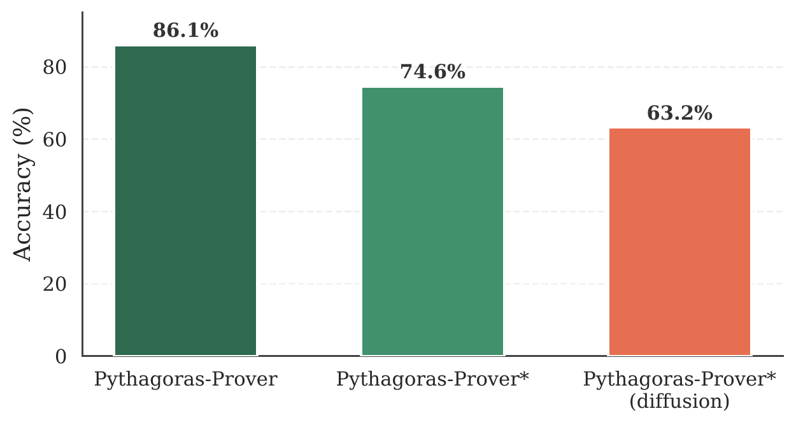
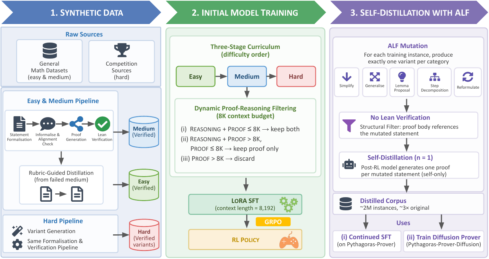

## 一句话

用 4B 参数的小模型在形式化定理证明上击败了 DeepSeek-Prover-V2-671B（参数少 167 倍），核心武器不是更大的算力，而是更聪明的数据策略。

---

## 论文信息

- **标题**：Pythagoras-Prover: Advancing Efficient Formal Proving via Augmented Lean Formalisation
- **作者**：Joshua Ong Jun Leang, Zheng Zhao, Mihaela Cătălina Stoian, Qiyuan Xu, Haonan Li, Wenda Li, Shay B. Cohen, Eleonora Giunchiglia
- **机构**：帝国理工学院、爱丁堡大学、南洋理工大学、MBZUAI
- **arXiv**：[2606.12594](https://arxiv.org/abs/2606.12594)（2026年6月10日提交）
- **代码 & 模型**：[HuggingFace: Pythagoras-LM](https://huggingface.co/Pythagoras-LM)
- **许可证**：CC BY 4.0

---

## 背景：大模型的"暴力美学"困境

过去两年，AI 数学推理的叙事很简单：**更大 = 更好**。

DeepSeek-Prover-V2 用 671B 参数在 MiniF2F 上做到 82.4%。AlphaProof 拿了 IMO 银牌但推理成本足以让个人研究者望而却步。Goedel-Prover-V2 32B 也是用了自修正循环和大量采样预算。这些系统都有一个共同的特征：**用参数规模或推理预算换取性能**。

但问题也出在这里：如果只有顶级实验室能玩得起，这对整个领域是不健康的。

Pythagoras-Prover 这篇论文的核心信息就是：**小模型 + 聪明数据 + 高效训练 = 可以战平甚至超越大模型的暴力算力**。而且它把模型、数据、基准全部开源了。

---

## 方法：三板斧砍出效率

Pythagoras-Prover 家族的效率来自三个环环相扣的策略：

### 第一板斧：课程式 SFT + 动态上下文过滤

传统做法是把所有训练数据一股脑塞给模型。Pythagoras-Prover 的做法截然不同：

**数据分层**：将约 84 万条 Lean 验证证明按难度分为三级——

| 难度 | 来源 | 构建方式 | 验证率 |
|------|------|---------|--------|
| **Easy（简单）** | 中等难度失败案例 | 按 7 类错误分类→精准简化→重新生成 | **79.2%** |
| **Medium（中等）** | DART-Math-Hard, DeepScaleR, OpenR1-Math | 自动形式化 + 双采样证明生成 | 28.1% |
| **Hard（困难）** | Big-Math-RL-Verified（奥赛/竞赛题） | 变异生成（n=4），原题保留给 RL 阶段 | 25.7% |

其中 Easy 层的构建尤其巧妙。论文把失败的证明尝试按错误类型分成 7 类（tactic 失败、未解目标、类型不匹配（ℕ vs ℤ）、未知常量等），然后针对性简化问题到导致失败的那个具体步骤。这相当于一个「哪里不会简化哪里」的精准纠错机制，效果立竿见影：验证率从 28.1% 跳到 79.2%，额外贡献了 26.2 万条有效数据。

**上下文预算严格控制**：所有训练严格限定在 8K token 上下文内。具体策略是：

- 如果「推理过程 + 证明」≤ 8K token → 保留完整内容
- 如果只有「证明」≤ 8K token → 丢弃推理过程，只保留证明
- 如果连「证明」都超过 8K → 丢弃该实例

这个简单规则的效果意外地好——论文显示，它在恢复接近全上下文 SFT 性能的同时，大幅降低了训练成本。

### 第二板斧：ALF（Augmented Lean Formalisation）——不需要验证的数据增强

这是整篇论文我最欣赏的部分。

Lean 形式化验证数据极其稀缺。想要更多训练数据？传统做法是跑更多自动形式化 + 验证流程，但 Lean 验证本身就是一个昂贵的瓶颈。

**ALF 的思路是绕开这个瓶颈**：

1. **变异**：用 Qwen3.6-27B 对每条 seed 数据生成 5 种结构变异（简化、泛化、引理提议、证明步骤分解、重新表述）
2. **自蒸馏**：用已经训练好的 Pythagoras-Prover 为每个变异生成一条证明（n=1，不追求多采样）
3. **轻量过滤**：只检查证明是否引用了目标命题（结构对齐检查），**不做 Lean 类型检查**

结果：以极低成本将训练语料扩充了约 2.5 倍（~200 万条实例）。随机抽查 2,000 条做 Lean 验证，**87.8% 可以通过编译**——说明变异质量相当高。

这个思路的核心 insight 是：**在自蒸馏场景下，完美正确性不是必须的**。只要大部分变异是合理的，模型就能从中学习到泛化能力，而不只是记忆原题表面形式。MiniF2F-ALF 污染敏感基准的消融实验也证明了这一点——模型确实学到了超越记忆的泛化。

### 第三板斧：扩散式证明器（概念验证）

这是论文里最"实验性"的部分。作者基于 block-diffusion（dLLM 框架）构建了一个 4B 的扩散定理证明器。

核心是 **tactic-based masking**：将 Lean 证明中的完整 tactic（策略步骤）作为掩码单元，迫使模型从上下文中恢复完整的推理步骤，而不是逐 token 预测。

虽然扩散模型在定理证明领域还是第一次尝试，结果是混合的：生成质量不如自回归模型，但在**吞吐量上有优势**。论文认为这个方向值得继续探索，尤其是对需要快速采样大量候选证明的场景。

---

## 实验结果：数字会说话

### MiniF2F-Test（形式化定理证明的核心基准）

这是最震撼的结果：

| 模型 | 参数量 | pass@32 |
|------|--------|---------|
| **Pythagoras-Prover-32B** | 32B | **93.0%** 🏆 |
| **Pythagoras-Prover-4B** | 4B | **86.1%** |
| DeepSeek-Prover-V2 | 671B | 82.4% |
| Goedel-Prover-V2 | 32B | 80.4% |
| Kimina-Prover | 7B | 76.2% |

关键看点：
- **4B 小模型超越了 671B 大模型**，参数少 167 倍
- **32B 模型达到 93.0%**，创开源最优，且没有使用自修正（self-correction）或测试时强化学习
- 在 PutnamBench（大学数学竞赛题）上解出了 93/672 题，同样是开源最佳

### MiniF2F-ALF：更有说服力的"真功夫"测试

论文还发布了一个自建的污染敏感基准 **MiniF2F-ALF**。通过对原版 MiniF2F 做 ALF 风格的变异，检验模型是真学到了推理能力，还是只是记住了训练集中的题目表述。

结果是：**所有模型在 MiniF2F-ALF 上表现都下降了**——这证实了 benchmark 检测到了污染/过拟合。但 Pythagoras-Prover-32B 依然是降幅最小的，保持在 85.0%。更关键的是，**4B 模型在 MiniF2F-ALF 上追平了 Goedel-Prover-V2-32B 的原始表现**。

这说明 ALF 的数据多样化策略确实起作用了——模型学到的是更本质的推理能力，而非表面形式的记忆。

### GRPO 强化学习：锦上添花，而非雪中送炭

一个有趣的发现：在 SFT 基础上叠加 GRPO 强化学习（rollout=8，二元编译奖励），只带来了**有限的额外提升**。论文推测这是因为 SFT 阶段已经让模型内化了足够强的证明搜索能力。

这其实也是一个重要信号：**当数据策略做得好时，RL 的边际收益可能比预期小**。对预算有限的研究者来说，这进一步验证了"把资源花在数据上，而非 RL 上"的路线。

---

## 为什么这篇论文值得重视

我看完论文后有几点思考：

### 1. 对"大就是好"叙事的最有力反驳之一

167 倍参数差距下的反超不是小幅度领先，而是从 82.4% 到 86.1%（+3.7 个百分点）。在 MiniF2F 这种高难度基准上，这是一次有实质意义的跨越。

### 2. ALF 的思路有广泛迁移价值

ALF 的核心——**通过结构化变异放大稀缺数据，不依赖昂贵的验证循环**——不只是适用于定理证明。任何需要"正确性保证"的 LLM 应用场景（代码生成、数学推理、程序合成）都可能从中受益。想象一下代码生成领域的 ALF：通过 AST 级别的变异（变量重命名、函数参数重排、控制流变换）生成变体，然后用现有模型自蒸馏——不需要跑完整的测试套件验证每个变体。

### 3. 8K 上下文的"限制"反而成了"纪律"

当大家都在追求更长的上下文窗口时，这篇论文主动限制在 8K token 内，并通过动态过滤证明了：**学会取舍比什么都保留更高效**。这在工程上有直接的指导意义——尤其是在成本敏感的场景下。

### 4. 开放科学的最佳实践

论文不仅开源了模型权重，还开源了完整的训练数据、ALF 变异语料、MiniF2F-ALF 基准。作者在 HuggingFace 上维护了 [Pythagoras-LM](https://huggingface.co/Pythagoras-LM) 组织，这让社区可以直接复现和构建。

---

## 局限与展望

每篇论文都有不完美之处：

- **扩散证明器仍处于早期阶段**：生成质量不及自回归，但吞吐量优势值得进一步探索
- **GRPO 增益有限**：虽然论文坦诚地报告了这一点值得赞赏，但也说明 RL 策略在此框架下还有优化空间
- **仅限 Lean 4**：暂时没有扩展到 Isabelle、Rocq 等其他证明助手
- **硬题的验证率仍然偏低**（困难层仅 25.7%）：构建更多高质量困难数据仍是挑战

---

## 总结

如果只用一句话推荐这篇论文：

> **如果你想看「数据策略如何打败参数规模」的教科书级案例，读这篇就够了。**

Pythagoras-Prover 用 4B 和 32B 的模型，通过课程学习、动态过滤、结构化变异和自蒸馏，在一个最需要"正确性"的领域证明了效率优先路线的可行性。对于预算有限的研究团队和个人开发者来说，这篇论文带来的鼓舞可能比任何大模型的新 benchmark 分数都更有实际意义。

---

*本文是对 [Pythagoras-Prover (arXiv:2606.12594)](https://arxiv.org/abs/2606.12594) 的深度解读。论文以 CC BY 4.0 许可证发布。*
